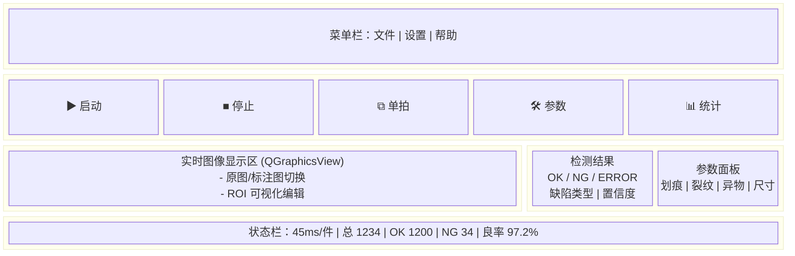

# UI 界面设计

## 1. 界面总览

### 1.1 主窗口布局



### 1.2 布局比例

| 区域 | 占比 | 最小尺寸 | 说明 |
| --- | --- | --- | --- |
| 菜单栏 | 固定高度 | 25px | 系统菜单 |
| 工具栏 | 固定高度 | 48px | 常用操作按钮 |
| 图像区 | 65% | 640×480 | 主显示区，可缩放 |
| 侧边栏 | 35% | 300px | 结果+参数面板，可折叠 |
| 状态栏 | 固定高度 | 24px | 实时统计信息 |

---

## 2. 界面清单

| 序号 | 界面 | 类型 | 功能 |
| --- | --- | --- | --- |
| 1 | MainWindow | 主窗口 | 实时显示、结果、参数、控制 |
| 2 | SettingsDialog | 对话框 | 系统设置（相机/PLC/算法/存储/用户/关于） |
| 3 | CalibrationDialog | 对话框 | 相机标定、标尺校准 |
| 4 | StatisticsView | 视图 | 报表、图表、良率趋势 |
| 5 | HistoryView | 视图 | 历史记录查询与回放 |
| 6 | SPCView | 视图 | 控制图、CPK 过程能力 |
| 7 | LoginDialog | 对话框 | 登录与权限验证 |
| 8 | UserManageDialog | 对话框 | 用户/角色管理 |
| 9 | ImageDetailDialog | 对话框 | 图像详情、缺陷标注查看 |
| 10 | ModelManageDialog | 对话框 | DNN 模型管理与切换 |
| 11 | AlarmDialog | 对话框 | 报警记录与处理 |
| 12 | AboutDialog | 对话框 | 关于与版本信息 |

---

## 3. 核心控件

### 3.1 图像显示控件 (ImageView)

```cpp
class ImageView : public QGraphicsView {
    Q_OBJECT
public:
    void setImage(const cv::Mat& image);
    void drawDefectRegions(const std::vector<cv::Rect>& regions, const QColor& color);
    void setROI(const cv::Rect& roi);
    void enableROIEdit(bool enable);
    enum class DisplayMode { Original, Annotated, SideBySide };
    void setDisplayMode(DisplayMode mode);
    void zoomIn(); void zoomOut(); void zoomFit(); void zoomActual();
signals:
    void roiChanged(const QRect& roi);
    void mousePositionChanged(const QPoint& pos, int grayValue);
};
```

要点：
- 支持鼠标滚轮缩放、拖动平移，双击复位。
- ROI 编辑模式下显示拖拽手柄，限制在图像范围内。
- SideBySide 模式左右对比原图/标注图。

### 3.2 结果面板 (ResultCard)

- 显示当前帧的综合判定（OK/NG/ERROR）。
- 列表展示各缺陷：类型、置信度、位置、严重度。
- 支持高亮对应 ROI、跳转图像详情。

### 3.3 参数面板 (ParamPanel)

- 折叠分组：划痕/裂纹/异物/尺寸/评分。
- 支持数值输入、滑条、下拉枚举；实时验证范围。
- “应用” 按钮触发热更新；失败回滚旧值。

---

## 4. 设置对话框

| Tab | 内容 |
| --- | --- |
| 相机 | 设备选择、分辨率、曝光、增益、帧率、触发模式、白平衡 |
| 光源/IO | 光源通道亮度、IO 映射、触发极性、延时 |
| PLC | 协议、IP/Port、寄存器映射、心跳开关 |
| 算法 | 预处理（灰度/去噪/均衡）、检测器阈值、DNN 模型选择 |
| 存储 | 数据库路径、图片保存策略、自动清理策略 |
| 用户 | 登录超时、密码策略、角色权限 |
| 关于 | 版本、依赖库、许可证 |

示例：严重度阈值输入

```cpp
auto* minor = new QDoubleSpinBox(); minor->setRange(0, 100); minor->setValue(20);
auto* moderate = new QDoubleSpinBox(); moderate->setRange(0, 100); moderate->setValue(50);
auto* severeHint = new QLabel(tr("严重阈值 (≥70): 自动计算"));
```

---

## 5. 历史与统计

- **HistoryView**：按时间/结果/缺陷类型筛选，表格 + 缩略图，双击查看详情或导出。
- **StatisticsView**：良率趋势、缺陷分布、节拍箱线图，支持导出 CSV/PNG。
- **SPCView**：Xbar-R、P 图、CP/CPK 计算，可选择采样窗口与分组。

---

## 6. 交互与状态

- 工具栏按钮：启动/停止/单拍/参数/统计，对应快捷键 `F5`、`F6`、`F7`、`Ctrl+,`、`Ctrl+T`。
- 状态栏：当前节拍、累计 OK/NG、良率、相机/PLC 连接状态、日志入口。
- 全屏模式 `F11`，侧边栏可折叠，缩放支持 `Ctrl+鼠标滚轮`。

---

## 7. 颜色与主题

- OK：绿色；NG：红色；警告：琥珀色；禁用：灰色。
- 缺陷标注：划痕(蓝)、裂纹(紫)、异物(橙)、尺寸(青)；支持透明度调整。
- 深浅色主题均支持，遵循 Qt Palette，留足对比度。

---

## 8. 键盘快捷键

| 快捷键 | 功能 | 说明 |
| --- | --- | --- |
| F5 | 启动检测 | 进入连续采集/检测 |
| F6 | 停止检测 | 停止采集，流水线安全停机 |
| F7 | 单拍 | 采集单帧并检测 |
| Ctrl + S | 保存配置 | 保存当前参数至 JSON |
| Ctrl + O | 加载配置 | 选择参数文件并应用 |
| Ctrl + + / - | 放大 / 缩小 | 图像缩放 |
| Ctrl + 0 | 适应窗口 | 重置缩放 |
| Ctrl + 1 | 原始大小 | 100% 显示 |
| F11 | 全屏 | 切换全屏模式 |

---

## 9. 响应式与多语言

- 分辨率 1920×1080：标准三栏；1366×768：侧边栏可折叠；1024×768：参数改为弹窗。
- 国际化：`resources/translations/app_zh_CN.ts / app_zh_TW.ts / app_en_US.ts`，所有字符串使用 `tr()` 包裹。

```cpp
QTranslator translator;
if (translator.load(":/translations/app_%1".arg(QLocale::system().name()))) {
    app.installTranslator(&translator);
}
```
