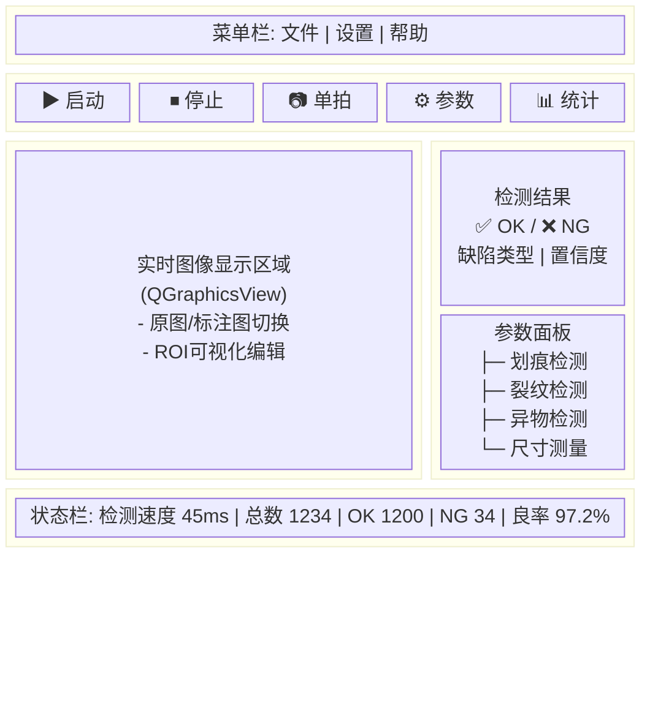
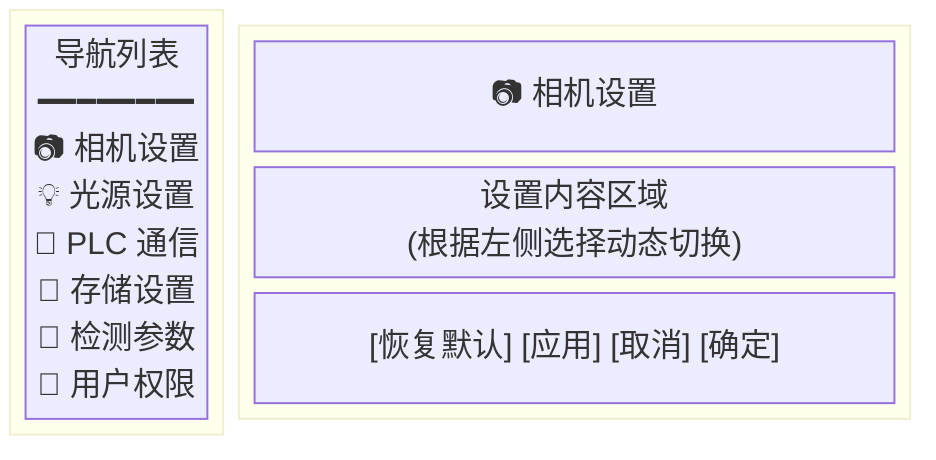
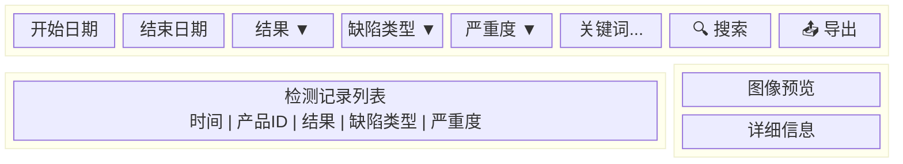

# UI 界面设计

## 1. 界面总览

### 1.1 主窗口布局



### 1.2 布局比例

| 区域 | 占比 | 最小尺寸 | 说明 |
| --- | --- | --- | --- |
| **菜单栏** | 固定高度 | 25px | 系统菜单 |
| **工具栏** | 固定高度 | 48px | 常用操作按钮 |
| **图像区** | 65% | 640×480 | 主显示区，可缩放 |
| **侧边栏** | 35% | 300px | 结果+参数面板 |
| **状态栏** | 固定高度 | 24px | 实时统计信息 |

---

## 2. 界面清单总览

| 序号 | 界面名称 | 类型 | 功能描述 |
| --- | --- | --- | --- |
| 1 | **MainWindow** | 主窗口 | 检测主界面，实时显示、结果、参数 |
| 2 | **SettingsDialog** | 对话框 | 系统设置（6 个 Tab 页） |
| 3 | **CalibrationDialog** | 对话框 | 相机标定向导 |
| 4 | **StatisticsView** | 视图 | 统计报表与图表 |
| 5 | **HistoryView** | 视图 | 历史记录查询与回放 |
| 6 | **SPCView** | 视图 | SPC 控制图与过程能力 |
| 7 | **LoginDialog** | 对话框 | 用户登录与权限验证 |
| 8 | **UserManageDialog** | 对话框 | 用户管理（管理员） |
| 9 | **ImageDetailDialog** | 对话框 | 图像详情与缺陷标注查看 |
| 10 | **ModelManageDialog** | 对话框 | DNN 模型管理与切换 |
| 11 | **AlarmDialog** | 对话框 | 报警记录与处理 |
| 12 | **AboutDialog** | 对话框 | 关于与版本信息 |

---

## 3. 核心控件实现

### 3.1 图像显示控件 (ImageView)

```cpp
class ImageView : public QGraphicsView {
    Q_OBJECT
public:
    explicit ImageView(QWidget* parent = nullptr);
    
    // 图像操作
    void setImage(const cv::Mat& image);
    void setImage(const QImage& image);
    void clear();
    
    // 缺陷标注
    void drawDefectRegions(const std::vector<cv::Rect>& regions, 
                           const QColor& color = Qt::red);
    void clearAnnotations();
    
    // ROI 编辑
    void setROI(const cv::Rect& roi);
    cv::Rect getROI() const;
    void enableROIEdit(bool enable);
    
    // 显示模式
    enum class DisplayMode { Original, Annotated, SideBySide };
    void setDisplayMode(DisplayMode mode);
    
    // 缩放
    void zoomIn();
    void zoomOut();
    void zoomFit();
    void zoomActual();
    
signals:
    void roiChanged(const QRect& roi);
    void mousePositionChanged(const QPoint& pos, int grayValue);
    void zoomChanged(double factor);
    
protected:
    void wheelEvent(QWheelEvent* event) override;
    void mouseMoveEvent(QMouseEvent* event) override;
    void mousePressEvent(QMouseEvent* event) override;
    void mouseReleaseEvent(QMouseEvent* event) override;
    void resizeEvent(QResizeEvent* event) override;
    
private:
    QGraphicsScene* m_scene;
    QGraphicsPixmapItem* m_imageItem;
    QGraphicsRectItem* m_roiItem;
    std::vector<QGraphicsRectItem*> m_defectItems;
    
    bool m_roiEditEnabled = false;
    bool m_isDragging = false;
    QPointF m_dragStart;
    double m_zoomFactor = 1.0;
    
    QImage cvMatToQImage(const cv::Mat& mat);
};
```

**实现要点**：

```cpp
void ImageView::setImage(const cv::Mat& image) {
    if (image.empty()) {
        clear();
        return;
    }
    
    // cv::Mat → QImage 转换
    QImage qimg = cvMatToQImage(image);
    m_imageItem->setPixmap(QPixmap::fromImage(qimg));
    
    // 首次显示时自适应窗口
    if (m_zoomFactor == 1.0) {
        zoomFit();
    }
}

QImage ImageView::cvMatToQImage(const cv::Mat& mat) {
    switch (mat.type()) {
        case CV_8UC1:  // 灰度图
            return QImage([mat.data](http://mat.data), mat.cols, mat.rows, 
                          mat.step, QImage::Format_Grayscale8).copy();
        case CV_8UC3:  // BGR
            cv::Mat rgb;
            cv::cvtColor(mat, rgb, cv::COLOR_BGR2RGB);
            return QImage([rgb.data](http://rgb.data), rgb.cols, rgb.rows,
                          rgb.step, QImage::Format_RGB888).copy();
        default:
            return QImage();
    }
}

void ImageView::wheelEvent(QWheelEvent* event) {
    // Ctrl + 滚轮缩放
    if (event->modifiers() & Qt::ControlModifier) {
        double factor = event->angleDelta().y() > 0 ? 1.15 : 0.85;
        m_zoomFactor *= factor;
        m_zoomFactor = std::clamp(m_zoomFactor, 0.1, 10.0);
        
        setTransform(QTransform::fromScale(m_zoomFactor, m_zoomFactor));
        emit zoomChanged(m_zoomFactor);
    } else {
        QGraphicsView::wheelEvent(event);
    }
}
```

### 3.2 ROI 编辑器

```cpp
class ROIEditor : public QObject {
    Q_OBJECT
public:
    enum class EditMode {
        None,       // 不可编辑
        Move,       // 移动整个 ROI
        Resize,     // 调整大小（拖拽边角）
        Draw        // 绘制新 ROI
    };
    
    explicit ROIEditor(QGraphicsScene* scene, QObject* parent = nullptr);
    
    void setROI(const QRectF& roi);
    QRectF getROI() const;
    void setEditMode(EditMode mode);
    
signals:
    void roiChanged(const QRectF& roi);
    void editStarted();
    void editFinished();
    
private:
    QGraphicsRectItem* m_roiRect;
    std::array<QGraphicsEllipseItem*, 8> m_handles;  // 8个调整手柄
    EditMode m_mode = EditMode::None;
    
    void updateHandles();
    int hitTestHandle(const QPointF& pos);
};
```

### 3.3 检测结果卡片

```cpp
class ResultCard : public QFrame {
    Q_OBJECT
public:
    explicit ResultCard(QWidget* parent = nullptr);
    
    void setResult(const DetectResult& result);
    void clear();
    
private:
    QLabel* m_statusLabel;      // OK/NG 大图标
    QLabel* m_defectTypeLabel;  // 缺陷类型
    QLabel* m_confidenceLabel;  // 置信度
    QProgressBar* m_severityBar; // 严重度进度条
    QLabel* m_severityLabel;    // 严重度等级
    QLabel* m_actionLabel;      // 处置建议
    
    void setupUI();
    void updateStyle(bool isNG);
};

void ResultCard::setResult(const DetectResult& result) {
    // 状态图标
    if (result.hasDefect) {
        m_statusLabel->setText("❌ NG");
        m_statusLabel->setStyleSheet("color: #ff4444; font-size: 32px; font-weight: bold;");
    } else {
        m_statusLabel->setText("✅ OK");
        m_statusLabel->setStyleSheet("color: #44ff44; font-size: 32px; font-weight: bold;");
    }
    
    // 缺陷类型
    m_defectTypeLabel->setText(defectTypeToString(result.defectType));
    
    // 置信度
    m_confidenceLabel->setText(QString("%1%").arg(result.confidence * 100, 0, 'f', 1));
    
    // 严重度进度条
    m_severityBar->setValue(static_cast<int>(result.severityScore));
    m_severityBar->setStyleSheet(getSeverityBarStyle(result.severityLevel));
    
    // 严重度等级
    m_severityLabel->setText(result.severityLabel);
    
    // 处置建议
    m_actionLabel->setText(getActionText(result.severityLevel));
    
    updateStyle(result.hasDefect);
}
```

### 3.4 参数配置面板

```cpp
class ParamPanel : public QWidget {
    Q_OBJECT
public:
    explicit ParamPanel(QWidget* parent = nullptr);
    
    void loadParams(const QString& configPath);
    void saveParams(const QString& configPath);
    QVariantMap getDetectorParams(const QString& detectorName);
    void setDetectorParams(const QString& detectorName, const QVariantMap& params);
    
signals:
    void paramsChanged(const QString& detectorName, const QVariantMap& params);
    
private:
    QTabWidget* m_tabWidget;
    
    // 各检测器参数页
    QWidget* createScratchPage();
    QWidget* createCrackPage();
    QWidget* createForeignPage();
    QWidget* createDimensionPage();
};
```

### 3.5 严重度进度条

```cpp
class SeverityBar : public QProgressBar {
    Q_OBJECT
public:
    explicit SeverityBar(QWidget* parent = nullptr);
    void setSeverity(double score, SeverityLevel level);
    
protected:
    void paintEvent(QPaintEvent* event) override;
    
private:
    SeverityLevel m_level = SeverityLevel::None;
    
    QColor getColor() const {
        switch (m_level) {
            case SeverityLevel::Minor:    return QColor("#4CAF50");  // 绿
            case SeverityLevel::Moderate: return QColor("#FFC107");  // 黄
            case SeverityLevel::Severe:   return QColor("#F44336");  // 红
            default:                      return QColor("#9E9E9E");  // 灰
        }
    }
};
```

---

## 4. 主窗口实现

### 4.1 MainWindow 类

```cpp
class MainWindow : public QMainWindow {
    Q_OBJECT
public:
    explicit MainWindow(QWidget* parent = nullptr);
    ~MainWindow();
    
private slots:
    void onStartClicked();
    void onStopClicked();
    void onSingleShotClicked();
    void onSettingsClicked();
    void onStatisticsClicked();
    
    void onResultReady(const DetectResult& result);
    void onFrameReady(const cv::Mat& frame);
    void onError(const QString& module, const QString& message);
    
    void updateStatistics();
    
private:
    void setupUI();
    void setupMenuBar();
    void setupToolBar();
    void setupStatusBar();
    void setupConnections();
    
    // UI 组件
    ImageView* m_imageView;
    ResultCard* m_resultCard;
    ParamPanel* m_paramPanel;
    
    // 状态栏组件
    QLabel* m_cycleTimeLabel;
    QLabel* m_totalCountLabel;
    QLabel* m_okCountLabel;
    QLabel* m_ngCountLabel;
    QLabel* m_yieldLabel;
    
    // 业务组件
    std::unique_ptr<DetectPipeline> m_pipeline;
    std::unique_ptr<SystemWatchdog> m_watchdog;
    
    // 统计
    int m_totalCount = 0;
    int m_okCount = 0;
    int m_ngCount = 0;
};
```

### 4.2 UI 布局代码

```cpp
void MainWindow::setupUI() {
    // 中心组件
    auto* centralWidget = new QWidget();
    setCentralWidget(centralWidget);
    
    auto* mainLayout = new QHBoxLayout(centralWidget);
    mainLayout->setContentsMargins(4, 4, 4, 4);
    mainLayout->setSpacing(4);
    
    // 左侧：图像显示区
    m_imageView = new ImageView();
    m_imageView->setMinimumSize(640, 480);
    mainLayout->addWidget(m_imageView, 65);  // 65% 宽度
    
    // 右侧：结果 + 参数面板
    auto* rightPanel = new QWidget();
    auto* rightLayout = new QVBoxLayout(rightPanel);
    rightLayout->setContentsMargins(0, 0, 0, 0);
    rightLayout->setSpacing(8);
    
    // 检测结果卡片
    m_resultCard = new ResultCard();
    m_resultCard->setFixedHeight(200);
    rightLayout->addWidget(m_resultCard);
    
    // 参数面板（可折叠）
    auto* paramGroup = new QGroupBox("检测参数");
    auto* paramLayout = new QVBoxLayout(paramGroup);
    m_paramPanel = new ParamPanel();
    paramLayout->addWidget(m_paramPanel);
    rightLayout->addWidget(paramGroup, 1);
    
    rightPanel->setMinimumWidth(300);
    mainLayout->addWidget(rightPanel, 35);  // 35% 宽度
    
    // 窗口属性
    setWindowTitle("缺陷检测系统 v1.0");
    setMinimumSize(1024, 768);
    resize(1280, 800);
}

void MainWindow::setupToolBar() {
    auto* toolbar = addToolBar("主工具栏");
    toolbar->setIconSize(QSize(32, 32));
    toolbar->setToolButtonStyle(Qt::ToolButtonTextUnderIcon);
    
    auto* startAction = toolbar->addAction(QIcon(":/icons/start.svg"), "启动");
    startAction->setShortcut(QKeySequence("F5"));
    connect(startAction, &QAction::triggered, this, &MainWindow::onStartClicked);
    
    auto* stopAction = toolbar->addAction(QIcon(":/icons/stop.svg"), "停止");
    stopAction->setShortcut(QKeySequence("F6"));
    connect(stopAction, &QAction::triggered, this, &MainWindow::onStopClicked);
    
    toolbar->addSeparator();
    
    auto* singleAction = toolbar->addAction(QIcon(":/icons/camera.svg"), "单拍");
    singleAction->setShortcut(QKeySequence("F7"));
    connect(singleAction, &QAction::triggered, this, &MainWindow::onSingleShotClicked);
    
    toolbar->addSeparator();
    
    auto* settingsAction = toolbar->addAction(QIcon(":/icons/settings.svg"), "参数");
    connect(settingsAction, &QAction::triggered, this, &MainWindow::onSettingsClicked);
    
    auto* statsAction = toolbar->addAction(QIcon(":/icons/chart.svg"), "统计");
    connect(statsAction, &QAction::triggered, this, &MainWindow::onStatisticsClicked);
}

void MainWindow::setupStatusBar() {
    auto* statusBar = this->statusBar();
    
    m_cycleTimeLabel = new QLabel("节拍: -- ms");
    m_cycleTimeLabel->setMinimumWidth(100);
    statusBar->addWidget(m_cycleTimeLabel);
    
    statusBar->addWidget(new QLabel("|"));
    
    m_totalCountLabel = new QLabel("总数: 0");
    statusBar->addWidget(m_totalCountLabel);
    
    m_okCountLabel = new QLabel("OK: 0");
    m_okCountLabel->setStyleSheet("color: green;");
    statusBar->addWidget(m_okCountLabel);
    
    m_ngCountLabel = new QLabel("NG: 0");
    m_ngCountLabel->setStyleSheet("color: red;");
    statusBar->addWidget(m_ngCountLabel);
    
    statusBar->addWidget(new QLabel("|"));
    
    m_yieldLabel = new QLabel("良率: --");
    m_yieldLabel->setStyleSheet("font-weight: bold;");
    statusBar->addWidget(m_yieldLabel);
}
```

---

## 5. 设置对话框详细设计

### 5.1 设置界面布局



### 5.2 SettingsDialog 完整实现

```cpp
class SettingsDialog : public QDialog {
    Q_OBJECT
public:
    explicit SettingsDialog(QWidget* parent = nullptr);
    
    void loadSettings();
    void saveSettings();
    
signals:
    void settingsChanged();
    
private slots:
    void onNavItemClicked(int index);
    void onRestoreDefaultClicked();
    void onApplyClicked();
    
private:
    void setupUI();
    void createNavList();
    void createStackedPages();
    
    QListWidget* m_navList;
    QStackedWidget* m_stackedWidget;
    
    // 各设置页
    QWidget* createCameraPage();
    QWidget* createLightPage();
    QWidget* createPLCPage();
    QWidget* createStoragePage();
    QWidget* createDetectorPage();
    QWidget* createUserPage();
};

void SettingsDialog::setupUI() {
    setWindowTitle(tr("系统设置"));
    setMinimumSize(800, 600);
    resize(900, 650);
    
    auto* mainLayout = new QHBoxLayout(this);
    
    // 左侧导航
    m_navList = new QListWidget();
    m_navList->setFixedWidth(180);
    m_navList->setIconSize(QSize(24, 24));
    createNavList();
    mainLayout->addWidget(m_navList);
    
    // 右侧内容区
    auto* rightLayout = new QVBoxLayout();
    
    m_stackedWidget = new QStackedWidget();
    createStackedPages();
    rightLayout->addWidget(m_stackedWidget, 1);
    
    // 底部按钮
    auto* btnLayout = new QHBoxLayout();
    btnLayout->addStretch();
    
    auto* restoreBtn = new QPushButton(tr("恢复默认"));
    connect(restoreBtn, &QPushButton::clicked, this, &SettingsDialog::onRestoreDefaultClicked);
    btnLayout->addWidget(restoreBtn);
    
    auto* applyBtn = new QPushButton(tr("应用"));
    connect(applyBtn, &QPushButton::clicked, this, &SettingsDialog::onApplyClicked);
    btnLayout->addWidget(applyBtn);
    
    auto* cancelBtn = new QPushButton(tr("取消"));
    connect(cancelBtn, &QPushButton::clicked, this, &QDialog::reject);
    btnLayout->addWidget(cancelBtn);
    
    auto* okBtn = new QPushButton(tr("确定"));
    okBtn->setDefault(true);
    connect(okBtn, &QPushButton::clicked, this, [this]{ 
        saveSettings(); 
        accept(); 
    });
    btnLayout->addWidget(okBtn);
    
    rightLayout->addLayout(btnLayout);
    mainLayout->addLayout(rightLayout);
    
    connect(m_navList, &QListWidget::currentRowChanged, 
            m_stackedWidget, &QStackedWidget::setCurrentIndex);
}

void SettingsDialog::createNavList() {
    m_navList->addItem(new QListWidgetItem(QIcon(":/icons/camera.svg"), tr("相机设置")));
    m_navList->addItem(new QListWidgetItem(QIcon(":/icons/light.svg"), tr("光源设置")));
    m_navList->addItem(new QListWidgetItem(QIcon(":/icons/plc.svg"), tr("PLC 通信")));
    m_navList->addItem(new QListWidgetItem(QIcon(":/icons/storage.svg"), tr("存储设置")));
    m_navList->addItem(new QListWidgetItem(QIcon(":/icons/detect.svg"), tr("检测参数")));
    m_navList->addItem(new QListWidgetItem(QIcon(":/icons/user.svg"), tr("用户权限")));
    m_navList->setCurrentRow(0);
}
```

### 5.3 相机设置页

```cpp
QWidget* SettingsDialog::createCameraPage() {
    auto* page = new QWidget();
    auto* layout = new QVBoxLayout(page);
    
    // 相机选择组
    auto* cameraGroup = new QGroupBox(tr("相机配置"));
    auto* cameraLayout = new QFormLayout(cameraGroup);
    
    // 相机类型
    m_cameraType = new QComboBox();
    m_cameraType->addItems({"GigE Vision", "USB3 Vision", "海康 SDK", "大恒 SDK", "文件输入"});
    cameraLayout->addRow(tr("相机类型:"), m_cameraType);
    
    // 相机 IP / 设备 ID
    auto* ipLayout = new QHBoxLayout();
    m_cameraIP = new QLineEdit("192.168.1.100");
    m_cameraIP->setPlaceholderText("192.168.1.100");
    ipLayout->addWidget(m_cameraIP);
    auto* scanBtn = new QPushButton(tr("扫描"));
    connect(scanBtn, &QPushButton::clicked, this, &SettingsDialog::onScanCameras);
    ipLayout->addWidget(scanBtn);
    cameraLayout->addRow(tr("相机 IP:"), ipLayout);
    
    // 曝光时间
    auto* exposureLayout = new QHBoxLayout();
    m_exposureSlider = new QSlider(Qt::Horizontal);
    m_exposureSlider->setRange(100, 100000);
    m_exposureSlider->setValue(5000);
    m_exposureSpin = new QSpinBox();
    m_exposureSpin->setRange(100, 100000);
    m_exposureSpin->setValue(5000);
    m_exposureSpin->setSuffix(" μs");
    connect(m_exposureSlider, &QSlider::valueChanged, m_exposureSpin, &QSpinBox::setValue);
    connect(m_exposureSpin, QOverload<int>::of(&QSpinBox::valueChanged), 
            m_exposureSlider, &QSlider::setValue);
    exposureLayout->addWidget(m_exposureSlider);
    exposureLayout->addWidget(m_exposureSpin);
    cameraLayout->addRow(tr("曝光时间:"), exposureLayout);
    
    // 增益
    auto* gainLayout = new QHBoxLayout();
    m_gainSlider = new QSlider(Qt::Horizontal);
    m_gainSlider->setRange(0, 24);
    m_gainSlider->setValue(0);
    m_gainSpin = new QSpinBox();
    m_gainSpin->setRange(0, 24);
    m_gainSpin->setValue(0);
    m_gainSpin->setSuffix(" dB");
    connect(m_gainSlider, &QSlider::valueChanged, m_gainSpin, &QSpinBox::setValue);
    connect(m_gainSpin, QOverload<int>::of(&QSpinBox::valueChanged), 
            m_gainSlider, &QSlider::setValue);
    gainLayout->addWidget(m_gainSlider);
    gainLayout->addWidget(m_gainSpin);
    cameraLayout->addRow(tr("增益:"), gainLayout);
    
    // 触发模式
    m_triggerMode = new QComboBox();
    m_triggerMode->addItems({tr("连续采集"), tr("软触发"), tr("硬触发")});
    m_triggerMode->setCurrentIndex(2);
    cameraLayout->addRow(tr("触发模式:"), m_triggerMode);
    
    // 图像格式
    m_imageFormat = new QComboBox();
    m_imageFormat->addItems({"Mono8", "Mono12", "BayerRG8", "RGB8"});
    cameraLayout->addRow(tr("图像格式:"), m_imageFormat);
    
    // 分辨率
    m_resolution = new QComboBox();
    m_resolution->addItems({"2592×1944", "1920×1080", "1280×720", "640×480"});
    cameraLayout->addRow(tr("分辨率:"), m_resolution);
    
    layout->addWidget(cameraGroup);
    
    // 预览区
    auto* previewGroup = new QGroupBox(tr("相机预览"));
    auto* previewLayout = new QVBoxLayout(previewGroup);
    
    m_cameraPreview = new QLabel();
    m_cameraPreview->setMinimumSize(320, 240);
    m_cameraPreview->setAlignment(Qt::AlignCenter);
    m_cameraPreview->setStyleSheet("background-color: #333; color: #999;");
    m_cameraPreview->setText(tr("未连接"));
    previewLayout->addWidget(m_cameraPreview);
    
    auto* previewBtnLayout = new QHBoxLayout();
    auto* connectBtn = new QPushButton(tr("📷 连接测试"));
    connect(connectBtn, &QPushButton::clicked, this, &SettingsDialog::onTestCamera);
    previewBtnLayout->addWidget(connectBtn);
    
    auto* captureBtn = new QPushButton(tr("🔄 抓取一帧"));
    connect(captureBtn, &QPushButton::clicked, this, &SettingsDialog::onCaptureFrame);
    previewBtnLayout->addWidget(captureBtn);
    previewBtnLayout->addStretch();
    previewLayout->addLayout(previewBtnLayout);
    
    layout->addWidget(previewGroup);
    layout->addStretch();
    
    return page;
}
```

### 5.4 光源设置页

```cpp
QWidget* SettingsDialog::createLightPage() {
    auto* page = new QWidget();
    auto* layout = new QVBoxLayout(page);
    
    auto* group = new QGroupBox(tr("光源配置"));
    auto* formLayout = new QFormLayout(group);
    
    // 控制方式
    m_lightCtrlType = new QComboBox();
    m_lightCtrlType->addItems({tr("串口控制"), tr("Modbus 控制"), tr("GPIO 控制"), tr("手动控制")});
    formLayout->addRow(tr("控制方式:"), m_lightCtrlType);
    
    // 串口设置
    auto* serialLayout = new QHBoxLayout();
    m_lightPort = new QComboBox();
    m_lightPort->addItems({"COM1", "COM2", "COM3", "/dev/ttyUSB0"});
    serialLayout->addWidget(m_lightPort);
    m_lightBaud = new QComboBox();
    m_lightBaud->addItems({"9600", "19200", "38400", "115200"});
    m_lightBaud->setCurrentText("9600");
    serialLayout->addWidget(m_lightBaud);
    formLayout->addRow(tr("串口设置:"), serialLayout);
    
    // 光源通道配置
    auto* channelGroup = new QGroupBox(tr("通道配置"));
    auto* channelLayout = new QGridLayout(channelGroup);
    
    const QStringList channelNames = {tr("通道 1 (正面)"), tr("通道 2 (侧光)"), 
                                       tr("通道 3 (背光)"), tr("通道 4 (备用)")};
    
    for (int i = 0; i < 4; i++) {
        auto* label = new QLabel(channelNames[i]);
        channelLayout->addWidget(label, i, 0);
        
        auto* enableCheck = new QCheckBox(tr("启用"));
        enableCheck->setChecked(i < 2);
        channelLayout->addWidget(enableCheck, i, 1);
        
        auto* slider = new QSlider(Qt::Horizontal);
        slider->setRange(0, 255);
        slider->setValue(200);
        channelLayout->addWidget(slider, i, 2);
        
        auto* spin = new QSpinBox();
        spin->setRange(0, 255);
        spin->setValue(200);
        connect(slider, &QSlider::valueChanged, spin, &QSpinBox::setValue);
        connect(spin, QOverload<int>::of(&QSpinBox::valueChanged), slider, &QSlider::setValue);
        channelLayout->addWidget(spin, i, 3);
    }
    
    formLayout->addRow(channelGroup);
    
    // 频闪设置
    auto* strobeGroup = new QGroupBox(tr("频闪设置"));
    auto* strobeLayout = new QFormLayout(strobeGroup);
    
    m_strobeEnable = new QCheckBox(tr("启用频闪模式"));
    strobeLayout->addRow(m_strobeEnable);
    
    m_strobeDuration = new QSpinBox();
    m_strobeDuration->setRange(100, 10000);
    m_strobeDuration->setValue(1000);
    m_strobeDuration->setSuffix(" μs");
    strobeLayout->addRow(tr("频闪时长:"), m_strobeDuration);
    
    formLayout->addRow(strobeGroup);
    
    layout->addWidget(group);
    
    // 测试按钮
    auto* testLayout = new QHBoxLayout();
    auto* testOnBtn = new QPushButton(tr("💡 开启光源"));
    auto* testOffBtn = new QPushButton(tr("关闭光源"));
    testLayout->addWidget(testOnBtn);
    testLayout->addWidget(testOffBtn);
    testLayout->addStretch();
    layout->addLayout(testLayout);
    
    layout->addStretch();
    return page;
}
```

### 5.5 PLC 通信设置页

```cpp
QWidget* SettingsDialog::createPLCPage() {
    auto* page = new QWidget();
    auto* layout = new QVBoxLayout(page);
    
    // 连接设置
    auto* connGroup = new QGroupBox(tr("连接设置"));
    auto* connLayout = new QFormLayout(connGroup);
    
    m_plcProtocol = new QComboBox();
    m_plcProtocol->addItems({"Modbus TCP", "Modbus RTU", "西门子 S7", "三菱 MC", "欧姆龙 FINS"});
    connLayout->addRow(tr("通信协议:"), m_plcProtocol);
    
    auto* ipLayout = new QHBoxLayout();
    m_plcIP = new QLineEdit("192.168.1.1");
    ipLayout->addWidget(m_plcIP);
    auto* colonLabel = new QLabel(":");
    ipLayout->addWidget(colonLabel);
    m_plcPort = new QSpinBox();
    m_plcPort->setRange(1, 65535);
    m_plcPort->setValue(502);
    ipLayout->addWidget(m_plcPort);
    connLayout->addRow(tr("IP 地址:"), ipLayout);
    
    m_plcSlaveId = new QSpinBox();
    m_plcSlaveId->setRange(1, 255);
    m_plcSlaveId->setValue(1);
    connLayout->addRow(tr("从站 ID:"), m_plcSlaveId);
    
    m_plcTimeout = new QSpinBox();
    m_plcTimeout->setRange(100, 10000);
    m_plcTimeout->setValue(1000);
    m_plcTimeout->setSuffix(" ms");
    connLayout->addRow(tr("超时时间:"), m_plcTimeout);
    
    layout->addWidget(connGroup);
    
    // 寄存器映射
    auto* regGroup = new QGroupBox(tr("寄存器映射"));
    auto* regLayout = new QFormLayout(regGroup);
    
    m_triggerAddr = new QSpinBox();
    m_triggerAddr->setRange(0, 65535);
    m_triggerAddr->setValue(40001);
    m_triggerAddr->setPrefix("D");
    regLayout->addRow(tr("触发地址:"), m_triggerAddr);
    
    m_resultAddr = new QSpinBox();
    m_resultAddr->setRange(0, 65535);
    m_resultAddr->setValue(40002);
    m_resultAddr->setPrefix("D");
    regLayout->addRow(tr("结果地址:"), m_resultAddr);
    
    m_defectTypeAddr = new QSpinBox();
    m_defectTypeAddr->setRange(0, 65535);
    m_defectTypeAddr->setValue(40003);
    m_defectTypeAddr->setPrefix("D");
    regLayout->addRow(tr("缺陷类型:"), m_defectTypeAddr);
    
    m_severityAddr = new QSpinBox();
    m_severityAddr->setRange(0, 65535);
    m_severityAddr->setValue(40004);
    m_severityAddr->setPrefix("D");
    regLayout->addRow(tr("严重度:"), m_severityAddr);
    
    layout->addWidget(regGroup);
    
    // 测试按钮
    auto* testLayout = new QHBoxLayout();
    auto* testConnBtn = new QPushButton(tr("🔌 连接测试"));
    connect(testConnBtn, &QPushButton::clicked, this, &SettingsDialog::onTestPLC);
    testLayout->addWidget(testConnBtn);
    
    auto* readBtn = new QPushButton(tr("📖 读取寄存器"));
    testLayout->addWidget(readBtn);
    
    auto* writeBtn = new QPushButton(tr("✏️ 写入测试"));
    testLayout->addWidget(writeBtn);
    testLayout->addStretch();
    layout->addLayout(testLayout);
    
    // 状态显示
    m_plcStatus = new QLabel(tr("状态: 未连接"));
    m_plcStatus->setStyleSheet("color: gray;");
    layout->addWidget(m_plcStatus);
    
    layout->addStretch();
    return page;
}
```

### 5.6 存储设置页

```cpp
QWidget* SettingsDialog::createStoragePage() {
    auto* page = new QWidget();
    auto* layout = new QVBoxLayout(page);
    
    // 路径设置
    auto* pathGroup = new QGroupBox(tr("存储路径"));
    auto* pathLayout = new QFormLayout(pathGroup);
    
    auto* ngPathLayout = new QHBoxLayout();
    m_ngImagePath = new QLineEdit("./ng_images/");
    ngPathLayout->addWidget(m_ngImagePath);
    auto* ngBrowseBtn = new QPushButton(tr("浏览..."));
    connect(ngBrowseBtn, &QPushButton::clicked, [this]{
        QString dir = QFileDialog::getExistingDirectory(this, tr("选择 NG 图像目录"));
        if (!dir.isEmpty()) m_ngImagePath->setText(dir);
    });
    ngPathLayout->addWidget(ngBrowseBtn);
    pathLayout->addRow(tr("NG 图像:"), ngPathLayout);
    
    auto* logPathLayout = new QHBoxLayout();
    m_logPath = new QLineEdit("./logs/");
    logPathLayout->addWidget(m_logPath);
    auto* logBrowseBtn = new QPushButton(tr("浏览..."));
    logPathLayout->addWidget(logBrowseBtn);
    pathLayout->addRow(tr("日志路径:"), logPathLayout);
    
    auto* dbPathLayout = new QHBoxLayout();
    m_dbPath = new QLineEdit("./data/inspection.db");
    dbPathLayout->addWidget(m_dbPath);
    auto* dbBrowseBtn = new QPushButton(tr("浏览..."));
    dbPathLayout->addWidget(dbBrowseBtn);
    pathLayout->addRow(tr("数据库:"), dbPathLayout);
    
    layout->addWidget(pathGroup);
    
    // 保存策略
    auto* saveGroup = new QGroupBox(tr("保存策略"));
    auto* saveLayout = new QFormLayout(saveGroup);
    
    m_saveNGImages = new QCheckBox(tr("保存 NG 图像"));
    m_saveNGImages->setChecked(true);
    saveLayout->addRow(m_saveNGImages);
    
    m_saveOKImages = new QCheckBox(tr("保存 OK 图像（不推荐，占用大量空间）"));
    saveLayout->addRow(m_saveOKImages);
    
    m_saveAnnotated = new QCheckBox(tr("同时保存标注图"));
    m_saveAnnotated->setChecked(true);
    saveLayout->addRow(m_saveAnnotated);
    
    m_imageFormat = new QComboBox();
    m_imageFormat->addItems({"PNG (无损)", "JPEG (压缩)", "BMP (无压缩)"});
    saveLayout->addRow(tr("图像格式:"), m_imageFormat);
    
    layout->addWidget(saveGroup);
    
    // 自动清理
    auto* cleanGroup = new QGroupBox(tr("自动清理"));
    auto* cleanLayout = new QFormLayout(cleanGroup);
    
    m_autoCleanup = new QCheckBox(tr("启用自动清理"));
    m_autoCleanup->setChecked(true);
    cleanLayout->addRow(m_autoCleanup);
    
    m_retentionDays = new QSpinBox();
    m_retentionDays->setRange(1, 365);
    m_retentionDays->setValue(30);
    m_retentionDays->setSuffix(tr(" 天"));
    cleanLayout->addRow(tr("图像保留:"), m_retentionDays);
    
    m_maxDiskUsage = new QSpinBox();
    m_maxDiskUsage->setRange(1, 1000);
    m_maxDiskUsage->setValue(100);
    m_maxDiskUsage->setSuffix(" GB");
    cleanLayout->addRow(tr("最大占用:"), m_maxDiskUsage);
    
    layout->addWidget(cleanGroup);
    
    // 磁盘状态
    auto* diskLayout = new QHBoxLayout();
    diskLayout->addWidget(new QLabel(tr("磁盘占用: 45.2 GB / 256 GB (17.6%)")));
    auto* cleanNowBtn = new QPushButton(tr("立即清理"));
    diskLayout->addWidget(cleanNowBtn);
    layout->addLayout(diskLayout);
    
    layout->addStretch();
    return page;
}
```

---

## 6. 历史记录视图

### 5.7 检测参数设置页

```cpp
QWidget* SettingsDialog::createDetectorPage() {
    auto* page = new QWidget();
    auto* layout = new QVBoxLayout(page);
    
    // ROI 设置
    auto* roiGroup = new QGroupBox(tr("ROI 设置"));
    auto* roiLayout = new QFormLayout(roiGroup);
    
    auto* roiPosLayout = new QHBoxLayout();
    m_roiX = new QSpinBox(); m_roiX->setRange(0, 4096); m_roiX->setValue(100);
    m_roiY = new QSpinBox(); m_roiY->setRange(0, 4096); m_roiY->setValue(100);
    roiPosLayout->addWidget(new QLabel("X:")); roiPosLayout->addWidget(m_roiX);
    roiPosLayout->addWidget(new QLabel("Y:")); roiPosLayout->addWidget(m_roiY);
    roiLayout->addRow(tr("起点:"), roiPosLayout);
    
    auto* roiSizeLayout = new QHBoxLayout();
    m_roiWidth = new QSpinBox(); m_roiWidth->setRange(1, 4096); m_roiWidth->setValue(1000);
    m_roiHeight = new QSpinBox(); m_roiHeight->setRange(1, 4096); m_roiHeight->setValue(800);
    roiSizeLayout->addWidget(new QLabel(tr("宽:"))); roiSizeLayout->addWidget(m_roiWidth);
    roiSizeLayout->addWidget(new QLabel(tr("高:"))); roiSizeLayout->addWidget(m_roiHeight);
    roiLayout->addRow(tr("尺寸:"), roiSizeLayout);
    
    auto* roiBtnLayout = new QHBoxLayout();
    auto* editRoiBtn = new QPushButton(tr("可视化编辑 ROI"));
    connect(editRoiBtn, &QPushButton::clicked, this, &SettingsDialog::onEditROI);
    roiBtnLayout->addWidget(editRoiBtn);
    auto* fullRoiBtn = new QPushButton(tr("使用全图"));
    connect(fullRoiBtn, &QPushButton::clicked, [this]{
        m_roiX->setValue(0); m_roiY->setValue(0);
        m_roiWidth->setValue(2592); m_roiHeight->setValue(1944);
    });
    roiBtnLayout->addWidget(fullRoiBtn);
    roiBtnLayout->addStretch();
    roiLayout->addRow(roiBtnLayout);
    
    layout->addWidget(roiGroup);
    
    // 检测器开关
    auto* detectorGroup = new QGroupBox(tr("检测器配置"));
    auto* detectorLayout = new QGridLayout(detectorGroup);
    
    // 表头
    detectorLayout->addWidget(new QLabel(tr("检测器")), 0, 0);
    detectorLayout->addWidget(new QLabel(tr("启用")), 0, 1);
    detectorLayout->addWidget(new QLabel(tr("灵敏度")), 0, 2);
    detectorLayout->addWidget(new QLabel(tr("详细设置")), 0, 3);
    
    // 划痕检测
    detectorLayout->addWidget(new QLabel(tr("🔍 划痕检测")), 1, 0);
    m_scratchEnable = new QCheckBox(); m_scratchEnable->setChecked(true);
    detectorLayout->addWidget(m_scratchEnable, 1, 1, Qt::AlignCenter);
    m_scratchSensitivity = new QSlider(Qt::Horizontal);
    m_scratchSensitivity->setRange(1, 10); m_scratchSensitivity->setValue(5);
    detectorLayout->addWidget(m_scratchSensitivity, 1, 2);
    auto* scratchDetailBtn = new QPushButton(tr("⚙"));
    scratchDetailBtn->setFixedWidth(32);
    connect(scratchDetailBtn, &QPushButton::clicked, this, &SettingsDialog::onScratchDetail);
    detectorLayout->addWidget(scratchDetailBtn, 1, 3, Qt::AlignCenter);
    
    // 裂纹检测
    detectorLayout->addWidget(new QLabel(tr("⚡ 裂纹检测")), 2, 0);
    m_crackEnable = new QCheckBox(); m_crackEnable->setChecked(true);
    detectorLayout->addWidget(m_crackEnable, 2, 1, Qt::AlignCenter);
    m_crackSensitivity = new QSlider(Qt::Horizontal);
    m_crackSensitivity->setRange(1, 10); m_crackSensitivity->setValue(5);
    detectorLayout->addWidget(m_crackSensitivity, 2, 2);
    auto* crackDetailBtn = new QPushButton(tr("⚙"));
    crackDetailBtn->setFixedWidth(32);
    detectorLayout->addWidget(crackDetailBtn, 2, 3, Qt::AlignCenter);
    
    // 异物检测
    detectorLayout->addWidget(new QLabel(tr("🔴 异物检测")), 3, 0);
    m_foreignEnable = new QCheckBox(); m_foreignEnable->setChecked(true);
    detectorLayout->addWidget(m_foreignEnable, 3, 1, Qt::AlignCenter);
    m_foreignSensitivity = new QSlider(Qt::Horizontal);
    m_foreignSensitivity->setRange(1, 10); m_foreignSensitivity->setValue(5);
    detectorLayout->addWidget(m_foreignSensitivity, 3, 2);
    auto* foreignDetailBtn = new QPushButton(tr("⚙"));
    foreignDetailBtn->setFixedWidth(32);
    detectorLayout->addWidget(foreignDetailBtn, 3, 3, Qt::AlignCenter);
    
    // 尺寸测量
    detectorLayout->addWidget(new QLabel(tr("📏 尺寸测量")), 4, 0);
    m_dimensionEnable = new QCheckBox(); m_dimensionEnable->setChecked(false);
    detectorLayout->addWidget(m_dimensionEnable, 4, 1, Qt::AlignCenter);
    m_dimensionSensitivity = new QSlider(Qt::Horizontal);
    m_dimensionSensitivity->setRange(1, 10); m_dimensionSensitivity->setValue(5);
    detectorLayout->addWidget(m_dimensionSensitivity, 4, 2);
    auto* dimensionDetailBtn = new QPushButton(tr("⚙"));
    dimensionDetailBtn->setFixedWidth(32);
    detectorLayout->addWidget(dimensionDetailBtn, 4, 3, Qt::AlignCenter);
    
    // DNN 检测
    detectorLayout->addWidget(new QLabel(tr("🧠 DNN 检测")), 5, 0);
    m_dnnEnable = new QCheckBox(); m_dnnEnable->setChecked(false);
    detectorLayout->addWidget(m_dnnEnable, 5, 1, Qt::AlignCenter);
    m_dnnConfidence = new QSlider(Qt::Horizontal);
    m_dnnConfidence->setRange(1, 10); m_dnnConfidence->setValue(7);
    detectorLayout->addWidget(m_dnnConfidence, 5, 2);
    auto* dnnDetailBtn = new QPushButton(tr("⚙"));
    dnnDetailBtn->setFixedWidth(32);
    connect(dnnDetailBtn, &QPushButton::clicked, this, &SettingsDialog::onDnnDetail);
    detectorLayout->addWidget(dnnDetailBtn, 5, 3, Qt::AlignCenter);
    
    layout->addWidget(detectorGroup);
    
    // 严重度阈值
    auto* severityGroup = new QGroupBox(tr("严重度阈值"));
    auto* severityLayout = new QFormLayout(severityGroup);
    
    m_minorThreshold = new QSpinBox();
    m_minorThreshold->setRange(0, 100); m_minorThreshold->setValue(30);
    m_minorThreshold->setSuffix(tr(" (轻微)"));
    severityLayout->addRow(tr("轻微阈值 (0~?):"), m_minorThreshold);
    
    m_moderateThreshold = new QSpinBox();
    m_moderateThreshold->setRange(0, 100); m_moderateThreshold->setValue(60);
    m_moderateThreshold->setSuffix(tr(" (中等)"));
    severityLayout->addRow(tr("中等阈值 (?~?):"), m_moderateThreshold);
    
    severityLayout->addRow(new QLabel(tr("严重阈值 (?~100): 自动计算")));
    
    layout->addWidget(severityGroup);
    
    // 处置策略
    auto* actionGroup = new QGroupBox(tr("处置策略"));
    auto* actionLayout = new QFormLayout(actionGroup);
    
    m_minorAction = new QComboBox();
    m_minorAction->addItems({tr("放行"), tr("人工复检"), tr("自动剔除")});
    actionLayout->addRow(tr("轻微缺陷:"), m_minorAction);
    
    m_moderateAction = new QComboBox();
    m_moderateAction->addItems({tr("放行"), tr("人工复检"), tr("自动剔除")});
    m_moderateAction->setCurrentIndex(1);
    actionLayout->addRow(tr("中等缺陷:"), m_moderateAction);
    
    m_severeAction = new QComboBox();
    m_severeAction->addItems({tr("放行"), tr("人工复检"), tr("自动剔除")});
    m_severeAction->setCurrentIndex(2);
    actionLayout->addRow(tr("严重缺陷:"), m_severeAction);
    
    layout->addWidget(actionGroup);
    
    // 高级设置
    auto* advGroup = new QGroupBox(tr("高级设置"));
    auto* advLayout = new QFormLayout(advGroup);
    
    m_cascadeMode = new QCheckBox(tr("级联检测模式（传统算法 + DNN）"));
    m_cascadeMode->setChecked(true);
    advLayout->addRow(m_cascadeMode);
    
    m_timeout = new QSpinBox();
    m_timeout->setRange(50, 5000); m_timeout->setValue(100);
    m_timeout->setSuffix(" ms");
    advLayout->addRow(tr("检测超时:"), m_timeout);
    
    m_parallelDetect = new QCheckBox(tr("并行检测（多线程）"));
    m_parallelDetect->setChecked(true);
    advLayout->addRow(m_parallelDetect);
    
    layout->addWidget(advGroup);
    
    layout->addStretch();
    return page;
}
```

### 5.8 用户权限设置页

```cpp
QWidget* SettingsDialog::createUserPage() {
    auto* page = new QWidget();
    auto* layout = new QVBoxLayout(page);
    
    // 当前用户信息
    auto* currentGroup = new QGroupBox(tr("当前用户"));
    auto* currentLayout = new QFormLayout(currentGroup);
    
    currentLayout->addRow(tr("用户名:"), new QLabel("admin"));
    currentLayout->addRow(tr("角色:"), new QLabel(tr("管理员")));
    currentLayout->addRow(tr("登录时间:"), new QLabel("2025-01-15 08:30:00"));
    
    auto* changePwdBtn = new QPushButton(tr("修改密码"));
    connect(changePwdBtn, &QPushButton::clicked, this, &SettingsDialog::onChangePassword);
    currentLayout->addRow(changePwdBtn);
    
    layout->addWidget(currentGroup);
    
    // 权限矩阵
    auto* permGroup = new QGroupBox(tr("权限配置"));
    auto* permLayout = new QVBoxLayout(permGroup);
    
    auto* permTable = new QTableWidget(5, 5);
    permTable->setHorizontalHeaderLabels({
        tr("功能"), tr("操作员"), tr("工程师"), tr("管理员"), tr("审计员")
    });
    permTable->verticalHeader()->setVisible(false);
    permTable->setEditTriggers(QAbstractItemView::NoEditTriggers);
    
    QStringList features = {
        tr("查看数据"), tr("调整参数"), tr("系统设置"), tr("用户管理"), tr("数据导出")
    };
    
    // 权限矩阵数据: [操作员, 工程师, 管理员, 审计员]
    bool permissions[5][4] = {
        {true,  true,  true,  true },   // 查看数据
        {false, true,  true,  false},   // 调整参数
        {false, false, true,  false},   // 系统设置
        {false, false, true,  false},   // 用户管理
        {false, true,  true,  true }    // 数据导出
    };
    
    for (int i = 0; i < 5; i++) {
        permTable->setItem(i, 0, new QTableWidgetItem(features[i]));
        for (int j = 0; j < 4; j++) {
            auto* check = new QCheckBox();
            check->setChecked(permissions[i][j]);
            check->setEnabled(false);  // 仅展示，不可编辑
            permTable->setCellWidget(i, j + 1, check);
        }
    }
    
    permTable->resizeColumnsToContents();
    permTable->horizontalHeader()->setStretchLastSection(true);
    permLayout->addWidget(permTable);
    
    layout->addWidget(permGroup);
    
    // 用户管理（仅管理员可见）
    auto* userGroup = new QGroupBox(tr("用户管理"));
    auto* userLayout = new QVBoxLayout(userGroup);
    
    m_userTable = new QTableWidget(3, 4);
    m_userTable->setHorizontalHeaderLabels({
        tr("用户名"), tr("角色"), tr("状态"), tr("最后登录")
    });
    m_userTable->verticalHeader()->setVisible(false);
    m_userTable->setSelectionBehavior(QAbstractItemView::SelectRows);
    
    // 示例数据
    m_userTable->setItem(0, 0, new QTableWidgetItem("admin"));
    m_userTable->setItem(0, 1, new QTableWidgetItem(tr("管理员")));
    m_userTable->setItem(0, 2, new QTableWidgetItem(tr("🟢 在线")));
    m_userTable->setItem(0, 3, new QTableWidgetItem("2025-01-15 08:30"));
    
    m_userTable->setItem(1, 0, new QTableWidgetItem("engineer"));
    m_userTable->setItem(1, 1, new QTableWidgetItem(tr("工程师")));
    m_userTable->setItem(1, 2, new QTableWidgetItem(tr("⚪ 离线")));
    m_userTable->setItem(1, 3, new QTableWidgetItem("2025-01-14 17:00"));
    
    m_userTable->setItem(2, 0, new QTableWidgetItem("operator"));
    m_userTable->setItem(2, 1, new QTableWidgetItem(tr("操作员")));
    m_userTable->setItem(2, 2, new QTableWidgetItem(tr("⚪ 离线")));
    m_userTable->setItem(2, 3, new QTableWidgetItem("2025-01-15 06:00"));
    
    m_userTable->resizeColumnsToContents();
    m_userTable->horizontalHeader()->setStretchLastSection(true);
    userLayout->addWidget(m_userTable);
    
    // 用户管理按钮
    auto* userBtnLayout = new QHBoxLayout();
    
    auto* addUserBtn = new QPushButton(tr("➕ 添加用户"));
    connect(addUserBtn, &QPushButton::clicked, this, &SettingsDialog::onAddUser);
    userBtnLayout->addWidget(addUserBtn);
    
    auto* editUserBtn = new QPushButton(tr("✏️ 编辑"));
    connect(editUserBtn, &QPushButton::clicked, this, &SettingsDialog::onEditUser);
    userBtnLayout->addWidget(editUserBtn);
    
    auto* deleteUserBtn = new QPushButton(tr("🗑️ 删除"));
    connect(deleteUserBtn, &QPushButton::clicked, this, &SettingsDialog::onDeleteUser);
    userBtnLayout->addWidget(deleteUserBtn);
    
    auto* resetPwdBtn = new QPushButton(tr("🔑 重置密码"));
    connect(resetPwdBtn, &QPushButton::clicked, this, &SettingsDialog::onResetPassword);
    userBtnLayout->addWidget(resetPwdBtn);
    
    userBtnLayout->addStretch();
    userLayout->addLayout(userBtnLayout);
    
    layout->addWidget(userGroup);
    
    // 操作日志
    auto* logGroup = new QGroupBox(tr("操作日志（最近 10 条）"));
    auto* logLayout = new QVBoxLayout(logGroup);
    
    m_auditLog = new QListWidget();
    m_auditLog->addItem("[2025-01-15 08:30:00] admin 登录系统");
    m_auditLog->addItem("[2025-01-15 08:25:00] engineer 修改检测参数");
    m_auditLog->addItem("[2025-01-14 17:00:00] engineer 退出系统");
    m_auditLog->addItem("[2025-01-14 16:55:00] admin 添加用户 operator");
    m_auditLog->setMaximumHeight(120);
    logLayout->addWidget(m_auditLog);
    
    auto* viewAllLogBtn = new QPushButton(tr("查看全部日志"));
    logLayout->addWidget(viewAllLogBtn, 0, Qt::AlignRight);
    
    layout->addWidget(logGroup);
    
    layout->addStretch();
    return page;
}
```

### 5.9 划痕检测详细设置对话框

```cpp
class ScratchDetailDialog : public QDialog {
    Q_OBJECT
public:
    explicit ScratchDetailDialog(QWidget* parent = nullptr) : QDialog(parent) {
        setWindowTitle(tr("划痕检测参数"));
        setMinimumWidth(400);
        
        auto* layout = new QFormLayout(this);
        
        // Canny 边缘检测参数
        auto* cannyGroup = new QGroupBox(tr("Canny 边缘检测"));
        auto* cannyLayout = new QFormLayout(cannyGroup);
        
        m_cannyLow = new QSpinBox();
        m_cannyLow->setRange(10, 200); m_cannyLow->setValue(50);
        cannyLayout->addRow(tr("低阈值:"), m_cannyLow);
        
        m_cannyHigh = new QSpinBox();
        m_cannyHigh->setRange(50, 400); m_cannyHigh->setValue(150);
        cannyLayout->addRow(tr("高阈值:"), m_cannyHigh);
        
        layout->addRow(cannyGroup);
        
        // 霍夫直线检测参数
        auto* houghGroup = new QGroupBox(tr("霍夫直线检测"));
        auto* houghLayout = new QFormLayout(houghGroup);
        
        m_minLength = new QSpinBox();
        m_minLength->setRange(5, 200); m_minLength->setValue(20);
        m_minLength->setSuffix(" px");
        houghLayout->addRow(tr("最小长度:"), m_minLength);
        
        m_maxGap = new QSpinBox();
        m_maxGap->setRange(1, 50); m_maxGap->setValue(10);
        m_maxGap->setSuffix(" px");
        houghLayout->addRow(tr("最大间隙:"), m_maxGap);
        
        m_angleRange = new QDoubleSpinBox();
        m_angleRange->setRange(0, 45); m_angleRange->setValue(15);
        m_angleRange->setSuffix("°");
        houghLayout->addRow(tr("角度容差:"), m_angleRange);
        
        layout->addRow(houghGroup);
        
        // 几何约束
        auto* geoGroup = new QGroupBox(tr("几何约束"));
        auto* geoLayout = new QFormLayout(geoGroup);
        
        m_minWidth = new QDoubleSpinBox();
        m_minWidth->setRange(0.1, 10); m_minWidth->setValue(0.5);
        m_minWidth->setSuffix(" mm");
        geoLayout->addRow(tr("最小宽度:"), m_minWidth);
        
        m_maxWidth = new QDoubleSpinBox();
        m_maxWidth->setRange(0.1, 50); m_maxWidth->setValue(5.0);
        m_maxWidth->setSuffix(" mm");
        geoLayout->addRow(tr("最大宽度:"), m_maxWidth);
        
        m_lengthWidthRatio = new QDoubleSpinBox();
        m_lengthWidthRatio->setRange(1, 100); m_lengthWidthRatio->setValue(5);
        geoLayout->addRow(tr("长宽比 ≥:"), m_lengthWidthRatio);
        
        layout->addRow(geoGroup);
        
        // 按钮
        auto* btnLayout = new QHBoxLayout();
        btnLayout->addStretch();
        
        auto* defaultBtn = new QPushButton(tr("恢复默认"));
        connect(defaultBtn, &QPushButton::clicked, this, &ScratchDetailDialog::resetToDefault);
        btnLayout->addWidget(defaultBtn);
        
        auto* okBtn = new QPushButton(tr("确定"));
        okBtn->setDefault(true);
        connect(okBtn, &QPushButton::clicked, this, &QDialog::accept);
        btnLayout->addWidget(okBtn);
        
        auto* cancelBtn = new QPushButton(tr("取消"));
        connect(cancelBtn, &QPushButton::clicked, this, &QDialog::reject);
        btnLayout->addWidget(cancelBtn);
        
        layout->addRow(btnLayout);
    }
    
private:
    QSpinBox* m_cannyLow;
    QSpinBox* m_cannyHigh;
    QSpinBox* m_minLength;
    QSpinBox* m_maxGap;
    QDoubleSpinBox* m_angleRange;
    QDoubleSpinBox* m_minWidth;
    QDoubleSpinBox* m_maxWidth;
    QDoubleSpinBox* m_lengthWidthRatio;
    
    void resetToDefault() {
        m_cannyLow->setValue(50);
        m_cannyHigh->setValue(150);
        m_minLength->setValue(20);
        m_maxGap->setValue(10);
        m_angleRange->setValue(15);
        m_minWidth->setValue(0.5);
        m_maxWidth->setValue(5.0);
        m_lengthWidthRatio->setValue(5);
    }
};
```

### 5.10 DNN 模型设置对话框

```cpp
class DnnDetailDialog : public QDialog {
    Q_OBJECT
public:
    explicit DnnDetailDialog(QWidget* parent = nullptr) : QDialog(parent) {
        setWindowTitle(tr("DNN 检测参数"));
        setMinimumWidth(450);
        
        auto* layout = new QVBoxLayout(this);
        
        // 模型选择
        auto* modelGroup = new QGroupBox(tr("模型配置"));
        auto* modelLayout = new QFormLayout(modelGroup);
        
        m_modelPath = new QLineEdit("./models/defect_yolov5s.onnx");
        auto* browseBtn = new QPushButton(tr("浏览..."));
        auto* pathLayout = new QHBoxLayout();
        pathLayout->addWidget(m_modelPath);
        pathLayout->addWidget(browseBtn);
        modelLayout->addRow(tr("模型路径:"), pathLayout);
        
        m_backend = new QComboBox();
        m_backend->addItems({"OpenCV DNN", "ONNX Runtime", "TensorRT", "OpenVINO"});
        modelLayout->addRow(tr("推理后端:"), m_backend);
        
        m_device = new QComboBox();
        m_device->addItems({"CPU", "CUDA (GPU)", "OpenCL"});
        modelLayout->addRow(tr("计算设备:"), m_device);
        
        layout->addWidget(modelGroup);
        
        // 推理参数
        auto* inferGroup = new QGroupBox(tr("推理参数"));
        auto* inferLayout = new QFormLayout(inferGroup);
        
        m_inputSize = new QComboBox();
        m_inputSize->addItems({"320×320", "416×416", "640×640", "1280×1280"});
        m_inputSize->setCurrentIndex(2);
        inferLayout->addRow(tr("输入尺寸:"), m_inputSize);
        
        m_confThreshold = new QDoubleSpinBox();
        m_confThreshold->setRange(0.1, 1.0); m_confThreshold->setValue(0.5);
        m_confThreshold->setSingleStep(0.05);
        inferLayout->addRow(tr("置信度阈值:"), m_confThreshold);
        
        m_nmsThreshold = new QDoubleSpinBox();
        m_nmsThreshold->setRange(0.1, 1.0); m_nmsThreshold->setValue(0.45);
        m_nmsThreshold->setSingleStep(0.05);
        inferLayout->addRow(tr("NMS 阈值:"), m_nmsThreshold);
        
        m_maxDetections = new QSpinBox();
        m_maxDetections->setRange(1, 1000); m_maxDetections->setValue(100);
        inferLayout->addRow(tr("最大检测数:"), m_maxDetections);
        
        layout->addWidget(inferGroup);
        
        // 类别映射
        auto* classGroup = new QGroupBox(tr("类别映射"));
        auto* classLayout = new QVBoxLayout(classGroup);
        
        m_classTable = new QTableWidget(4, 3);
        m_classTable->setHorizontalHeaderLabels({tr("类别 ID"), tr("类别名"), tr("映射缺陷")});
        m_classTable->setItem(0, 0, new QTableWidgetItem("0"));
        m_classTable->setItem(0, 1, new QTableWidgetItem("scratch"));
        m_classTable->setItem(0, 2, new QTableWidgetItem(tr("划痕")));
        m_classTable->setItem(1, 0, new QTableWidgetItem("1"));
        m_classTable->setItem(1, 1, new QTableWidgetItem("crack"));
        m_classTable->setItem(1, 2, new QTableWidgetItem(tr("裂纹")));
        m_classTable->setItem(2, 0, new QTableWidgetItem("2"));
        m_classTable->setItem(2, 1, new QTableWidgetItem("foreign"));
        m_classTable->setItem(2, 2, new QTableWidgetItem(tr("异物")));
        m_classTable->setItem(3, 0, new QTableWidgetItem("3"));
        m_classTable->setItem(3, 1, new QTableWidgetItem("stain"));
        m_classTable->setItem(3, 2, new QTableWidgetItem(tr("污渍")));
        m_classTable->resizeColumnsToContents();
        m_classTable->setMaximumHeight(150);
        classLayout->addWidget(m_classTable);
        
        layout->addWidget(classGroup);
        
        // 性能信息
        auto* perfGroup = new QGroupBox(tr("性能信息"));
        auto* perfLayout = new QFormLayout(perfGroup);
        
        perfLayout->addRow(tr("模型大小:"), new QLabel("14.2 MB"));
        perfLayout->addRow(tr("推理速度:"), new QLabel("~25 ms (GPU) / ~80 ms (CPU)"));
        perfLayout->addRow(tr("预热状态:"), new QLabel(tr("🟢 已预热")));
        
        layout->addWidget(perfGroup);
        
        // 按钮
        auto* btnLayout = new QHBoxLayout();
        btnLayout->addStretch();
        
        auto* testBtn = new QPushButton(tr("测试模型"));
        btnLayout->addWidget(testBtn);
        
        auto* okBtn = new QPushButton(tr("确定"));
        okBtn->setDefault(true);
        connect(okBtn, &QPushButton::clicked, this, &QDialog::accept);
        btnLayout->addWidget(okBtn);
        
        auto* cancelBtn = new QPushButton(tr("取消"));
        connect(cancelBtn, &QPushButton::clicked, this, &QDialog::reject);
        btnLayout->addWidget(cancelBtn);
        
        layout->addLayout(btnLayout);
    }
    
private:
    QLineEdit* m_modelPath;
    QComboBox* m_backend;
    QComboBox* m_device;
    QComboBox* m_inputSize;
    QDoubleSpinBox* m_confThreshold;
    QDoubleSpinBox* m_nmsThreshold;
    QSpinBox* m_maxDetections;
    QTableWidget* m_classTable;
};
```

### 6.1 界面布局



### 6.2 HistoryView 实现

```cpp
class HistoryView : public QWidget {
    Q_OBJECT
public:
    explicit HistoryView(QWidget* parent = nullptr);
    
public slots:
    void refresh();
    void exportToCSV();
    void exportToPDF();
    
private slots:
    void onSearchClicked();
    void onRecordSelected(const QModelIndex& index);
    void onRecordDoubleClicked(const QModelIndex& index);
    
private:
    void setupUI();
    void setupFilters();
    
    // 筛选控件
    QDateEdit* m_startDate;
    QDateEdit* m_endDate;
    QComboBox* m_resultFilter;
    QComboBox* m_defectFilter;
    QComboBox* m_severityFilter;
    QLineEdit* m_keywordEdit;
    
    // 列表
    QTableView* m_tableView;
    HistoryTableModel* m_model;
    
    // 详情
    ImageView* m_previewImage;
    QLabel* m_detailLabel;
    
    // 分页
    QSpinBox* m_pageSpin;
    QLabel* m_pageInfoLabel;
    int m_pageSize = 50;
    int m_currentPage = 1;
    int m_totalPages = 1;
};
```

---

## 7. 统计视图

```cpp
class StatisticsView : public QWidget {
    Q_OBJECT
public:
    explicit StatisticsView(QWidget* parent = nullptr);
    
    void setData(const QVector<InspectionRecord>& records);
    void refresh();
    
private:
    // 图表组件
    QChartView* m_yieldChart;       // 良率趋势图
    QChartView* m_defectPieChart;   // 缺陷分布饼图
    QChartView* m_severityBar;      // 严重度分布柱状图
    
    // 统计表格
    QTableView* m_summaryTable;
    
    void setupCharts();
    void updateYieldChart(const QVector<InspectionRecord>& records);
    void updateDefectPieChart(const QVector<InspectionRecord>& records);
};
```

---

## 8. SPC 控制图视图

```cpp
class SPCView : public QWidget {
    Q_OBJECT
public:
    explicit SPCView(QWidget* parent = nullptr);
    
public slots:
    void refresh();
    void setTimeRange(const QDateTime& start, const QDateTime& end);
    
private:
    void setupUI();
    void updateXBarChart();
    void updateRChart();
    void updateCapabilityIndicators();
    
    // 图表
    QChartView* m_xBarChart;      // X-Bar 控制图
    QChartView* m_rChart;         // R 控制图
    QChartView* m_histogramChart; // 直方图
    
    // 指标
    QLabel* m_cpkLabel;
    QLabel* m_ppkLabel;
    QLabel* m_uclLabel;
    QLabel* m_clLabel;
    QLabel* m_lclLabel;
    
    // 告警列表
    QListWidget* m_alarmList;
};
```

---

## 9. 登录对话框

```cpp
class LoginDialog : public QDialog {
    Q_OBJECT
public:
    explicit LoginDialog(QWidget* parent = nullptr);
    
    QString getUsername() const { return m_username->text(); }
    QString getRole() const { return m_role; }
    
private slots:
    void onLoginClicked();
    void onCancelClicked();
    
private:
    void setupUI();
    bool validateCredentials();
    
    QLineEdit* m_username;
    QLineEdit* m_password;
    QCheckBox* m_rememberMe;
    QLabel* m_errorLabel;
    QString m_role;
};

void LoginDialog::setupUI() {
    setWindowTitle(tr("系统登录"));
    setFixedSize(350, 250);
    setWindowFlags(windowFlags() & ~Qt::WindowContextHelpButtonHint);
    
    auto* layout = new QVBoxLayout(this);
    layout->setSpacing(16);
    
    // Logo
    auto* logoLabel = new QLabel();
    logoLabel->setPixmap(QPixmap(":/images/logo.png").scaled(64, 64, Qt::KeepAspectRatio));
    logoLabel->setAlignment(Qt::AlignCenter);
    layout->addWidget(logoLabel);
    
    // 标题
    auto* titleLabel = new QLabel(tr("缺陷检测系统"));
    titleLabel->setAlignment(Qt::AlignCenter);
    titleLabel->setStyleSheet("font-size: 18px; font-weight: bold;");
    layout->addWidget(titleLabel);
    
    // 用户名
    auto* userLayout = new QHBoxLayout();
    userLayout->addWidget(new QLabel("👤"));
    m_username = new QLineEdit();
    m_username->setPlaceholderText(tr("用户名"));
    userLayout->addWidget(m_username);
    layout->addLayout(userLayout);
    
    // 密码
    auto* pwdLayout = new QHBoxLayout();
    pwdLayout->addWidget(new QLabel("🔒"));
    m_password = new QLineEdit();
    m_password->setPlaceholderText(tr("密码"));
    m_password->setEchoMode(QLineEdit::Password);
    pwdLayout->addWidget(m_password);
    layout->addLayout(pwdLayout);
    
    // 记住我
    m_rememberMe = new QCheckBox(tr("记住用户名"));
    layout->addWidget(m_rememberMe);
    
    // 错误提示
    m_errorLabel = new QLabel();
    m_errorLabel->setStyleSheet("color: red;");
    m_errorLabel->setAlignment(Qt::AlignCenter);
    layout->addWidget(m_errorLabel);
    
    // 按钮
    auto* btnLayout = new QHBoxLayout();
    auto* loginBtn = new QPushButton(tr("登录"));
    loginBtn->setDefault(true);
    connect(loginBtn, &QPushButton::clicked, this, &LoginDialog::onLoginClicked);
    btnLayout->addWidget(loginBtn);
    
    auto* cancelBtn = new QPushButton(tr("退出"));
    connect(cancelBtn, &QPushButton::clicked, this, &QDialog::reject);
    btnLayout->addWidget(cancelBtn);
    layout->addLayout(btnLayout);
}
```

---

## 10. 图像详情对话框

```cpp
class ImageDetailDialog : public QDialog {
    Q_OBJECT
public:
    explicit ImageDetailDialog(const InspectionRecord& record, QWidget* parent = nullptr);
    
private:
    void setupUI();
    void loadImages();
    
    InspectionRecord m_record;
    
    // 图像显示
    ImageView* m_originalImage;
    ImageView* m_annotatedImage;
    QTabWidget* m_imageTab;
    
    // 信息面板
    QLabel* m_productIdLabel;
    QLabel* m_timestampLabel;
    QLabel* m_resultLabel;
    QLabel* m_defectTypeLabel;
    QLabel* m_severityLabel;
    QLabel* m_cycleTimeLabel;
    
    // 缺陷列表
    QTableWidget* m_defectTable;
};
```

---

## 11. 模型管理对话框

```cpp
class ModelManageDialog : public QDialog {
    Q_OBJECT
public:
    explicit ModelManageDialog(QWidget* parent = nullptr);
    
private slots:
    void onImportModel();
    void onDeleteModel();
    void onActivateModel();
    void onTestModel();
    
private:
    void setupUI();
    void refreshModelList();
    
    QTableWidget* m_modelTable;
    QLabel* m_activeModelLabel;
    
    // 模型信息
    QLabel* m_modelNameLabel;
    QLabel* m_modelVersionLabel;
    QLabel* m_modelSizeLabel;
    QLabel* m_modelAccuracyLabel;
    QLabel* m_modelSpeedLabel;
};
```

---

## 12. 报警对话框

```cpp
class AlarmDialog : public QDialog {
    Q_OBJECT
public:
    explicit AlarmDialog(QWidget* parent = nullptr);
    
public slots:
    void addAlarm(const QString& module, const QString& message, AlarmLevel level);
    void clearAlarms();
    
private:
    void setupUI();
    
    QTableWidget* m_alarmTable;
    QComboBox* m_levelFilter;
    
    int m_totalAlarms = 0;
    int m_unackedAlarms = 0;
};

enum class AlarmLevel {
    Info,       // 信息
    Warning,    // 警告
    Error,      // 错误
    Critical    // 严重
};
```

---

## 13. 关于对话框

```cpp
class AboutDialog : public QDialog {
    Q_OBJECT
public:
    explicit AboutDialog(QWidget* parent = nullptr);
    
private:
    void setupUI();
};

void AboutDialog::setupUI() {
    setWindowTitle(tr("关于"));
    setFixedSize(400, 350);
    
    auto* layout = new QVBoxLayout(this);
    layout->setAlignment(Qt::AlignCenter);
    
    // Logo
    auto* logoLabel = new QLabel();
    logoLabel->setPixmap(QPixmap(":/images/logo.png").scaled(80, 80, Qt::KeepAspectRatio));
    logoLabel->setAlignment(Qt::AlignCenter);
    layout->addWidget(logoLabel);
    
    // 名称
    auto* nameLabel = new QLabel(tr("缺陷检测系统"));
    nameLabel->setStyleSheet("font-size: 20px; font-weight: bold;");
    nameLabel->setAlignment(Qt::AlignCenter);
    layout->addWidget(nameLabel);
    
    // 版本
    auto* versionLabel = new QLabel(tr("版本: 1.0.0 (Build 2025.01.15)"));
    versionLabel->setAlignment(Qt::AlignCenter);
    layout->addWidget(versionLabel);
    
    layout->addSpacing(20);
    
    // 技术栈
    auto* techLabel = new QLabel(
        tr("技术栈:\n"
           "• Qt 6.5\n"
           "• OpenCV 4.6\n"
           "• spdlog\n"
           "• nlohmann/json")
    );
    techLabel->setAlignment(Qt::AlignCenter);
    layout->addWidget(techLabel);
    
    layout->addSpacing(20);
    
    // 版权
    auto* copyrightLabel = new QLabel(tr("© 2025 All Rights Reserved"));
    copyrightLabel->setStyleSheet("color: gray;");
    copyrightLabel->setAlignment(Qt::AlignCenter);
    layout->addWidget(copyrightLabel);
    
    // 关闭按钮
    auto* closeBtn = new QPushButton(tr("关闭"));
    connect(closeBtn, &QPushButton::clicked, this, &QDialog::accept);
    layout->addWidget(closeBtn, 0, Qt::AlignCenter);
}
```

---

## 14. 样式与主题

### 14.1 全局样式表 (QSS)

```css
/* style.qss */

/* 主窗口背景 */
QMainWindow {
    background-color: #f5f5f5;
}

/* 工具栏 */
QToolBar {
    background-color: #ffffff;
    border-bottom: 1px solid #e0e0e0;
    spacing: 8px;
    padding: 4px;
}

QToolButton {
    border: none;
    border-radius: 4px;
    padding: 8px;
}

QToolButton:hover {
    background-color: #e3f2fd;
}

QToolButton:pressed {
    background-color: #bbdefb;
}

/* 分组框 */
QGroupBox {
    font-weight: bold;
    border: 1px solid #e0e0e0;
    border-radius: 4px;
    margin-top: 8px;
    padding-top: 16px;
}

/* 滑块 */
QSlider::groove:horizontal {
    height: 4px;
    background: #e0e0e0;
    border-radius: 2px;
}

QSlider::handle:horizontal {
    width: 16px;
    height: 16px;
    margin: -6px 0;
    background: #2196f3;
    border-radius: 8px;
}

/* 进度条 */
QProgressBar {
    border: none;
    border-radius: 4px;
    background: #e0e0e0;
    text-align: center;
}

/* 状态栏 */
QStatusBar {
    background-color: #fafafa;
    border-top: 1px solid #e0e0e0;
}

/* 结果卡片 - OK */
.ResultCard[status="ok"] {
    background-color: #e8f5e9;
    border: 2px solid #4caf50;
    border-radius: 8px;
}

/* 结果卡片 - NG */
.ResultCard[status="ng"] {
    background-color: #ffebee;
    border: 2px solid #f44336;
    border-radius: 8px;
}
```

---

## 15. 快捷键

| 快捷键 | 功能 | 说明 |
| --- | --- | --- |
| `F5` | 启动检测 | 开始连续检测 |
| `F6` | 停止检测 | 停止检测 |
| `F7` | 单拍 | 采集单帧并检测 |
| `Ctrl + S` | 保存配置 | 保存当前参数 |
| `Ctrl + O` | 加载配置 | 加载参数文件 |
| `Ctrl + +` | 放大 | 图像放大 |
| `Ctrl + -` | 缩小 | 图像缩小 |
| `Ctrl + 0` | 适应窗口 | 图像适应窗口大小 |
| `Ctrl + 1` | 原始大小 | 图像 100% 显示 |
| `F11` | 全屏 | 切换全屏模式 |

---

## 16. 响应式设计

| 分辨率 | 布局调整 | 说明 |
| --- | --- | --- |
| **1920×1080** | 标准三栏布局 | 推荐分辨率 |
| **1366×768** | 侧边栏可折叠 | 紧凑模式 |
| **1024×768** | 隐藏参数面板，弹窗操作 | 最小支持分辨率 |

---

## 17. 国际化 (i18n)

### 17.1 翻译文件结构

```
resources/
└── translations/
    ├── app_zh_CN.ts    # 简体中文
    ├── app_zh_TW.ts    # 繁体中文
    └── app_en_US.ts    # 英文
```

### 17.2 使用 tr() 标记可翻译字符串

```cpp
void MainWindow::setupToolBar() {
    auto* startAction = toolbar->addAction(QIcon(":/icons/start.svg"), tr("启动"));
    auto* stopAction = toolbar->addAction(QIcon(":/icons/stop.svg"), tr("停止"));
    auto* singleAction = toolbar->addAction(QIcon(":/icons/camera.svg"), tr("单拍"));
}
```

### 17.3 加载翻译

```cpp
int main(int argc, char* argv[]) {
    QApplication app(argc, argv);
    
    QTranslator translator;
    QString locale = QLocale::system().name();
    if (translator.load(QString(":/translations/app_%1").arg(locale))) {
        app.installTranslator(&translator);
    }
    
    MainWindow window;
    [window.show](http://window.show)();
    return app.exec();
}
```