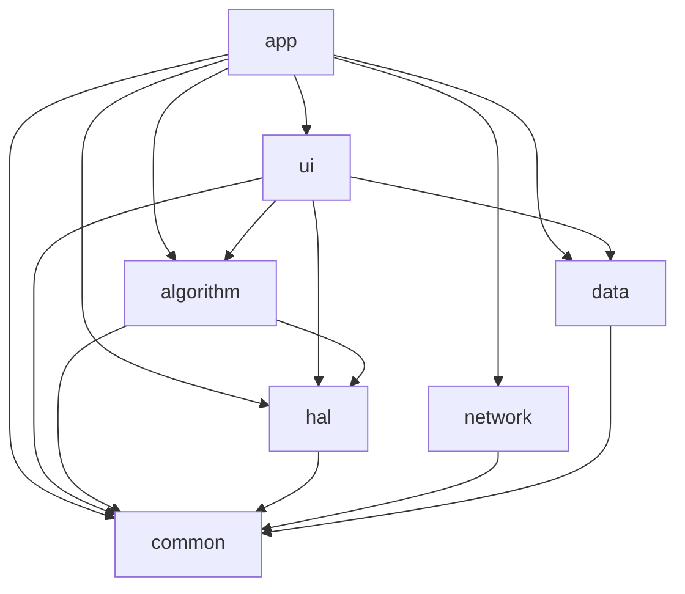

# qmake 工程配置文件

## 项目结构

```
defect-detection/
├── defect-detection.pro    # 根项目（subdirs）
├── config.pri              # 全局配置
└── src/
    ├── common/common.pro
    ├── data/data.pro
    ├── network/network.pro
    ├── hal/hal.pro
    ├── algorithm/algorithm.pro
    ├── ui/ui.pro
    └── app/app.pro
```

---

## 1. 根项目 `defect-detection.pro`

```
TEMPLATE = subdirs
CONFIG += ordered

SUBDIRS += \
    src/common \
    src/data \
    src/network \
    src/hal \
    src/algorithm \
    src/ui \
    src/app

src-data.depends = src-common
src-network.depends = src-common
src-hal.depends = src-common
src-algorithm.depends = src-common src-hal
src-ui.depends = src-common src-data src-hal src-algorithm
src-app.depends = src-common src-data src-network src-hal src-algorithm src-ui

src-common.subdir = src/common
src-data.subdir = src/data
src-network.subdir = src/network
src-hal.subdir = src/hal
src-algorithm.subdir = src/algorithm
src-ui.subdir = src/ui
src-app.subdir = src/app
```

---

## 2. 全局配置 `config.pri`

```
VERSION = 1.0.0
DEFINES += APP_VERSION=\"$$VERSION\"

CONFIG += c++17 warn_on
CONFIG -= debug_and_release

RELEASE {
    QMAKE_CXXFLAGS += -O2
    DEFINES += NDEBUG
}
DEBUG {
    DEFINES += DEBUG_MODE
    QMAKE_CXXFLAGS += -g
}

ROOT_DIR = $$PWD
SRC_DIR = $$ROOT_DIR/src
INCLUDE_DIR = $$ROOT_DIR/include
THIRD_PARTY_DIR = $$ROOT_DIR/third_party
EXTERNAL_DIR = $$ROOT_DIR/external

DESTDIR = $$ROOT_DIR/bin
OBJECTS_DIR = $$ROOT_DIR/build/obj/$$TARGET
MOC_DIR = $$ROOT_DIR/build/moc/$$TARGET
RCC_DIR = $$ROOT_DIR/build/rcc/$$TARGET
UI_DIR = $$ROOT_DIR/build/ui/$$TARGET

unix:!macx {
    CONFIG += link_pkgconfig
    PKGCONFIG += opencv4
}

win32 {
    OPENCV_DIR = C:/opencv/build
    INCLUDEPATH += $$OPENCV_DIR/include
    LIBS += -L$$OPENCV_DIR/x64/vc17/lib \
        -lopencv_core470 -lopencv_imgproc470 -lopencv_imgcodecs470 -lopencv_highgui470
}
```

---

## 3. 模块示例（以 `src/algorithm/algorithm.pro`）

```
include(../../config.pri)
TEMPLATE = lib
TARGET = algorithm
CONFIG += staticlib

INCLUDEPATH += $$SRC_DIR/common $$SRC_DIR/hal
SOURCES += \
    DetectorFactory.cpp \
    ScratchDetector.cpp \
    CrackDetector.cpp \
    ForeignDetector.cpp \
    DimensionDetector.cpp
HEADERS += \
    DetectorFactory.h \
    IDefectDetector.h \
    ScratchDetector.h \
    CrackDetector.h \
    ForeignDetector.h \
    DimensionDetector.h

LIBS += -L$$DESTDIR/lib -lcommon -lhal
```

其他模块依赖：
- `hal.pro` 依赖相机/IO SDK，链接顺序放在最后。
- `ui.pro` 依赖 `common`、`data`、`hal`、`algorithm`，开启 `QT += widgets charts`。
- `app.pro` 作为最终可执行，链接所有静态库。

---

## 4. 资源与翻译

```
RESOURCES += ../../resources/resources.qrc
TRANSLATIONS = ../../resources/translations/app_zh_CN.ts \
               ../../resources/translations/app_en_US.ts
```

---

## 5. 构建命令示例

```bash
qmake defect-detection.pro -r
make -j8
./bin/defect-detection
```

Windows：使用 Qt Creator 或 VS + Qt 插件导入 `.pro`，选择 Release 构建。

---

## 6. 模块依赖关系



---

## 7. 平台差异（静态库后缀）

```
win32 {
    LIB_SUFFIX = .lib
} else {
    LIB_SUFFIX = .a
}
PRE_TARGETDEPS += $$DESTDIR/lib/libcommon$$LIB_SUFFIX
```

或：

```
win32:PRE_TARGETDEPS += $$DESTDIR/lib/common.lib
unix:PRE_TARGETDEPS += $$DESTDIR/lib/libcommon.a
```
