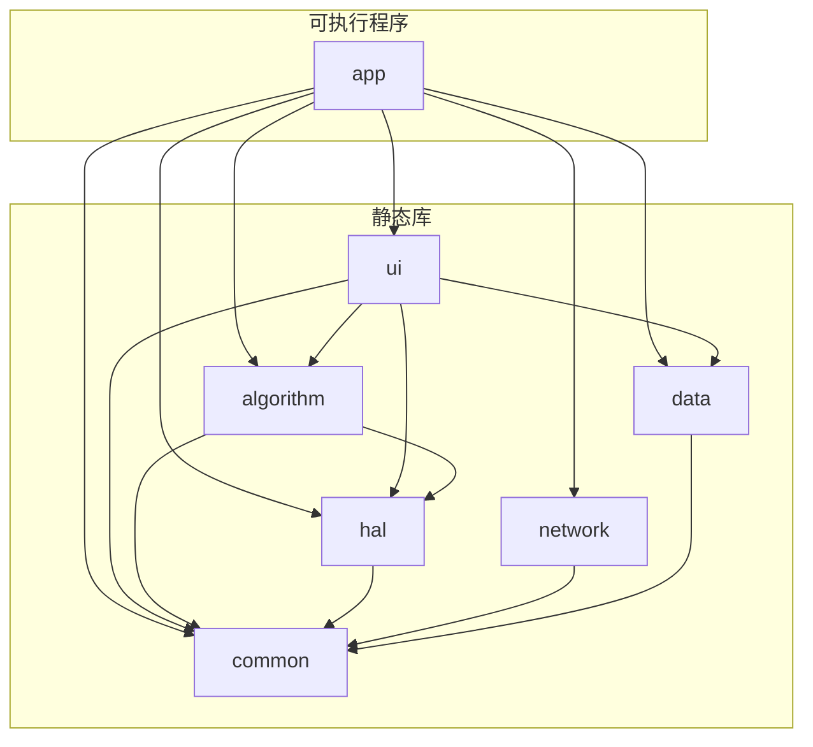

# qmake 工程配置文件

## 项目结构总览

```
defect-detection/
├── [defect-detection.pro](http://defect-detection.pro)          # 根项目文件
├── src/
│   ├── common/[common.pro](http://common.pro)         # 公共模块
│   ├── data/[data.pro](http://data.pro)             # 数据层
│   ├── network/[network.pro](http://network.pro)       # 网络层
│   ├── hal/[hal.pro](http://hal.pro)               # 硬件抽象层
│   ├── algorithm/[algorithm.pro](http://algorithm.pro)   # 算法层
│   ├── ui/[ui.pro](http://ui.pro)                 # 界面层
│   └── app/[app.pro](http://app.pro)               # 主程序
└── config.pri                    # 全局配置
```

---

## 1. 根项目文件 [`defect-detection.pro`](http://defect-detection.pro)

```
# =============================================================================
# 项目名称: 产品缺陷检测系统
# 构建系统: qmake (Qt 6.5+)
# =============================================================================

TEMPLATE = subdirs
CONFIG += ordered

# 按依赖顺序构建
SUBDIRS += \
    src/common \
    src/data \
    src/network \
    src/hal \
    src/algorithm \
    src/ui \
    src/app

# 显式依赖声明（可选，用于并行构建）
src-data.depends = src-common
src-network.depends = src-common
src-hal.depends = src-common
src-algorithm.depends = src-common src-hal
src-ui.depends = src-common src-data src-hal src-algorithm
src-app.depends = src-common src-data src-network src-hal src-algorithm src-ui

# SUBDIRS 名称映射
src-common.subdir = src/common
src-data.subdir = src/data
src-network.subdir = src/network
src-hal.subdir = src/hal
src-algorithm.subdir = src/algorithm
src-ui.subdir = src/ui
src-app.subdir = src/app
```

---

## 2. 全局配置 `config.pri`

```
# =============================================================================
# 全局配置文件 - 所有子项目共享
# =============================================================================

# ------------------ 版本信息 ------------------
VERSION = 1.0.0
DEFINES += APP_VERSION=\\\"$$VERSION\\\"

# ------------------ 编译器选项 ------------------
CONFIG += c++17
CONFIG += warn_on
CONFIG -= debug_and_release  # 避免 debug/release 子目录

# 编译优化
RELEASE {
    QMAKE_CXXFLAGS += -O2
    DEFINES += NDEBUG
}

DEBUG {
    DEFINES += DEBUG_MODE
    QMAKE_CXXFLAGS += -g
}

# ------------------ 目录定义 ------------------
ROOT_DIR = $$PWD
SRC_DIR = $$ROOT_DIR/src
INCLUDE_DIR = $$ROOT_DIR/include
THIRD_PARTY_DIR = $$ROOT_DIR/third_party
EXTERNAL_DIR = $$ROOT_DIR/external

# 构建输出目录
DESTDIR = $$ROOT_DIR/bin
OBJECTS_DIR = $$ROOT_DIR/build/obj/$$TARGET
MOC_DIR = $$ROOT_DIR/build/moc/$$TARGET
RCC_DIR = $$ROOT_DIR/build/rcc/$$TARGET
UI_DIR = $$ROOT_DIR/build/ui/$$TARGET

# ------------------ OpenCV 配置 ------------------
# 方式1: 系统安装 (pkg-config)
unix:!macx {
    CONFIG += link_pkgconfig
    PKGCONFIG += opencv4
}

# 方式2: 自定义路径
# OPENCV_DIR = $$EXTERNAL_DIR/opencv_prebuilt/linux-x64
# INCLUDEPATH += $$OPENCV_DIR/include/opencv4
# LIBS += -L$$OPENCV_DIR/lib \
#         -lopencv_core -lopencv_imgproc -lopencv_imgcodecs \
#         -lopencv_highgui -lopencv_dnn

# Windows 配置
win32 {
    OPENCV_DIR = C:/opencv/build
    INCLUDEPATH += $$OPENCV_DIR/include
    
    CONFIG(debug, debug|release) {
        LIBS += -L$$OPENCV_DIR/x64/vc16/lib \
                -lopencv_world460d
    } else {
        LIBS += -L$$OPENCV_DIR/x64/vc16/lib \
                -lopencv_world460
    }
}

# ------------------ 第三方库 ------------------
# spdlog (header-only)
INCLUDEPATH += $$THIRD_PARTY_DIR/spdlog/include

# nlohmann/json (header-only)
INCLUDEPATH += $$THIRD_PARTY_DIR/json/include

# libmodbus
unix {
    LIBS += -lmodbus
}
win32 {
    MODBUS_DIR = $$EXTERNAL_DIR/libmodbus
    INCLUDEPATH += $$MODBUS_DIR/include
    LIBS += -L$$MODBUS_DIR/lib -lmodbus
}

# ------------------ 项目模块路径 ------------------
INCLUDEPATH += $$SRC_DIR
INCLUDEPATH += $$INCLUDE_DIR
```

---

## 3. 公共模块 `src/common/[common.pro](http://common.pro)`

```
# =============================================================================
# common - 公共基础模块
# 职责: 类型定义、日志、工具函数、线程池、无锁队列
# 依赖: 无（最底层模块）
# =============================================================================

include(../../config.pri)

TEMPLATE = lib
TARGET = common
CONFIG += staticlib

QT += core
QT -= gui

# ------------------ 头文件 ------------------
HEADERS += \
    Types.h \
    Constants.h \
    ErrorCode.h \
    Logger.h \
    Utils.h \
    Singleton.h \
    ThreadPool.h \
    SPSCQueue.h \
    CircularBuffer.h \
    Timer.h

# ------------------ 源文件 ------------------
SOURCES += \
    Logger.cpp \
    Utils.cpp

# ------------------ 安装规则 ------------------
target.path = $$DESTDIR/lib
INSTALLS += target
```

---

## 4. 数据层 `src/data/[data.pro](http://data.pro)`

```
# =============================================================================
# data - 数据持久化层
# 职责: 数据库管理、文件存储、数据导出
# 依赖: common
# =============================================================================

include(../../config.pri)

TEMPLATE = lib
TARGET = data
CONFIG += staticlib

QT += core sql
QT -= gui

# ------------------ 依赖模块 ------------------
LIBS += -L$$DESTDIR/lib -lcommon
PRE_TARGETDEPS += $$DESTDIR/lib/libcommon.a

# ------------------ 头文件 ------------------
HEADERS += \
    DatabaseManager.h \
    repositories/IRepository.h \
    repositories/InspectionRepository.h \
    repositories/DefectRepository.h \
    repositories/ConfigRepository.h \
    storage/ImageStorage.h \
    storage/BackupManager.h \
    export/CSVExporter.h \
    export/ExcelExporter.h \
    export/ReportGenerator.h

# ------------------ 源文件 ------------------
SOURCES += \
    DatabaseManager.cpp \
    repositories/InspectionRepository.cpp \
    repositories/DefectRepository.cpp \
    repositories/ConfigRepository.cpp \
    storage/ImageStorage.cpp \
    storage/BackupManager.cpp \
    export/CSVExporter.cpp \
    export/ExcelExporter.cpp \
    export/ReportGenerator.cpp

# ------------------ 安装规则 ------------------
target.path = $$DESTDIR/lib
INSTALLS += target
```

---

## 5. 网络层 `src/network/[network.pro](http://network.pro)`

```
# =============================================================================
# network - 网络通信层
# 职责: HTTP 服务、WebSocket 推送、MES 对接
# 依赖: common
# =============================================================================

include(../../config.pri)

TEMPLATE = lib
TARGET = network
CONFIG += staticlib

QT += core network websockets
QT -= gui

# 可选: HTTP 服务器库
# LIBS += -lqhttpserver

# ------------------ 依赖模块 ------------------
LIBS += -L$$DESTDIR/lib -lcommon
PRE_TARGETDEPS += $$DESTDIR/lib/libcommon.a

# ------------------ 头文件 ------------------
HEADERS += \
    http/HttpServer.h \
    http/ApiRoutes.h \
    websocket/WSServer.h \
    mes/MESClient.h \
    mes/MESProtocol.h

# ------------------ 源文件 ------------------
SOURCES += \
    http/HttpServer.cpp \
    http/ApiRoutes.cpp \
    websocket/WSServer.cpp \
    mes/MESClient.cpp

# ------------------ 安装规则 ------------------
target.path = $$DESTDIR/lib
INSTALLS += target
```

---

## 6. 硬件抽象层 `src/hal/[hal.pro](http://hal.pro)`

```
# =============================================================================
# hal - 硬件抽象层
# 职责: 相机驱动、IO 控制、光源控制、PLC 通信
# 依赖: common
# =============================================================================

include(../../config.pri)

TEMPLATE = lib
TARGET = hal
CONFIG += staticlib

QT += core serialport
QT -= gui

# ------------------ 依赖模块 ------------------
LIBS += -L$$DESTDIR/lib -lcommon
PRE_TARGETDEPS += $$DESTDIR/lib/libcommon.a

# ------------------ 相机 SDK 配置 ------------------
# 海康相机 SDK
unix {
    HIK_SDK = /opt/MVS
    INCLUDEPATH += $$HIK_SDK/include
    LIBS += -L$$HIK_SDK/lib/64 -lMvCameraControl
    DEFINES += HAVE_HIK_SDK
}
win32 {
    HIK_SDK = "C:/Program Files (x86)/MVS"
    INCLUDEPATH += $$HIK_SDK/Development/Includes
    LIBS += -L$$HIK_SDK/Development/Libraries/win64 -lMvCameraControl
    DEFINES += HAVE_HIK_SDK
}

# 大恒相机 SDK (可选)
# DAHENG_SDK = /opt/Galaxy_camera
# INCLUDEPATH += $$DAHENG_SDK/inc
# LIBS += -L$$DAHENG_SDK/lib -lgxiapi
# DEFINES += HAVE_DAHENG_SDK

# ------------------ 头文件 ------------------
HEADERS += \
    camera/ICamera.h \
    camera/CameraFactory.h \
    camera/GigECamera.h \
    camera/USBCamera.h \
    camera/HikCamera.h \
    camera/DahengCamera.h \
    camera/FileCamera.h \
    io/IIOController.h \
    io/GPIOController.h \
    io/SerialIO.h \
    light/ILightController.h \
    light/SerialLightController.h \
    light/ModbusLightController.h \
    plc/IPLCClient.h \
    plc/ModbusTCPClient.h \
    plc/ModbusRTUClient.h \
    plc/SiemensS7Client.h \
    plc/MitsubishiMCClient.h

# ------------------ 源文件 ------------------
SOURCES += \
    camera/CameraFactory.cpp \
    camera/GigECamera.cpp \
    camera/USBCamera.cpp \
    camera/HikCamera.cpp \
    camera/DahengCamera.cpp \
    camera/FileCamera.cpp \
    io/GPIOController.cpp \
    io/SerialIO.cpp \
    light/SerialLightController.cpp \
    light/ModbusLightController.cpp \
    plc/ModbusTCPClient.cpp \
    plc/ModbusRTUClient.cpp \
    plc/SiemensS7Client.cpp \
    plc/MitsubishiMCClient.cpp

# ------------------ 安装规则 ------------------
target.path = $$DESTDIR/lib
INSTALLS += target
```

---

## 7. 算法层 `src/algorithm/[algorithm.pro](http://algorithm.pro)`

```
# =============================================================================
# algorithm - 算法引擎层
# 职责: 图像预处理、缺陷检测、DNN 推理、严重度评分
# 依赖: common, hal
# =============================================================================

include(../../config.pri)

TEMPLATE = lib
TARGET = algorithm
CONFIG += staticlib

QT += core
QT -= gui

# ------------------ 依赖模块 ------------------
LIBS += -L$$DESTDIR/lib -lcommon -lhal
PRE_TARGETDEPS += \
    $$DESTDIR/lib/libcommon.a \
    $$DESTDIR/lib/libhal.a

# OpenCV 已在 config.pri 中配置

# ------------------ 头文件 ------------------
HEADERS += \
    IDefectDetector.h \
    DetectorFactory.h \
    detectors/ScratchDetector.h \
    detectors/CrackDetector.h \
    detectors/ForeignDetector.h \
    detectors/DimensionDetector.h \
    dnn/DnnDetector.h \
    dnn/YoloDetector.h \
    dnn/ModelManager.h \
    scoring/DefectScorer.h \
    scoring/SeverityConfig.h \
    preprocess/ImagePreprocessor.h \
    preprocess/ROIManager.h \
    preprocess/Calibration.h \
    postprocess/NMSFilter.h \
    postprocess/DefectMerger.h

# ------------------ 源文件 ------------------
SOURCES += \
    DetectorFactory.cpp \
    detectors/ScratchDetector.cpp \
    detectors/CrackDetector.cpp \
    detectors/ForeignDetector.cpp \
    detectors/DimensionDetector.cpp \
    dnn/DnnDetector.cpp \
    dnn/YoloDetector.cpp \
    dnn/ModelManager.cpp \
    scoring/DefectScorer.cpp \
    preprocess/ImagePreprocessor.cpp \
    preprocess/ROIManager.cpp \
    preprocess/Calibration.cpp \
    postprocess/NMSFilter.cpp \
    postprocess/DefectMerger.cpp

# ------------------ 安装规则 ------------------
target.path = $$DESTDIR/lib
INSTALLS += target
```

---

## 8. 界面层 `src/ui/[ui.pro](http://ui.pro)`

```
# =============================================================================
# ui - 用户界面层
# 职责: Qt6 GUI、自定义控件、对话框、视图
# 依赖: common, data, hal, algorithm
# =============================================================================

include(../../config.pri)

TEMPLATE = lib
TARGET = ui
CONFIG += staticlib

QT += core gui widgets charts

# ------------------ 依赖模块 ------------------
LIBS += -L$$DESTDIR/lib -lcommon -ldata -lhal -lalgorithm
PRE_TARGETDEPS += \
    $$DESTDIR/lib/libcommon.a \
    $$DESTDIR/lib/libdata.a \
    $$DESTDIR/lib/libhal.a \
    $$DESTDIR/lib/libalgorithm.a

# ------------------ 头文件 ------------------
HEADERS += \
    MainWindow.h \
    widgets/ImageView.h \
    widgets/ROIEditor.h \
    widgets/SeverityBar.h \
    widgets/ParamPanel.h \
    widgets/ResultCard.h \
    dialogs/SettingsDialog.h \
    dialogs/CalibrationDialog.h \
    dialogs/LoginDialog.h \
    dialogs/AboutDialog.h \
    views/DetectView.h \
    views/StatisticsView.h \
    views/HistoryView.h \
    views/SPCView.h \
    models/DefectTableModel.h \
    models/HistoryTableModel.h

# ------------------ 源文件 ------------------
SOURCES += \
    MainWindow.cpp \
    widgets/ImageView.cpp \
    widgets/ROIEditor.cpp \
    widgets/SeverityBar.cpp \
    widgets/ParamPanel.cpp \
    widgets/ResultCard.cpp \
    dialogs/SettingsDialog.cpp \
    dialogs/CalibrationDialog.cpp \
    dialogs/LoginDialog.cpp \
    dialogs/AboutDialog.cpp \
    views/DetectView.cpp \
    views/StatisticsView.cpp \
    views/HistoryView.cpp \
    views/SPCView.cpp \
    models/DefectTableModel.cpp \
    models/HistoryTableModel.cpp

# ------------------ UI 文件 ------------------
FORMS += \
    MainWindow.ui \
    dialogs/SettingsDialog.ui \
    dialogs/CalibrationDialog.ui \
    dialogs/LoginDialog.ui \
    dialogs/AboutDialog.ui

# ------------------ 资源文件 ------------------
RESOURCES += \
    ../../resources/icons.qrc \
    ../../resources/styles.qrc \
    ../../resources/translations.qrc

# ------------------ 翻译文件 ------------------
TRANSLATIONS += \
    ../../resources/translations/app_zh_CN.ts \
    ../../resources/translations/app_en_US.ts

# ------------------ 安装规则 ------------------
target.path = $$DESTDIR/lib
INSTALLS += target
```

---

## 9. 主程序 `src/app/[app.pro](http://app.pro)`

```
# =============================================================================
# app - 主应用程序
# 职责: 程序入口、业务流程编排、系统协调
# 依赖: 全部模块
# =============================================================================

include(../../config.pri)

TEMPLATE = app
TARGET = DefectDetection

QT += core gui widgets charts sql network websockets serialport

# 控制台输出（调试用）
# CONFIG += console

# Windows 图标
win32:RC_ICONS = ../../resources/icons/app.ico

# macOS 图标
macx:ICON = ../../resources/icons/app.icns

# ------------------ 依赖模块 ------------------
LIBS += -L$$DESTDIR/lib \
    -lui -lalgorithm -lhal -lnetwork -ldata -lcommon

PRE_TARGETDEPS += \
    $$DESTDIR/lib/libcommon.a \
    $$DESTDIR/lib/libdata.a \
    $$DESTDIR/lib/libnetwork.a \
    $$DESTDIR/lib/libhal.a \
    $$DESTDIR/lib/libalgorithm.a \
    $$DESTDIR/lib/libui.a

# ------------------ 头文件 ------------------
HEADERS += \
    DetectPipeline.h \
    FlowController.h \
    ConfigManager.h \
    SystemWatchdog.h \
    ResultAggregator.h \
    ConfigValidator.h

# ------------------ 源文件 ------------------
SOURCES += \
    main.cpp \
    DetectPipeline.cpp \
    FlowController.cpp \
    ConfigManager.cpp \
    SystemWatchdog.cpp \
    ResultAggregator.cpp \
    ConfigValidator.cpp

# ------------------ 部署规则 ------------------
target.path = $$DESTDIR
INSTALLS += target

# 配置文件部署
config.files = ../../config/*
config.path = $$DESTDIR/config
INSTALLS += config

# 模型文件部署
models.files = ../../models/*
models.path = $$DESTDIR/models
INSTALLS += models
```

---

## 10. 构建命令速查

```bash
# -------------------- Linux/macOS --------------------
# 配置项目
mkdir -p build && cd build
qmake ../[defect-detection.pro](http://defect-detection.pro) CONFIG+=release

# 编译 (并行)
make -j$(nproc)

# 安装到 bin 目录
make install

# 清理
make clean
make distclean

# -------------------- Windows (MSVC) --------------------
# 配置项目
mkdir build && cd build
qmake ..\[defect-detection.pro](http://defect-detection.pro) CONFIG+=release

# 编译
nmake
# 或使用 jom 并行编译
jom -j8

# -------------------- Qt Creator --------------------
# 直接打开 [defect-detection.pro](http://defect-detection.pro) 即可
```

---

## 11. 模块依赖关系图



---

## 12. Windows 静态库后缀适配

如果在 Windows 上构建，需要修改 `PRE_TARGETDEPS`：

```
# config.pri 中添加平台判断
win32 {
    LIB_SUFFIX = .lib
} else {
    LIB_SUFFIX = .a
}

# 各模块中使用
PRE_TARGETDEPS += $$DESTDIR/lib/libcommon$$LIB_SUFFIX
```

或者使用更简洁的写法：

```
win32:PRE_TARGETDEPS += $$DESTDIR/lib/common.lib
unix:PRE_TARGETDEPS += $$DESTDIR/lib/libcommon.a
```