# 功能时序

## 1. 系统启动时序

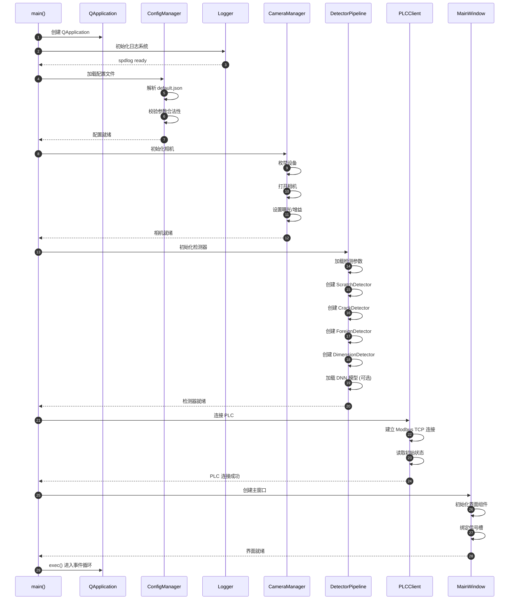

---

## 2. 单次检测时序

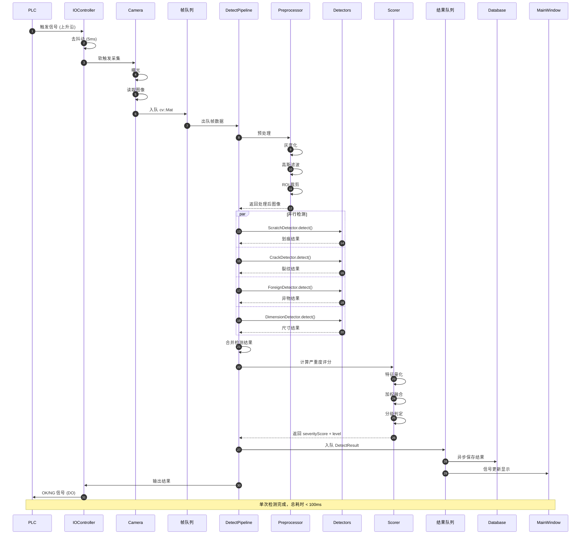

---

## 3. 图像采集线程时序

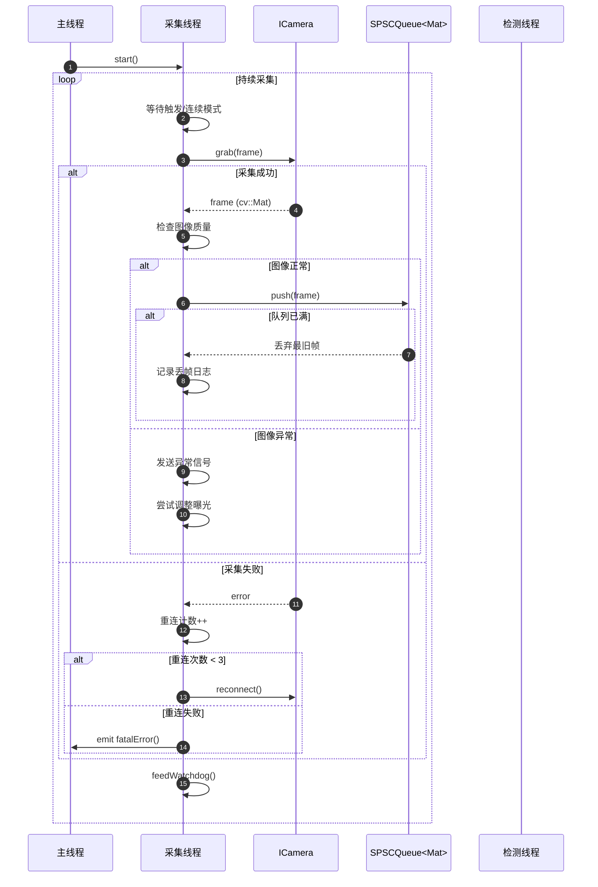

---

## 4. 检测线程时序

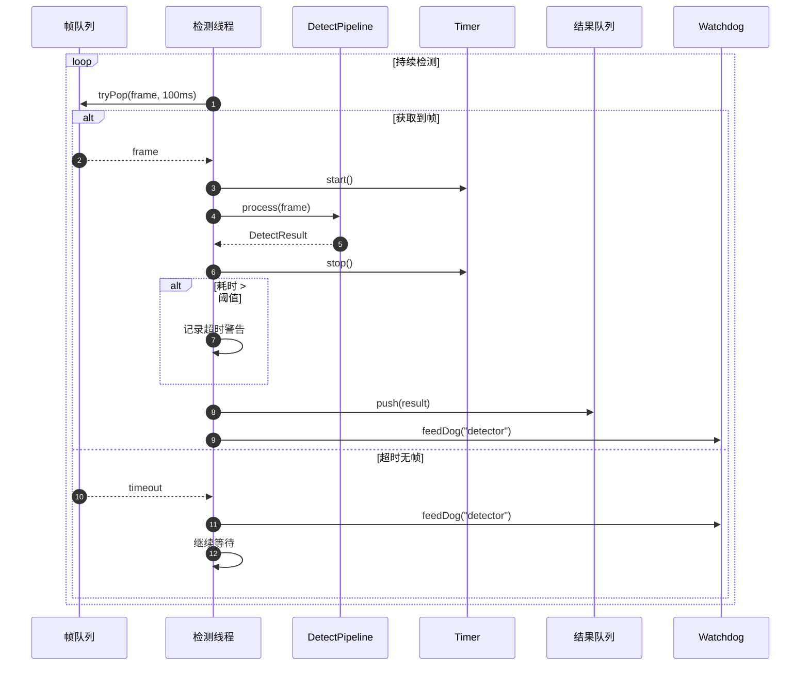

---

## 5. 划痕检测算法时序

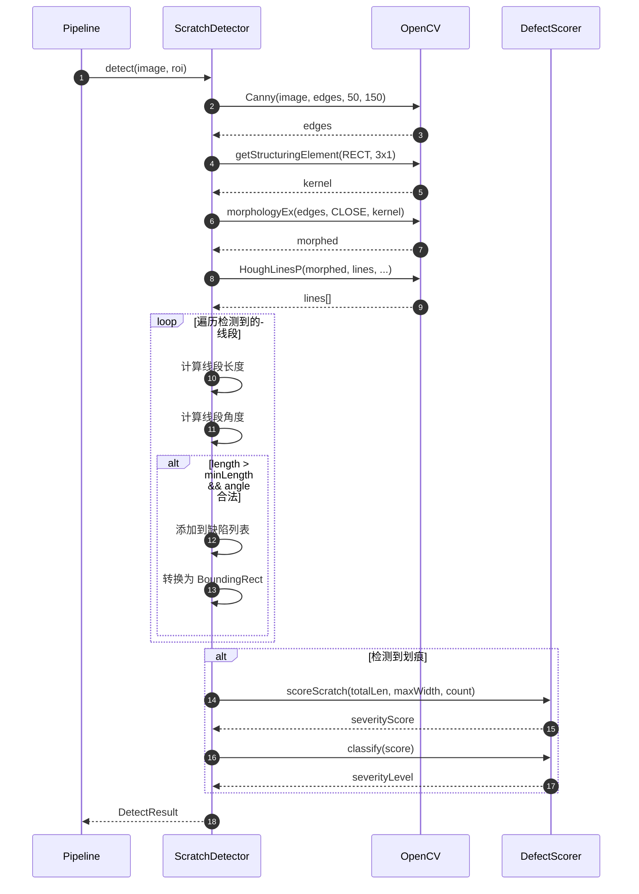

---

## 6. 裂纹检测算法时序

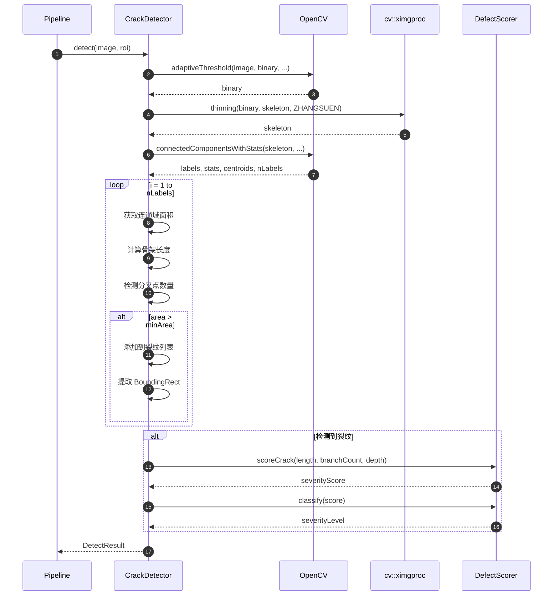

---

## 7. DNN 推理时序

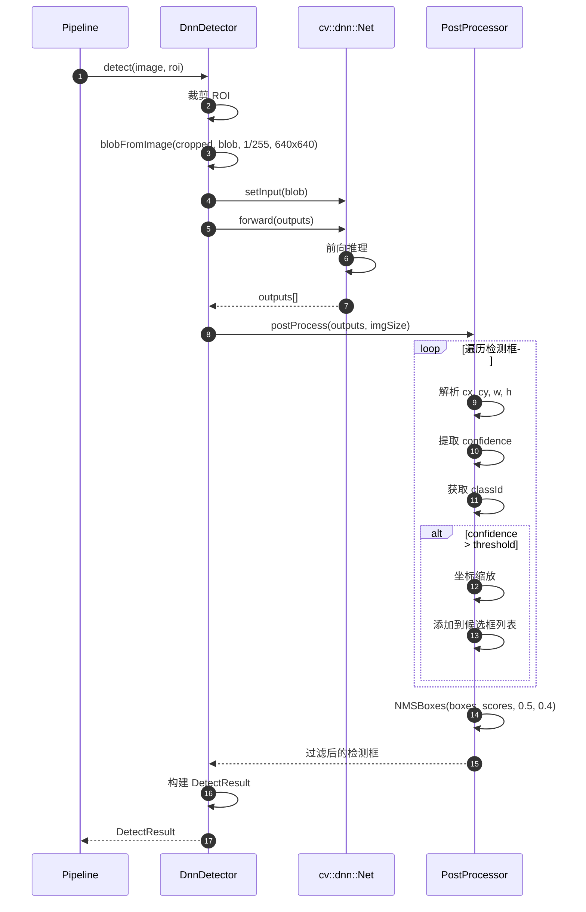

---

## 8. PLC 通信时序

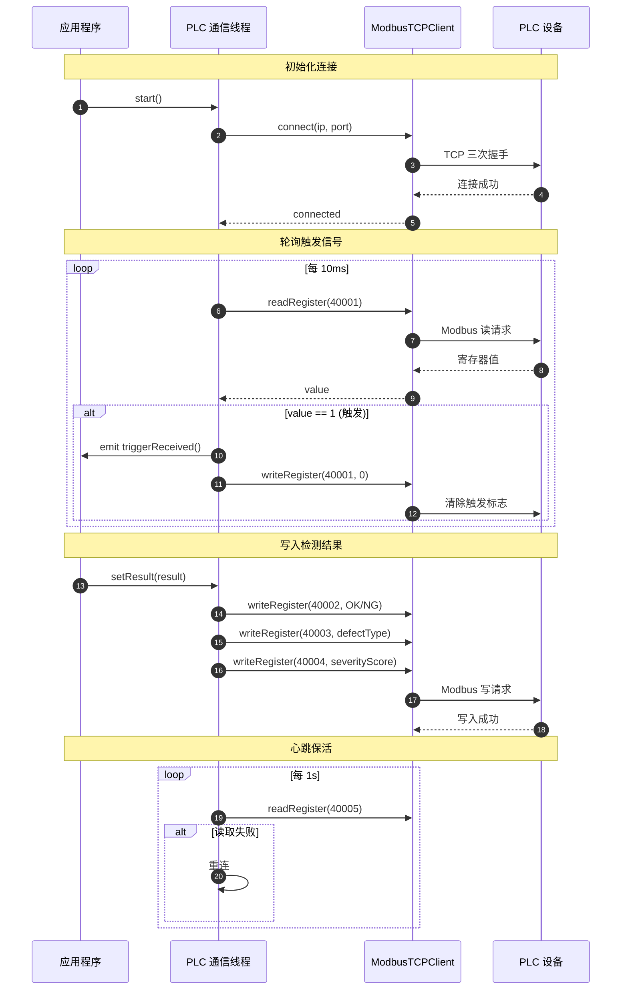

---

## 9. 配置热加载时序

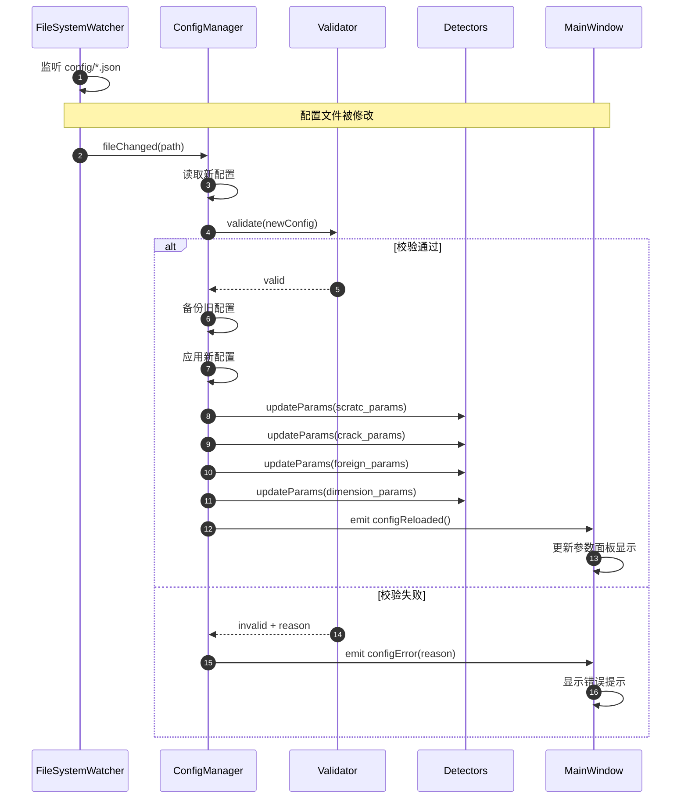

---

## 10. 异常恢复时序

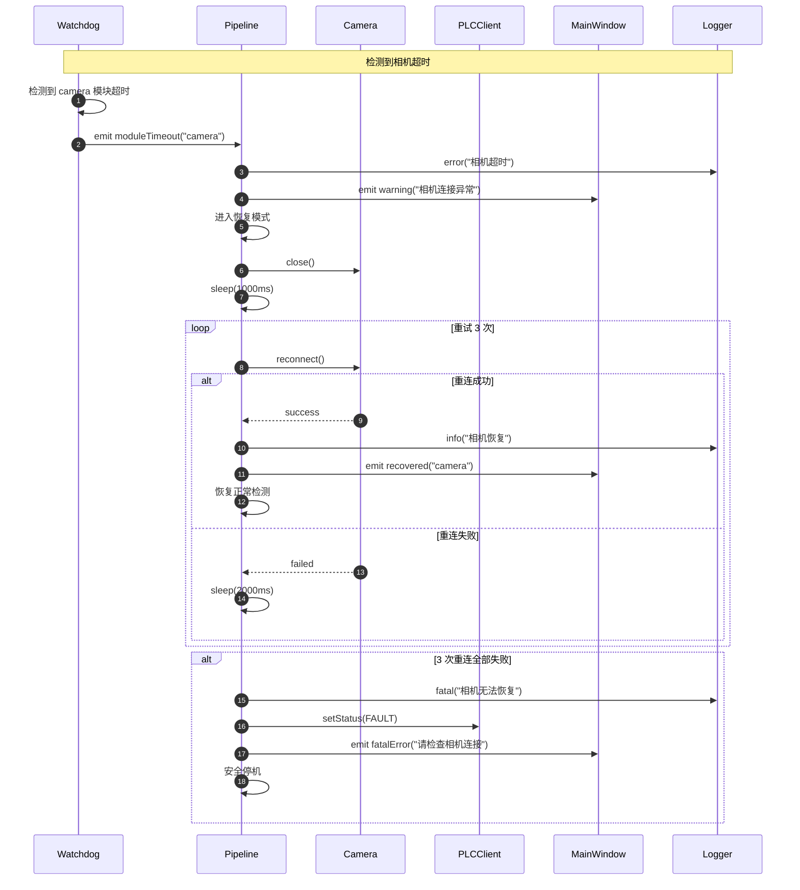

---

## 11. 系统关闭时序

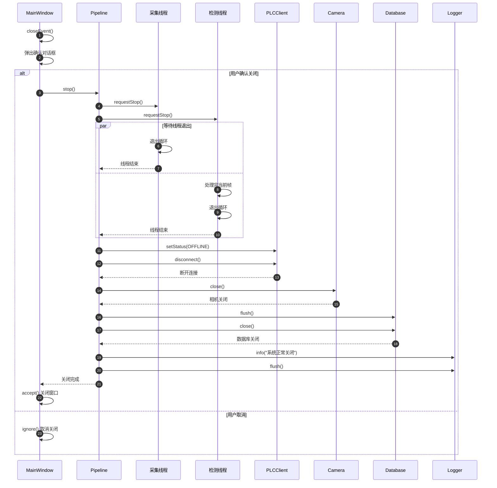

---

## 12. 多工位协同时序

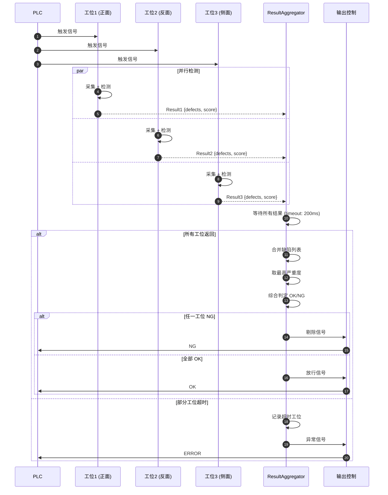