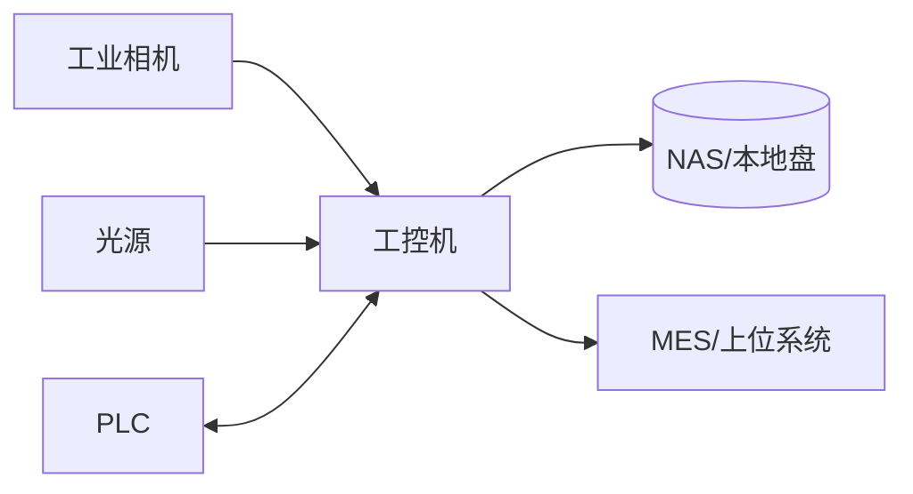
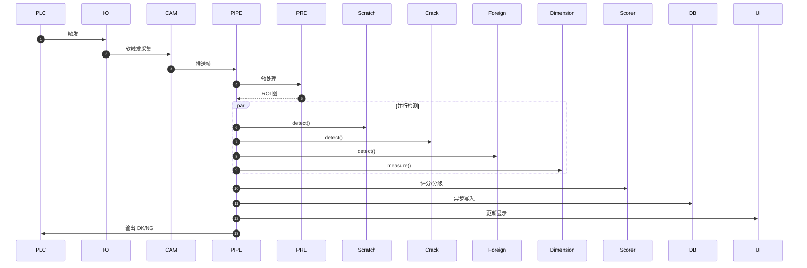

# 基于 QT6 + OpenCV 4.6 实现产品缺陷检测

> 定位：工业产线实时缺陷检测解决方案，覆盖划痕、裂纹、异物、尺寸偏差四类缺陷，目标单件节拍 ≤ 100ms。

---

## 1. 系统概述

### 1.1 检测目标

| 缺陷类型 | 描述 | 检测难度 | 主要特征 |
| --- | --- | --- | --- |
| 划痕 | 细长线性痕迹，灰度突变 | 中 | 长条、边缘强、方向性 |
| 裂纹 | 不规则分叉裂纹 | 高 | 分支、角点、低对比 |
| 异物 | 灰尘、颗粒、油污等附着物 | 中 | 面积小、亮度突变 |
| 尺寸偏差 | 外形/孔径超公差 | 低 | 轮廓、边长、角度 |

### 1.2 性能指标
- 单件检测节拍：P95 ≤ 100ms，P99 ≤ 120ms。
- 漏检率 < 0.1%，误检率 < 1%。
- 支持分辨率：720p~2K；平台：x86_64 / aarch64（RK3399）。

### 1.3 验收测试
- 节拍：连续 1000 次统计 P50/P95/P99/Max。
- 漏检：Golden Sample 100 片 × 10 轮，漏检 ≤ 1 次。
- 误检：OK 样本 100 片 × 10 轮，误报 ≤ 10 次。
- 稳定性：72h 无崩溃，内存涨幅 < 10MB/h。

---

## 2. 硬件架构



- 相机：GigE/USB，支持外触发；曝光/增益可远程设置。
- 光源：分通道可调亮度，IO 控制延时可配置。
- 触发：PLC 上升沿 → IO 去抖动 5ms → 相机软触发。

---

## 3. 软件架构

- **应用层**：`DetectPipeline`、`FlowController`、`ConfigManager`、`SystemWatchdog`。
- **算法层**：`ImagePreprocessor`、`Scratch/Crack/Foreign/DimensionDetector`、`DefectScorer`、可选 `DnnDetector`。
- **HAL 层**：`ICamera`、`ILightController`、`IIOController`、`PLCClient`（Modbus/S7/MC 可扩展）。
- **数据层**：`DatabaseManager`（SQLite/MySQL）、`InspectionDAO`、`DefectDAO`、`AuditLogger`、`DataExporter`。
- **网络层**：`RESTServer`、`WebSocketServer`、`MESClient`。

---

## 4. 核心流程

### 4.1 启动流程
1. 读取配置并校验（默认值回填）。
2. 初始化日志 → 相机 → 检测器 → PLC → UI。
3. 进入事件循环，开启采集/检测线程。

### 4.2 单次检测时序（简版）



---

## 5. 预处理流程

- 灰度化 → 高斯/双边滤波（自适应核大小） → CLAHE 均衡 → ROI 裁剪 → 尺寸标准化。
- 可配置项：滤波类型、核大小、CLAHE clipLimit、ROI 坐标。

---

## 6. 检测算法

### 6.1 划痕 (ScratchDetector)
- Canny 边缘 → 形态学细化 → HoughLinesP → 过滤长度/角度/对比度。
- 关键参数：`canny_low/high`、`min_length`、`max_gap`、`min_contrast`。

### 6.2 裂纹 (CrackDetector)
- Top-hat 提升暗纹理 → 自适应阈值 → 细化 → 连通域 + 骨架分支计数。
- 关键参数：`min_area`、`max_area`、`branch_threshold`、`thin_iter`。

### 6.3 异物 (ForeignDetector)
- 背景建模/光照校正 → 高通滤波 → 连通域筛选（面积/圆度/偏心率）。
- 关键参数：`min_area`、`max_area`、`min_circularity`、`max_aspect_ratio`。

### 6.4 尺寸 (DimensionDetector)
- Sobel/Scharr 边缘 → 轮廓提取 → 最小外接矩形/圆 → 像素-物理换算。
- 关键参数：`pixel_per_mm`、`length_tol_mm`、`width_tol_mm`、`angle_tol_deg`。

### 6.5 DNN 可选流程
- 使用 YOLOv8/MobileNet-SSD 推理，输出 bbox + conf；
- 与传统算法结果做 NMS/并集，优先取高置信度。

---

## 7. 严重度评分

```text
severity_score = w1*norm_len + w2*norm_area + w3*contrast + w4*branch
等级：
0-20 轻微，20-60 中等，60-100 严重（可配置）
```

- 每类缺陷可定制权重；尺寸偏差按公差百分比换算得分。
- 输出：`severity_score`（0~100）+ `severity_level`（None/Minor/Moderate/Severe）。

---

## 8. 性能优化

- 采集/检测/存储 三线程并行，`SPSCQueue<cv::Mat>` 传递帧。
- 预分配缓冲，避免频繁 new/delete；循环使用 `cv::UMat`（如启用 OpenCL）。
- 使用 ROI 处理与降采样；可配置跳帧比率用于压力测试。
- 统计每阶段耗时（采集/预处理/检测/评分/存储），写入日志与监控。

---

## 9. 产线集成

### 9.1 PLC 映射（示例 Modbus）

| 地址 | 方向 | 含义 |
| --- | --- | --- |
| 40001 | 输入 | 触发信号 | 
| 40002 | 输出 | 结果：0=OK,1=NG,2=ERROR |
| 40003 | 输出 | 缺陷类型 bitmask |
| 40004 | 输出 | 严重度分数（0-1000，放大10倍） |

### 9.2 MES/接口
- REST API：`/api/v1/inspection/{id}` 查询，`/api/v1/inspections` 列表，`/api/v1/system/control` 控制。
- WebSocket 推送：`inspection_result`、`alarm`、`heartbeat`。
- 数据持久化：SQLite 默认，支持切换 MySQL/PostgreSQL。

---

## 10. 可靠性与运维

- **看门狗**：相机/PLC 心跳、线程存活、队列堆积阈值。
- **日志**：spdlog 按日滚动，保留 7~30 天；错误级别触发报警。
- **配置管理**：JSON 热更新，失败回滚；配置历史存档。
- **健康检查**：`/healthz` 返回相机/PLC/DB 状态与版本号。

---

## 11. 验收与样本管理

- Golden Sample：OK 10~20 片；缺陷样本轻/中/重各 3 片；尺寸边界样本 ±5 片。
- 培训：操作员 4h（操作/点检），设备员 8h（参数/维护），工程师 16h（原理/调试）。

---

## 12. 版本与路线图

| 版本 | 内容 |
| --- | --- |
| v1.0 | 基础检测 + PLC + SQLite |
| v1.1 | DNN 支持 + WebSocket 推送 |
| v1.2 | 严重度评分体系 + SPC 统计 |
| v1.3 | 多工位聚合 + 运维/健康检查 |
