# 基于QT6+OpenCV4.6实现产品缺陷值检测

> **项目定位**：基于 QT6 + OpenCV 4.6 构建流水线产品缺陷检测系统，支持划痕、裂纹、异物、尺寸偏差四类缺陷的实时检测与判定。
> 

---

## 1. 系统概述

### 1.1 检测目标

| 缺陷类型 | 描述 | 检测难度 |
| --- | --- | --- |
| **划痕** | 产品表面线性损伤，通常呈细长条状 | ⭐⭐ |
| **裂纹** | 材料断裂形成的不规则纹路，可能分叉 | ⭐⭐⭐ |
| **异物** | 表面附着的外来物质（灰尘、颗粒、污渍） | ⭐⭐ |
| **尺寸偏差** | 产品外形尺寸超出公差范围 | ⭐ |

### 1.2 性能指标

- **检测节拍**：≤ 100ms/件（含采集 + 处理 + 判定）
- **漏检率**：< 0.1%
- **误检率**：< 1%
- **分辨率支持**：720p ~ 2K
- **运行环境**：x86_64 / aarch64（如 RK3399）

### 1.3 性能测试规范

> ⚠️ **验收前必须完成以下测试，并形成测试报告**
> 

| 测试项 | 测试方法 | 通过标准 | 测试样本 |
| --- | --- | --- | --- |
| **节拍测试** | 连续运行 1000 次，统计耗时 | P95 ≤ 100ms, P99 ≤ 120ms | 随机生产样本 |
| **漏检率测试** | Golden Sample 100 片 × 10 轮 | 漏检次数 ≤ 1 次 (0.1%) | 已标定缺陷样本 |
| **误检率测试** | OK 样本 100 片 × 10 轮 | 误报次数 ≤ 10 次 (1%) | 合格品样本 |
| **稳定性测试** | 连续运行 72 小时 | 无崩溃、内存泄漏 < 10MB/h | 混合样本循环 |

```cpp
// 节拍统计工具类
class PerformanceProfiler {
public:
    void recordCycleTime(double ms) {
        std::lock_guard<std::mutex> lock(m_mutex);
        m_cycleTimes.push_back(ms);
    }
    
    struct Statistics {
        double avg, p50, p95, p99, max;
        int count;
    };
    
    Statistics getStatistics() const {
        std::lock_guard<std::mutex> lock(m_mutex);
        auto sorted = m_cycleTimes;
        std::sort(sorted.begin(), sorted.end());
        
        int n = sorted.size();
        return {
            .avg = std::accumulate(sorted.begin(), sorted.end(), 0.0) / n,
            .p50 = sorted[n * 0.50],
            .p95 = sorted[n * 0.95],
            .p99 = sorted[n * 0.99],
            .max = sorted.back(),
            .count = n
        };
    }
    
private:
    mutable std::mutex m_mutex;
    std::vector<double> m_cycleTimes;
};
```

---

## 2. 硬件架构

### 2.1 系统拓扑

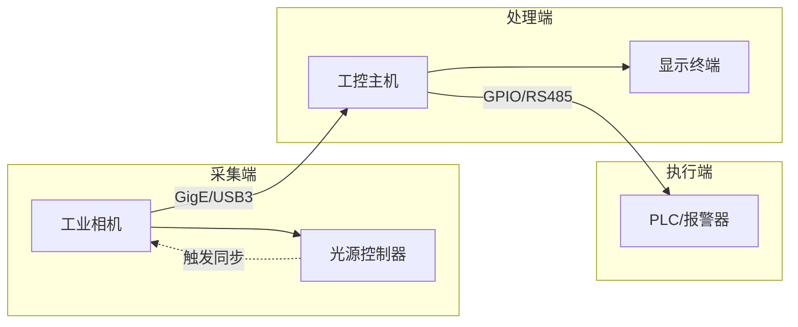

### 2.2 硬件选型建议

| 组件 | 推荐规格 | 说明 |
| --- | --- | --- |
| **工业相机** | 500万像素，全局快门，GigE | 海康/大恒/Basler |
| **镜头** | 定焦 12mm ~ 25mm，低畸变 | 视野覆盖产品区域 |
| **光源** | 条形光/环形光/背光，可调亮度 | 根据缺陷类型选择 |
| **工控主机** | i5 以上 / 16GB RAM / SSD | 或 RK3399 嵌入式方案 |
| **触发器** | 光电传感器 + IO 板卡 | 流水线同步触发 |

### 2.3 光源方案

| 缺陷类型 | 推荐光源 | 原理 |
| --- | --- | --- |
| 划痕/裂纹 | **低角度侧光** | 凸显表面微小起伏 |
| 异物 | **同轴光/环形光** | 均匀照明，突出色差 |
| 尺寸测量 | **背光** | 清晰轮廓边缘 |

---

## 3. 软件架构

### 3.1 模块划分

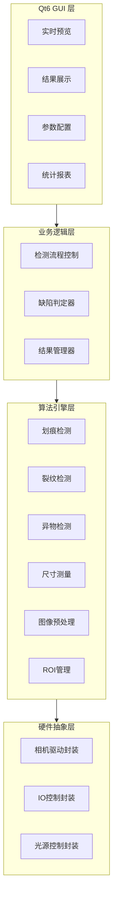

### 3.2 线程模型

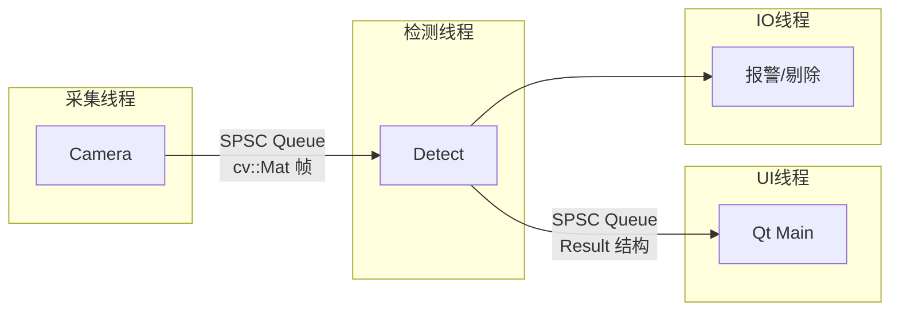

**关键设计**：

- 采集线程与检测线程通过 **SPSC 无锁队列** 解耦，避免帧丢失
- UI 刷新频率可降采（如 10 FPS），检测线程全速运行
- IO 控制独立线程，防止阻塞检测流程

<aside>
⚠️

**cv::Mat 跨线程安全注意事项**

`cv::Mat` 默认使用引用计数的浅拷贝，跨线程传递时必须使用 `.clone()` 进行深拷贝，否则会导致数据竞争！

```cpp
// ❌ 错误：浅拷贝，多线程访问同一块内存
void AcquisitionThread::onFrameGrabbed(const cv::Mat& frame) {
m_queue.push(frame);  // 危险！
}
// ✅ 正确：深拷贝，每个线程独立内存
void AcquisitionThread::onFrameGrabbed(const cv::Mat& frame) {
m_queue.push(frame.clone());  // 安全
}
```

</aside>

### 3.3 核心类设计

<aside>
⚠️

**接口类必须声明虚析构函数**

所有抽象基类必须包含 `virtual ~ClassName() = default;`，否则通过基类指针删除派生类对象时会导致**内存泄漏**和**未定义行为**。

</aside>

```cpp
// 相机抽象接口
class ICamera {
public:
    virtual ~ICamera() = default;  // ⚠️ 必须添加虚析构函数
    virtual bool open(const CameraConfig& cfg) = 0;
    virtual bool grab(cv::Mat& frame) = 0;
    virtual void close() = 0;
};

// 检测器基类
class IDefectDetector {
public:
    virtual ~IDefectDetector() = default;  // ⚠️ 必须添加虚析构函数
    virtual void setParams(const QVariantMap& params) = 0;
    virtual DetectResult detect(const cv::Mat& image, const cv::Rect& roi) = 0;
    virtual QString name() const = 0;
};

// 检测结果
struct DetectResult {
    bool hasDefect = false;
    QString defectType;        // "scratch" | "crack" | "foreign" | "dimension"
    double confidence = 0.0;   // 0.0 ~ 1.0
    std::vector<cv::Rect> regions;  // 缺陷区域
    QVariantMap details;       // 附加信息（如尺寸值）
    
    // 严重度评分（详见 4.6 节）
    double severityScore = 0.0;
    SeverityLevel severityLevel = SeverityLevel::None;
    QString severityLabel;
};

// 检测流水线
class DetectPipeline : public QObject {
    Q_OBJECT
public:
    void addDetector(std::shared_ptr<IDefectDetector> detector);
    void setROI(const cv::Rect& roi);
    DetectResult process(const cv::Mat& frame);
signals:
    void resultReady(const DetectResult& result);
};
```

---

## 4. 算法设计

### 4.1 图像预处理流程

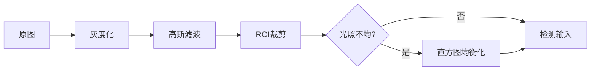

```cpp
cv::Mat preprocess(const cv::Mat& src, const cv::Rect& roi) {
    cv::Mat gray, blurred, equalized;
    cv::cvtColor(src, gray, cv::COLOR_BGR2GRAY);
    cv::GaussianBlur(gray, blurred, cv::Size(3, 3), 0);
    cv::Mat cropped = blurred(roi);
    // cv::equalizeHist(cropped, equalized);  // 光照不均时启用
    return cropped;
}
```

### 4.2 划痕检测

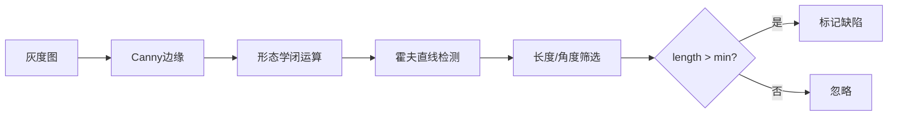

```cpp
DetectResult ScratchDetector::detect(const cv::Mat& image, const cv::Rect& roi) {
    DetectResult result;
    result.defectType = "scratch";
    
    // ⚠️ 输入校验：防止空图像或无效 ROI 导致崩溃
    if (image.empty()) {
        LOG_WARN("ScratchDetector: 输入图像为空");
        return result;
    }
    
    // ROI 边界检查，防止越界访问
    cv::Rect safeRoi = roi & cv::Rect(0, 0, image.cols, image.rows);
    if (safeRoi.empty()) {
        LOG_WARN("ScratchDetector: ROI 无效或超出图像边界");
        return result;
    }
    
    cv::Mat cropped = image(safeRoi);
    cv::Mat edges, morphed;
    
    try {
        cv::Canny(cropped, edges, m_cannyLow, m_cannyHigh);
        
        cv::Mat kernel = cv::getStructuringElement(cv::MORPH_RECT, cv::Size(3, 1));
        cv::morphologyEx(edges, morphed, cv::MORPH_CLOSE, kernel);
        
        std::vector<cv::Vec4i> lines;
        cv::HoughLinesP(morphed, lines, 1, CV_PI/180, 30, m_minLength, m_maxGap);
        
        for (const auto& line : lines) {
            double length = cv::norm(cv::Point(line[0], line[1]) - cv::Point(line[2], line[3]));
            if (length > m_minLength) {
                result.hasDefect = true;
                cv::Rect lineRect = lineToRect(line);
                // 转换回原图坐标
                lineRect.x += safeRoi.x;
                lineRect.y += safeRoi.y;
                result.regions.push_back(lineRect);
            }
        }
    } catch (const cv::Exception& e) {
        LOG_ERROR("ScratchDetector: OpenCV 异常 - {}", e.what());
    }
    
    return result;
}
```

**可调参数**：

| 参数 | 默认值 | 说明 |
| --- | --- | --- |
| `cannyLow` | 50 | Canny 低阈值 |
| `cannyHigh` | 150 | Canny 高阈值 |
| `minLength` | 20 px | 最小划痕长度 |
| `maxGap` | 10 px | 线段最大断裂间隙 |

### 4.3 裂纹检测

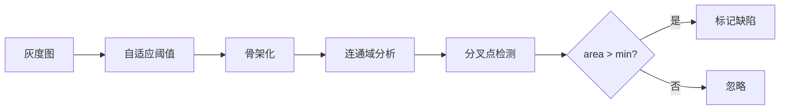

```cpp
DetectResult CrackDetector::detect(const cv::Mat& image, const cv::Rect& roi) {
    DetectResult result;
    result.defectType = "crack";
    
    // 输入校验
    if (image.empty()) {
        LOG_WARN("CrackDetector: 输入图像为空");
        return result;
    }
    
    cv::Rect safeRoi = roi & cv::Rect(0, 0, image.cols, image.rows);
    if (safeRoi.empty()) {
        LOG_WARN("CrackDetector: ROI 无效");
        return result;
    }
    
    cv::Mat cropped = image(safeRoi);
    cv::Mat binary, skeleton;
    
    try {
        // 自适应阈值二值化
        cv::adaptiveThreshold(cropped, binary, 255, 
            cv::ADAPTIVE_THRESH_GAUSSIAN_C, cv::THRESH_BINARY_INV, 
            m_adaptiveBlockSize, m_adaptiveC);
        
        // 骨架化（需要 opencv_contrib 的 ximgproc 模块）
        cv::ximgproc::thinning(binary, skeleton, cv::ximgproc::THINNING_ZHANGSUEN);
        
        // 连通域分析
        cv::Mat labels, stats, centroids;
        int nLabels = cv::connectedComponentsWithStats(skeleton, labels, stats, centroids);
        
        // 分析每个连通域
        for (int i = 1; i < nLabels; i++) {
            int area = [stats.at](http://stats.at)<int>(i, cv::CC_STAT_AREA);
            
            if (area > m_minArea) {
                result.hasDefect = true;
                
                // 提取边界框
                cv::Rect bbox(
                    [stats.at](http://stats.at)<int>(i, cv::CC_STAT_LEFT) + safeRoi.x,
                    [stats.at](http://stats.at)<int>(i, cv::CC_STAT_TOP) + safeRoi.y,
                    [stats.at](http://stats.at)<int>(i, cv::CC_STAT_WIDTH),
                    [stats.at](http://stats.at)<int>(i, cv::CC_STAT_HEIGHT)
                );
                result.regions.push_back(bbox);
                
                // 计算裂纹长度（骨架像素数）
                double length = static_cast<double>(area);
                
                // 检测分叉点数量（3x3邻域内有3+个连接点）
                int branchCount = countBranchPoints(skeleton, labels, i);
                
                // 估算深度（基于骨架宽度，需要原始二值图）
                double depth = estimateDepth(binary, labels, i);
                
                // 累计特征用于严重度评分
                result.details["totalLength"] = result.details["totalLength"].toDouble() + length;
                result.details["branchCount"] = result.details["branchCount"].toInt() + branchCount;
                if (depth > result.details["maxDepth"].toDouble()) {
                    result.details["maxDepth"] = depth;
                }
            }
        }
        
        result.details["crackCount"] = static_cast<int>(result.regions.size());
        
        // 计算严重度评分
        if (result.hasDefect) {
            result.severityScore = m_scorer.scoreCrack(
                result.details["totalLength"].toDouble(),
                result.details["branchCount"].toInt(),
                result.details["maxDepth"].toDouble()
            );
            result.severityLevel = m_scorer.classify(result.severityScore);
            result.severityLabel = m_scorer.levelToLabel(result.severityLevel);
        }
        
    } catch (const cv::Exception& e) {
        LOG_ERROR("CrackDetector: OpenCV 异常 - {}", e.what());
    }
    
    return result;
}

// 检测骨架分叉点
int CrackDetector::countBranchPoints(const cv::Mat& skeleton, const cv::Mat& labels, int labelId) {
    int branchCount = 0;
    for (int y = 1; y < skeleton.rows - 1; y++) {
        for (int x = 1; x < skeleton.cols - 1; x++) {
            if ([labels.at](http://labels.at)<int>(y, x) != labelId) continue;
            if ([skeleton.at](http://skeleton.at)<uchar>(y, x) == 0) continue;
            
            // 统计 8 邻域连接数
            int neighbors = 0;
            for (int dy = -1; dy <= 1; dy++) {
                for (int dx = -1; dx <= 1; dx++) {
                    if (dx == 0 && dy == 0) continue;
                    if ([skeleton.at](http://skeleton.at)<uchar>(y + dy, x + dx) > 0) {
                        neighbors++;
                    }
                }
            }
            // 分叉点：连接数 >= 3
            if (neighbors >= 3) branchCount++;
        }
    }
    return branchCount;
}
```

### 4.4 异物检测

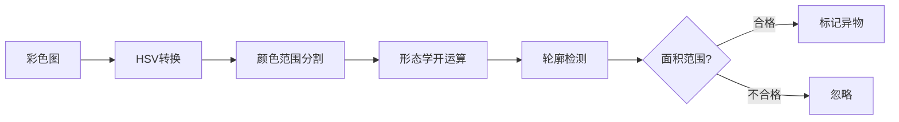

```cpp
DetectResult ForeignDetector::detect(const cv::Mat& image, const cv::Rect& roi) {
    cv::Mat hsv, mask;
    cv::cvtColor(image, hsv, cv::COLOR_BGR2HSV);
    
    // 基于颜色范围的异物检测（需根据产品颜色调整）
    cv::inRange(hsv, m_lowerBound, m_upperBound, mask);
    cv::bitwise_not(mask, mask);  // 反转，异物为白色
    
    // 形态学去噪
    cv::Mat kernel = cv::getStructuringElement(cv::MORPH_ELLIPSE, cv::Size(5, 5));
    cv::morphologyEx(mask, mask, cv::MORPH_OPEN, kernel);
    
    // Blob 检测
    std::vector<std::vector<cv::Point>> contours;
    cv::findContours(mask, contours, cv::RETR_EXTERNAL, cv::CHAIN_APPROX_SIMPLE);
    
    DetectResult result;
    for (const auto& contour : contours) {
        double area = cv::contourArea(contour);
        if (area > m_minArea && area < m_maxArea) {
            result.hasDefect = true;
            result.regions.push_back(cv::boundingRect(contour));
        }
    }
    result.defectType = "foreign";
    return result;
}
```

### 4.5 尺寸测量

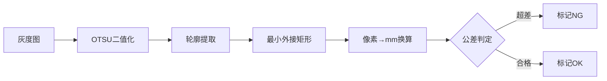

```cpp
DetectResult DimensionDetector::detect(const cv::Mat& image, const cv::Rect& roi) {
    cv::Mat binary;
    cv::threshold(image, binary, 0, 255, cv::THRESH_BINARY | cv::THRESH_OTSU);
    
    std::vector<std::vector<cv::Point>> contours;
    cv::findContours(binary, contours, cv::RETR_EXTERNAL, cv::CHAIN_APPROX_SIMPLE);
    
    DetectResult result;
    if (contours.empty()) return result;
    
    // 取最大轮廓
    auto maxContour = *std::max_element(contours.begin(), contours.end(),
        [](const auto& a, const auto& b) { return cv::contourArea(a) < cv::contourArea(b); });
    
    cv::RotatedRect rect = cv::minAreaRect(maxContour);
    
    // 像素→mm 换算（m_pixelRatio 需标定）
    double width_mm = rect.size.width * m_pixelRatio;
    double height_mm = rect.size.height * m_pixelRatio;
    
    // 公差判定
    bool widthOK = (width_mm >= m_widthMin && width_mm <= m_widthMax);
    bool heightOK = (height_mm >= m_heightMin && height_mm <= m_heightMax);
    
    result.hasDefect = !(widthOK && heightOK);
    result.defectType = "dimension";
    result.details["width_mm"] = width_mm;
    result.details["height_mm"] = height_mm;
    result.details["widthOK"] = widthOK;
    result.details["heightOK"] = heightOK;
    
    return result;
}
```

**标定方法**：

```cpp
// 使用已知尺寸的标定板计算 pixelRatio
double calibratePixelRatio(const cv::Mat& calibImage, double realWidth_mm) {
    // ... 检测标定板轮廓 ...
    double pixelWidth = rect.size.width;
    return realWidth_mm / pixelWidth;  // mm/pixel
}
```

### 4.6 缺陷严重度评分系统

> 将缺陷特征量化为 **0~100** 的严重度分值，支持分级判定（轻微/中等/严重）和质量追溯。
> 

### 4.6.1 评分模型

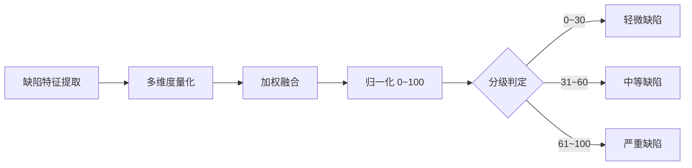

### 4.6.2 各类缺陷评分公式

| 缺陷类型 | 评分维度 | 计算公式 |
| --- | --- | --- |
| **划痕** | 长度 L、宽度 W、数量 N | `Score = 0.5×(L/L_max) + 0.3×(W/W_max) + 0.2×(N/N_max)` × 100 |
| **裂纹** | 长度 L、分叉数 B、深度 D | `Score = 0.4×(L/L_max) + 0.3×(B/B_max) + 0.3×(D/D_max)` × 100 |
| **异物** | 面积 A、对比度 C、数量 N | `Score = 0.5×(A/A_max) + 0.3×(C/C_max) + 0.2×(N/N_max)` × 100 |
| **尺寸偏差** | 宽度偏差 ΔW、高度偏差 ΔH | `Score = max(ΔW/Tol_W, ΔH/Tol_H)` × 100 |

### 4.6.3 分级阈值配置

```json
{
  "severity_levels": {
    "minor": { "min": 0, "max": 30, "action": "pass", "label": "轻微" },
    "moderate": { "min": 31, "max": 60, "action": "review", "label": "中等" },
    "severe": { "min": 61, "max": 100, "action": "reject", "label": "严重" }
  },
  "thresholds": {
    "scratch": { "L_max": 100, "W_max": 5, "N_max": 5 },
    "crack": { "L_max": 50, "B_max": 3, "D_max": 10 },
    "foreign": { "A_max": 500, "C_max": 128, "N_max": 10 },
    "dimension": { "Tol_W": 0.5, "Tol_H": 0.5 }
  }
}
```

### 4.6.4 数据结构更新

```cpp
// 缺陷严重度等级
enum class SeverityLevel {
    None = 0,      // 无缺陷
    Minor,         // 轻微 (0-30)
    Moderate,      // 中等 (31-60)
    Severe         // 严重 (61-100)
};

// 扩展检测结果
struct DetectResult {
    bool hasDefect;
    QString defectType;
    double confidence;
    std::vector<cv::Rect> regions;
    QVariantMap details;
    
    // 新增：严重度评分
    double severityScore;          // 0.0 ~ 100.0
    SeverityLevel severityLevel;   // 分级
    QString severityLabel;         // "轻微" / "中等" / "严重"
};
```

### 4.6.5 评分计算实现

```cpp
class DefectScorer {
public:
    struct ScoringParams {
        double L_max, W_max, N_max;      // 划痕
        double B_max, D_max;              // 裂纹（L_max 共用）
        double A_max, C_max;              // 异物（N_max 共用）
        double Tol_W, Tol_H;              // 尺寸
    };
    
    void setParams(const ScoringParams& params) { m_params = params; }
    
    // 划痕评分
    double scoreScratch(double totalLength, double maxWidth, int count) {
        double scoreL = std::min(totalLength / m_params.L_max, 1.0);
        double scoreW = std::min(maxWidth / m_params.W_max, 1.0);
        double scoreN = std::min((double)count / m_params.N_max, 1.0);
        return (0.5 * scoreL + 0.3 * scoreW + 0.2 * scoreN) * 100.0;
    }
    
    // 裂纹评分
    double scoreCrack(double length, int branchCount, double depth) {
        double scoreL = std::min(length / m_params.L_max, 1.0);
        double scoreB = std::min((double)branchCount / m_params.B_max, 1.0);
        double scoreD = std::min(depth / m_params.D_max, 1.0);
        return (0.4 * scoreL + 0.3 * scoreB + 0.3 * scoreD) * 100.0;
    }
    
    // 异物评分
    double scoreForeign(double totalArea, double maxContrast, int count) {
        double scoreA = std::min(totalArea / m_params.A_max, 1.0);
        double scoreC = std::min(maxContrast / m_params.C_max, 1.0);
        double scoreN = std::min((double)count / m_params.N_max, 1.0);
        return (0.5 * scoreA + 0.3 * scoreC + 0.2 * scoreN) * 100.0;
    }
    
    // 尺寸偏差评分
    double scoreDimension(double deltaW, double deltaH) {
        double scoreW = std::abs(deltaW) / m_params.Tol_W;
        double scoreH = std::abs(deltaH) / m_params.Tol_H;
        return std::min(std::max(scoreW, scoreH) * 100.0, 100.0);
    }
    
    // 分级判定
    SeverityLevel classify(double score) {
        if (score <= 30) return SeverityLevel::Minor;
        if (score <= 60) return SeverityLevel::Moderate;
        return SeverityLevel::Severe;
    }
    
    QString levelToLabel(SeverityLevel level) {
        switch (level) {
            case SeverityLevel::Minor: return "轻微";
            case SeverityLevel::Moderate: return "中等";
            case SeverityLevel::Severe: return "严重";
            default: return "无";
        }
    }

private:
    ScoringParams m_params;
};
```

### 4.6.6 裂纹检测器集成示例

```cpp
DetectResult CrackDetector::detect(const cv::Mat& image, const cv::Rect& roi) {
    // ... 原有检测逻辑 ...
    
    DetectResult result;
    result.defectType = "crack";
    
    if (!cracks.empty()) {
        result.hasDefect = true;
        
        // 提取特征
        double totalLength = 0;
        int branchCount = 0;
        double maxDepth = 0;
        
        for (const auto& crack : cracks) {
            totalLength += crack.length;
            branchCount += crack.branches;
            maxDepth = std::max(maxDepth, crack.depth);
            result.regions.push_back(crack.boundingRect);
        }
        
        // 计算严重度评分
        result.severityScore = m_scorer.scoreCrack(totalLength, branchCount, maxDepth);
        result.severityLevel = m_scorer.classify(result.severityScore);
        result.severityLabel = m_scorer.levelToLabel(result.severityLevel);
        
        // 详细信息
        result.details["totalLength"] = totalLength;
        result.details["branchCount"] = branchCount;
        result.details["maxDepth"] = maxDepth;
        result.details["crackCount"] = (int)cracks.size();
    }
    
    return result;
}
```

### 4.6.7 UI 显示效果

```
┌─────────────────────────────────────┐
│  检测结果                            │
│  ━━━━━━━━━━━━━━━━━━━━━━━━━━━━━━━━━  │
│  缺陷类型：裂纹                       │
│  严重度评分：12 / 100                 │
│  ┌─────────────────────────────┐    │
│  │████░░░░░░░░░░░░░░░░░░░░░░░░│    │
│  └─────────────────────────────┘    │
│  等级：🟢 轻微缺陷                    │
│  处置：放行                          │
│  ─────────────────────────────────  │
│  详细指标：                          │
│  · 总长度：15.2 px                   │
│  · 分叉数：0                         │
│  · 最大深度：2.1 px                  │
└─────────────────────────────────────┘
```

### 4.6.8 分级处置策略

| 等级 | 分值范围 | 颜色标识 | 默认处置 | 适用场景 |
| --- | --- | --- | --- | --- |
| **轻微** | 0~30 | 🟢 绿色 | 放行 | 外观件可接受 |
| **中等** | 31~60 | 🟡 黄色 | 人工复检 | 需确认是否影响功能 |
| **严重** | 61~100 | 🔴 红色 | 自动剔除 | 功能/安全件不合格 |

---

## 5. Qt6 界面设计

### 5.1 主界面布局

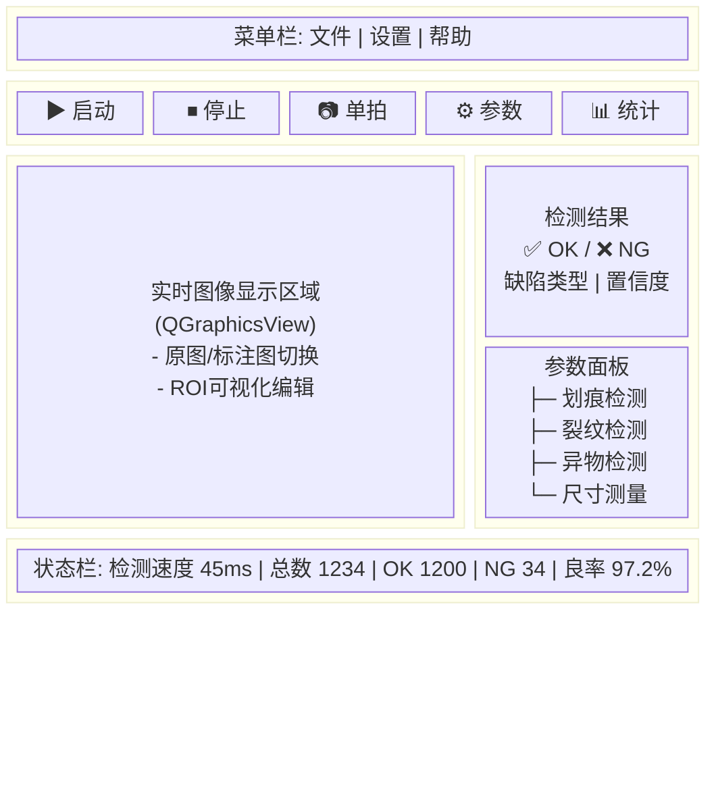

### 5.2 关键组件

```cpp
// 图像显示组件（支持缩放、标注）
class ImageView : public QGraphicsView {
    Q_OBJECT
public:
    void setImage(const cv::Mat& image);
    void drawDefectRegions(const std::vector<cv::Rect>& regions);
    void setROI(const cv::Rect& roi);
signals:
    void roiChanged(const QRect& roi);
};

// 参数配置面板
class ParamPanel : public QWidget {
    Q_OBJECT
public:
    void loadParams(const QString& configPath);
    void saveParams(const QString& configPath);
    QVariantMap getDetectorParams(const QString& detectorName);
signals:
    void paramsChanged(const QString& detectorName, const QVariantMap& params);
};
```

---

## 6. 配置文件设计

### 6.0 配置校验器

<aside>
✅

**启动前必须校验配置**：系统启动时自动校验配置文件，校验失败则拒绝启动并输出详细错误信息。

</aside>

```cpp
class ConfigValidator {
public:
    struct ValidationResult {
        bool valid = true;
        QStringList errors;
        QStringList warnings;
        
        void addError(const QString& msg) {
            valid = false;
            errors << msg;
        }
        void addWarning(const QString& msg) {
            warnings << msg;
        }
    };
    
    ValidationResult validate(const QJsonObject& config) {
        ValidationResult result;
        
        // 1. 相机配置校验
        if (!config.contains("camera")) {
            result.addError("缺少 'camera' 配置段");
        } else {
            auto cam = config["camera"].toObject();
            if (!cam.contains("type")) {
                result.addError("camera.type 未定义");
            }
            if (cam["type"].toString() == "gige" && !cam.contains("ip")) {
                result.addError("GigE 相机需要配置 camera.ip");
            }
            int exposure = cam["exposure_us"].toInt(0);
            if (exposure <= 0 || exposure > 1000000) {
                result.addError(QString("camera.exposure_us 无效: %1 (应为 1~1000000)").arg(exposure));
            }
        }
        
        // 2. ROI 配置校验
        if (!config.contains("roi")) {
            result.addWarning("缺少 'roi' 配置，将使用全图检测");
        } else {
            auto roi = config["roi"].toObject();
            if (roi["width"].toInt() <= 0 || roi["height"].toInt() <= 0) {
                result.addError("roi.width 和 roi.height 必须 > 0");
            }
            if (roi["x"].toInt() < 0 || roi["y"].toInt() < 0) {
                result.addError("roi.x 和 roi.y 不能为负数");
            }
        }
        
        // 3. 检测器配置校验
        if (config.contains("detectors")) {
            auto detectors = config["detectors"].toObject();
            for (const QString& name : {"scratch", "crack", "foreign", "dimension"}) {
                if (detectors.contains(name)) {
                    validateDetector(detectors[name].toObject(), name, result);
                }
            }
        } else {
            result.addWarning("缺少 'detectors' 配置，所有检测器将使用默认参数");
        }
        
        // 4. 输出配置校验
        if (config.contains("output")) {
            auto output = config["output"].toObject();
            QString ngPath = output["ng_image_path"].toString();
            if (!ngPath.isEmpty() && !QDir(ngPath).exists()) {
                result.addWarning(QString("NG 图像目录不存在: %1").arg(ngPath));
            }
        }
        
        return result;
    }
    
private:
    void validateDetector(const QJsonObject& det, const QString& name, ValidationResult& result) {
        if (name == "scratch") {
            int cannyLow = det["canny_low"].toInt(50);
            int cannyHigh = det["canny_high"].toInt(150);
            if (cannyLow >= cannyHigh) {
                result.addError(QString("scratch.canny_low (%1) 必须小于 canny_high (%2)")
                    .arg(cannyLow).arg(cannyHigh));
            }
        }
        if (name == "dimension") {
            double pixelRatio = det["pixel_ratio"].toDouble(0);
            if (pixelRatio <= 0) {
                result.addError("dimension.pixel_ratio 必须 > 0");
            }
        }
    }
};

// 使用示例
void Application::loadConfig(const QString& path) {
    QFile file(path);
    if ((QIODevice::ReadOnly)) {
        LOG_ERROR("无法打开配置文件: {}", path.toStdString());
        throw std::runtime_error("配置文件读取失败");
    }
    
    QJsonDocument doc = QJsonDocument::fromJson(file.readAll());
    QJsonObject config = doc.object();
    
    ConfigValidator validator;
    auto result = validator.validate(config);
    
    // 输出警告
    for (const auto& warn : result.warnings) {
        LOG_WARN("配置警告: {}", warn.toStdString());
    }
    
    // 校验失败则退出
    if (!result.valid) {
        for (const auto& err : result.errors) {
            LOG_ERROR("配置错误: {}", err.toStdString());
        }
        throw std::runtime_error("配置校验失败，请检查配置文件");
    }
    
    m_config = config;
    LOG_INFO("配置加载成功");
}
```

### 6.1 JSON 配置结构

```json
{
  "camera": {
    "type": "gige",
    "ip": "192.168.1.100",
    "exposure_us": 5000,
    "gain_db": 0,
    "trigger_mode": "hardware"
  },
  "roi": {
    "x": 100, "y": 100, "width": 1000, "height": 800
  },
  "detectors": {
    "scratch": {
      "enabled": true,
      "canny_low": 50,
      "canny_high": 150,
      "min_length": 20,
      "max_gap": 10
    },
    "crack": {
      "enabled": true,
      "adaptive_block_size": 11,
      "adaptive_c": 2,
      "min_area": 50
    },
    "foreign": {
      "enabled": true,
      "hsv_lower": [0, 0, 0],
      "hsv_upper": [180, 255, 200],
      "min_area": 100,
      "max_area": 10000
    },
    "dimension": {
      "enabled": true,
      "pixel_ratio": 0.05,
      "width_min": 49.5,
      "width_max": 50.5,
      "height_min": 29.5,
      "height_max": 30.5
    }
  },
  "output": {
    "save_ng_images": true,
    "ng_image_path": "./ng_images/",
    "log_path": "./logs/"
  }
}
```

---

## 7. 开发计划

### 7.1 里程碑

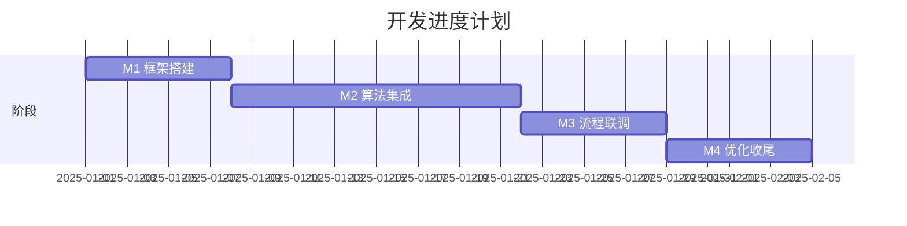

| 阶段 | 周期 | 交付物 |
| --- | --- | --- |
| **M1：框架搭建** | 1 周 | 项目骨架、相机采集、基础 UI |
| **M2：算法集成** | 2 周 | 四类检测算法、参数可调 |
| **M3：流程联调** | 1 周 | 完整检测流程、IO 联动 |
| **M4：优化收尾** | 1 周 | 性能优化、稳定性测试、文档 |

### 7.2 技术风险与对策

| 风险 | 影响 | 对策 |
| --- | --- | --- |
| 复杂背景干扰 | 误检率高 | 增加背景学习模块；考虑轻量 CNN |
| 光照波动 | 检测不稳定 | 自动曝光 + 直方图均衡化；光源恒流驱动 |
| 嵌入式性能不足 | 节拍超标 | ROI 缩小；算法降级；多线程并行 |

---

## 8. 扩展方向

- [ ]  **深度学习集成**：使用 OpenCV DNN 加载 ONNX 模型，提升复杂缺陷识别能力
- [ ]  **多相机支持**：扩展为多工位并行检测
- [ ]  **MES 对接**：通过 TCP/HTTP 上报检测数据
- [ ]  **远程监控**：WebSocket + 前端可视化看板

---

## 附录

### A. 依赖库版本

| 库 | 版本 | 说明 |
| --- | --- | --- |
| Qt | 6.5+ | GUI 框架 |
| OpenCV | 4.6+ | 图像处理核心 |
| spdlog | 1.10+ | 日志库（可选） |
| nlohmann/json | 3.11+ | JSON 解析 |

### B. 参考资料

- OpenCV 官方文档：[https://docs.opencv.org](https://docs.opencv.org)
- Qt6 多线程指南：[https://doc.qt.io/qt-6/threads.html](https://doc.qt.io/qt-6/threads.html)
- 工业视觉光源选型：机器视觉光源基础知识

---

## 9. 深度学习检测模块（可选扩展）

> 当传统算法在复杂纹理背景下误检率过高时，可引入轻量 CNN 模型提升检测能力。OpenCV 4.6 的 DNN 模块原生支持 ONNX 格式推理，无需额外依赖。
> 

### 9.1 方案选型

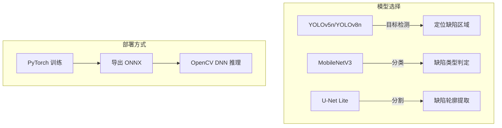

| 模型 | 参数量 | 推理速度 (CPU) | 适用场景 |
| --- | --- | --- | --- |
| **YOLOv5n** | 1.9M | ~30ms (i5) | 多类缺陷定位 |
| **YOLOv8n** | 3.2M | ~35ms (i5) | 更高精度定位 |
| **MobileNetV3-Small** | 2.5M | ~15ms (i5) | 二分类 OK/NG |
| **U-Net Lite** | 1.0M | ~50ms (i5) | 像素级分割 |

### 9.2 推理流程

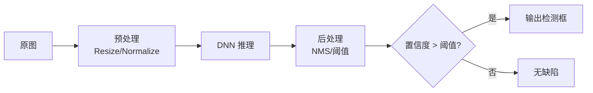

### 9.3 OpenCV DNN 集成代码

```cpp
class DnnDefectDetector : public IDefectDetector {
public:
    virtual ~DnnDefectDetector() = default;  // ⚠️ 虚析构函数
    
    DnnDefectDetector(const QString& modelPath, const QString& configPath = "") {
        // 加载 ONNX 模型
        m_net = cv::dnn::readNetFromONNX(modelPath.toStdString());
        
        // 优先使用 GPU（如有）
        m_net.setPreferableBackend(cv::dnn::DNN_BACKEND_OPENCV);
        m_net.setPreferableTarget(cv::dnn::DNN_TARGET_CPU);
        // 如有 CUDA：
        // m_net.setPreferableBackend(cv::dnn::DNN_BACKEND_CUDA);
        // m_net.setPreferableTarget(cv::dnn::DNN_TARGET_CUDA);
    }
    
    DetectResult detect(const cv::Mat& image, const cv::Rect& roi) override {
        DetectResult result;
        result.defectType = "dnn";
        
        // 输入校验
        if (image.empty()) {
            LOG_WARN("DnnDetector: 输入图像为空");
            return result;
        }
        
        cv::Rect safeRoi = roi & cv::Rect(0, 0, image.cols, image.rows);
        if (safeRoi.empty()) return result;
        
        cv::Mat blob;
        cv::Mat cropped = image(safeRoi).clone();  // ⚠️ 深拷贝
        
        // 预处理：RGB, 640x640, 归一化
        cv::dnn::blobFromImage(cropped, blob, 1.0/255.0, 
            cv::Size(640, 640), cv::Scalar(), true, false);
        
        m_net.setInput(blob);
        
        // 前向推理
        std::vector<cv::Mat> outputs;
        m_net.forward(outputs, m_net.getUnconnectedOutLayersNames());
        
        // 后处理（以 YOLOv5 为例）
        return postProcess(outputs, cropped.size(), safeRoi);
    }
    
private:
    cv::dnn::Net m_net;
    const std::vector<QString> m_classNames = {"scratch", "crack", "foreign", "dimension"};
    
    // ✅ 完整的 YOLOv5 后处理实现
    DetectResult postProcess(const std::vector<cv::Mat>& outputs, cv::Size imgSize, const cv::Rect& roi) {
        DetectResult result;
        std::vector<cv::Rect> boxes;
        std::vector<float> confidences;
        std::vector<int> classIds;
        
        const float confThreshold = 0.5f;
        const float nmsThreshold = 0.4f;
        const float scaleX = static_cast<float>(imgSize.width) / 640.0f;
        const float scaleY = static_cast<float>(imgSize.height) / 640.0f;
        
        // 解析 YOLO 输出 [batch, num_detections, 5+num_classes]
        cv::Mat output = outputs[0];
        const int rows = output.size[1];
        const int dims = output.size[2];
        float* data = (float*)[output.data](http://output.data);
        
        for (int i = 0; i < rows; i++) {
            float confidence = data[4];  // objectness score
            
            if (confidence >= confThreshold) {
                // 获取类别得分
                cv::Mat scores = cv::Mat(1, dims - 5, CV_32F, data + 5);
                cv::Point classIdPoint;
                double maxClassScore;
                cv::minMaxLoc(scores, nullptr, &maxClassScore, nullptr, &classIdPoint);
                
                float finalScore = confidence * static_cast<float>(maxClassScore);
                
                if (finalScore > confThreshold) {
                    // 解析边界框 (cx, cy, w, h) -> (x, y, w, h)
                    float cx = data[0] * scaleX;
                    float cy = data[1] * scaleY;
                    float w = data[2] * scaleX;
                    float h = data[3] * scaleY;
                    
                    int left = static_cast<int>(cx - w / 2);
                    int top = static_cast<int>(cy - h / 2);
                    
                    boxes.emplace_back(left, top, static_cast<int>(w), static_cast<int>(h));
                    confidences.push_back(finalScore);
                    classIds.push_back(classIdPoint.x);
                }
            }
            data += dims;
        }
        
        // NMS 非极大值抑制
        std::vector<int> indices;
        cv::dnn::NMSBoxes(boxes, confidences, confThreshold, nmsThreshold, indices);
        
        // 构建结果
        for (int idx : indices) {
            result.hasDefect = true;
            
            // 转换回原图坐标
            cv::Rect box = boxes[idx];
            box.x += roi.x;
            box.y += roi.y;
            result.regions.push_back(box);
            
            result.confidence = std::max(result.confidence, static_cast<double>(confidences[idx]));
            
            // 设置缺陷类型（取置信度最高的）
            if (classIds[idx] < static_cast<int>(m_classNames.size())) {
                result.defectType = m_classNames[classIds[idx]];
            }
        }
        
        return result;
    }
    
    QString classIdToType(int classId) {
        if (classId >= 0 && classId < static_cast<int>(m_classNames.size())) {
            return m_classNames[classId];
        }
        return "unknown";
    }
};
```

### 9.4 模型训练流程

```mermaid
flowchart LR
    subgraph 数据准备
        A[采集缺陷样本] --> B[标注\nLabelImg/CVAT]
        B --> C[数据增强\n旋转/翻转/噪声]
    end
    
    subgraph 训练
        C --> D[划分训练/验证集]
        D --> E[YOLOv5 训练\npython [train.py](http://train.py)]
        E --> F[验证 mAP]
    end
    
    subgraph 部署
        F --> G[导出 ONNX\npython [export.py](http://export.py)]
        G --> H[OpenCV DNN 加载]
    end
```

**训练命令示例**：

```bash
# 安装 YOLOv5
git clone [https://github.com/ultralytics/yolov5](https://github.com/ultralytics/yolov5)
cd yolov5
pip install -r requirements.txt

# 准备数据集（YOLO 格式）
# dataset/
# ├── images/
# │   ├── train/
# │   └── val/
# └── labels/
#     ├── train/
#     └── val/

# 训练（使用预训练权重，100 epochs）
python [train.py](http://train.py) --img 640 --batch 16 --epochs 100 \
    --data dataset.yaml --weights [yolov5n.pt](http://yolov5n.pt) --name defect_model

# 导出 ONNX
python [export.py](http://export.py) --weights runs/train/defect_model/weights/[best.pt](http://best.pt) --include onnx
```

### 9.5 混合检测策略

> 传统算法速度快但泛化差，深度学习精度高但耗时。可采用 **级联策略** 兼顾效率与精度。
> 

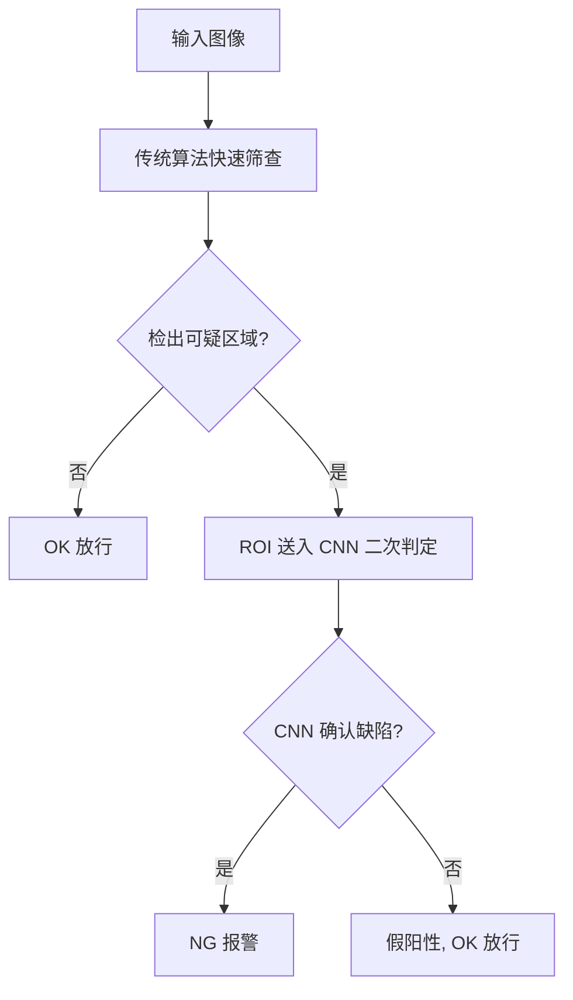

**优势**：

- 大部分 OK 件由传统算法快速放行（~10ms）
- 仅对疑似 NG 件调用 CNN（~30ms），整体节拍可控
- 漏检率由 CNN 保障，误检率由级联过滤

### 9.6 嵌入式部署优化

| 优化手段 | 适用平台 | 加速效果 |
| --- | --- | --- |
| **ONNX Runtime** | x86/ARM | 1.5x~2x |
| **OpenVINO** | Intel CPU/iGPU | 2x~4x |
| **TensorRT** | NVIDIA GPU | 5x~10x |
| **NCNN** | ARM (RK3399) | 2x~3x |
| **INT8 量化** | 全平台 | 1.5x~2x（精度损失 <1%） |

**RK3399 部署建议**：

```cpp
// 使用 NCNN 替代 OpenCV DNN
#include "ncnn/net.h"

ncnn::Net net;
net.opt.use_vulkan_compute = true;  // 启用 GPU
net.load_param("model.param");
net.load_model("model.bin");
```

---

## 10. 工程可靠性设计

> 工业现场环境复杂，系统需具备高可靠性、容错能力和长期稳定运行的保障机制。
> 

### 10.1 异常处理与容错机制

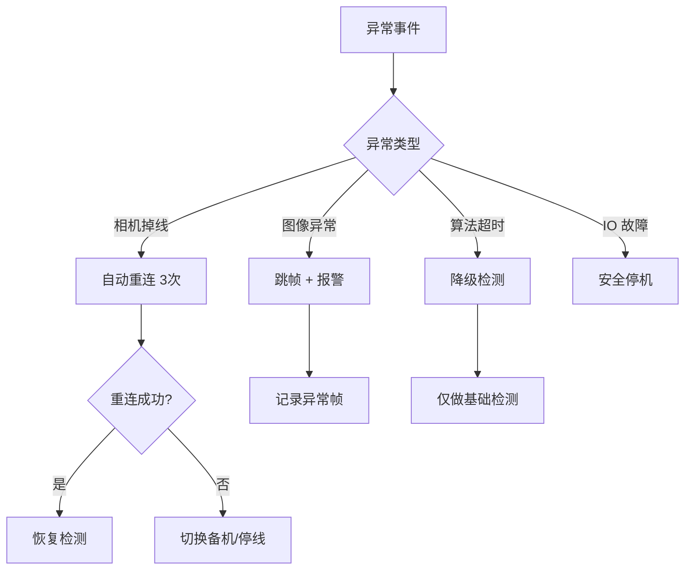

```cpp
class FaultTolerantPipeline {
public:
    void onCameraDisconnect() {
        for (int i = 0; i < 3; i++) {
            if (m_camera->reconnect()) {
                emit recovered("camera");
                return;
            }
            std::this_thread::sleep_for(std::chrono::seconds(1));
        }
        emit fatalError("camera", "重连失败，请检查设备");
        triggerSafeStop();
    }
    
    void onDetectTimeout(const cv::Mat& frame) {
        // 降级：跳过复杂算法，仅做快速检测
        auto result = m_fastDetector->detect(frame, m_roi);
        result.details["degraded"] = true;
        emit resultReady(result);
        m_timeoutCount++;
        
        if (m_timeoutCount > 10) {
            emit warning("连续超时，建议检查系统负载");
        }
    }
    
    void onImageAbnormal(const cv::Mat& frame) {
        // 图像异常：过曝/欠曝/模糊
        double brightness = cv::mean(frame)[0];
        double laplacian = calcLaplacianVar(frame);
        
        if (brightness < 30 || brightness > 225) {
            emit warning("图像亮度异常: " + QString::number(brightness));
            adjustExposure(brightness);
        }
        if (laplacian < m_blurThreshold) {
            emit warning("图像模糊，请检查镜头/振动");
        }
    }
    
private:
    double calcLaplacianVar(const cv::Mat& img) {
        cv::Mat laplacian;
        cv::Laplacian(img, laplacian, CV_64F);
        cv::Scalar mean, stddev;
        cv::meanStdDev(laplacian, mean, stddev);
        return stddev.val[0] * stddev.val[0];
    }
};
```

### 10.2 看门狗与心跳监控

<aside>
⚠️

**线程安全修正**：原代码在持有锁时 emit 信号可能导致死锁。修正后使用副本迭代，释放锁后再发送信号。

</aside>

```cpp
class SystemWatchdog : public QObject {
    Q_OBJECT
public:
    void start() {
        m_timer.start(1000);  // 1秒检查一次
        connect(&m_timer, &QTimer::timeout, this, &SystemWatchdog::check);
    }
    
    void feedDog(const QString& module) {
        QMutexLocker lock(&m_mutex);
        m_heartbeats[module] = QDateTime::currentMSecsSinceEpoch();
    }
    
    void registerModule(const QString& module, qint64 timeoutMs) {
        QMutexLocker lock(&m_mutex);
        m_timeouts[module] = timeoutMs;
        m_heartbeats[module] = QDateTime::currentMSecsSinceEpoch();
    }
    
signals:
    void moduleTimeout(const QString& module, qint64 elapsedMs);
    
private slots:
    void check() {
        qint64 now = QDateTime::currentMSecsSinceEpoch();
        
        // ✅ 修正：使用副本迭代，避免持锁时 emit 导致死锁
        QMap<QString, qint64> heartbeatsCopy;
        QMap<QString, qint64> timeoutsCopy;
        {
            QMutexLocker lock(&m_mutex);
            heartbeatsCopy = m_heartbeats;
            timeoutsCopy = m_timeouts;
        }  // 释放锁
        
        // 在锁外检查并发送信号
        for (auto it = heartbeatsCopy.constBegin(); it != heartbeatsCopy.constEnd(); ++it) {
            qint64 timeout = timeoutsCopy.value(it.key(), 5000);
            qint64 elapsed = now - it.value();
            if (elapsed > timeout) {
                emit moduleTimeout(it.key(), elapsed);  // ✅ 安全：锁已释放
            }
        }
    }
    
private:
    QTimer m_timer;
    QMutex m_mutex;
    QMap<QString, qint64> m_heartbeats;
    QMap<QString, qint64> m_timeouts = {
        {"camera", 3000},      // 相机 3 秒超时
        {"detector", 5000},    // 检测 5 秒超时
        {"plc", 2000}          // PLC 2 秒超时
    };
};
```

### 10.3 数据备份与恢复

| 数据类型 | 备份策略 | 存储位置 | 保留周期 |
| --- | --- | --- | --- |
| **配置文件** | 每次修改自动备份 | 本地 + NAS | 永久（最近 10 版本） |
| **检测结果** | 实时写入 + 每小时归档 | SQLite + CSV | 90 天 |
| **NG 图像** | 实时保存 | 本地 SSD + NAS | 30 天 |
| **日志文件** | 按日切割 | 本地 | 7 天（压缩后 30 天） |
| **模型文件** | 版本化管理 | Git LFS / NAS | 永久 |

---

## 11. 产线集成设计

### 11.1 PLC 通信协议

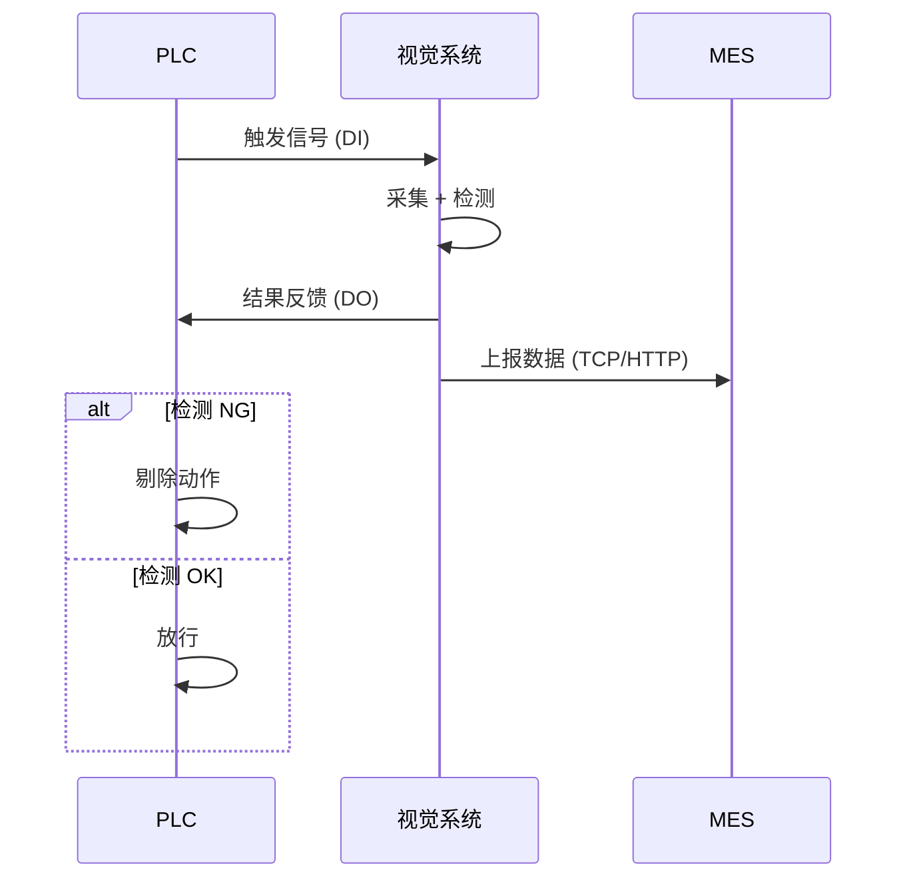

**Modbus TCP 寄存器定义**：

| 地址 | 类型 | 名称 | 说明 |
| --- | --- | --- | --- |
| 40001 | Holding | 触发请求 | 1=触发采集 |
| 40002 | Holding | 检测结果 | 0=OK, 1=NG, 2=异常 |
| 40003 | Holding | 缺陷类型 | 1=划痕, 2=裂纹, 3=异物, 4=尺寸 |
| 40004 | Holding | 严重度评分 | 0~100 |
| 40005 | Holding | 系统状态 | 0=待机, 1=运行, 2=故障 |
| 40006-40007 | Holding | 产品计数 | 32位无符号整数 |
| 40008-40009 | Holding | NG 计数 | 32位无符号整数 |

```cpp
class ModbusServer : public QObject {
public:
    void handleTrigger() {
        if (m_registers[0] == 1) {
            m_registers[0] = 0;  // 清除触发
            emit triggerReceived();
        }
    }
    
    void setResult(const DetectResult& result) {
        m_registers[1] = result.hasDefect ? 1 : 0;
        m_registers[2] = defectTypeToCode(result.defectType);
        m_registers[3] = static_cast<uint16_t>(result.severityScore);
    }
    
private:
    std::array<uint16_t, 100> m_registers;
};
```

<aside>
⚠️

**资源管理修正**：Modbus 连接需使用 RAII 模式管理，防止资源泄漏。

</aside>

```cpp
// ✅ RAII 封装的 Modbus TCP 客户端
class ModbusTCPClient {
public:
    ModbusTCPClient() : m_ctx(nullptr), m_connected(false) {}
    
    ~ModbusTCPClient() {
        disconnect();  // ✅ 析构时自动释放资源
    }
    
    // 禁止拷贝，允许移动
    ModbusTCPClient(const ModbusTCPClient&) = delete;
    ModbusTCPClient& operator=(const ModbusTCPClient&) = delete;
    ModbusTCPClient(ModbusTCPClient&& other) noexcept 
        : m_ctx(other.m_ctx), m_connected(other.m_connected) {
        other.m_ctx = nullptr;
        other.m_connected = false;
    }
    
    bool connect(const QString& ip, int port = 502) {
        disconnect();  // 先断开已有连接
        
        m_ctx = modbus_new_tcp(ip.toStdString().c_str(), port);
        if (!m_ctx) {
            LOG_ERROR("ModbusTCPClient: 创建上下文失败");
            return false;
        }
        
        // 设置超时
        modbus_set_response_timeout(m_ctx, 1, 0);  // 1秒超时
        
        if (modbus_connect(m_ctx) == -1) {
            LOG_ERROR("ModbusTCPClient: 连接失败 - {}", modbus_strerror(errno));
            modbus_free(m_ctx);
            m_ctx = nullptr;
            return false;
        }
        
        m_connected = true;
        LOG_INFO("ModbusTCPClient: 连接成功 {}:{}", ip.toStdString(), port);
        return true;
    }
    
    void disconnect() {
        if (m_ctx) {
            if (m_connected) {
                modbus_close(m_ctx);
            }
            modbus_free(m_ctx);
            m_ctx = nullptr;
            m_connected = false;
        }
    }
    
    bool isConnected() const { return m_connected; }
    
    bool writeRegister(int addr, uint16_t value) {
        if (!m_connected) return false;
        return modbus_write_register(m_ctx, addr, value) == 1;
    }
    
    bool readRegisters(int addr, int count, uint16_t* dest) {
        if (!m_connected) return false;
        return modbus_read_registers(m_ctx, addr, count, dest) == count;
    }
    
private:
    modbus_t* m_ctx;
    bool m_connected;
};
```

### 11.2 MES/ERP 对接接口

```json
// REST API: POST /api/v1/inspection/result
{
    "timestamp": "2025-01-15T14:32:15.123Z",
    "productId": "PROD-2025-001234",
    "batchNo": "BATCH-20250115-A",
    "stationId": "ST-01",
    "result": "NG",
    "defects": [
        {
            "type": "crack",
            "severityScore": 45,
            "severityLevel": "moderate",
            "location": {"x": 150, "y": 200, "width": 30, "height": 15},
            "features": {
                "length": 28.5,
                "branchCount": 1,
                "depth": 3.2
            }
        }
    ],
    "cycleTime_ms": 85,
    "imageUrl": "[http://nas/images/2025/01/15/PROD-2025-001234.jpg](http://nas/images/2025/01/15/PROD-2025-001234.jpg)"
}
```

### 11.3 多工位协同

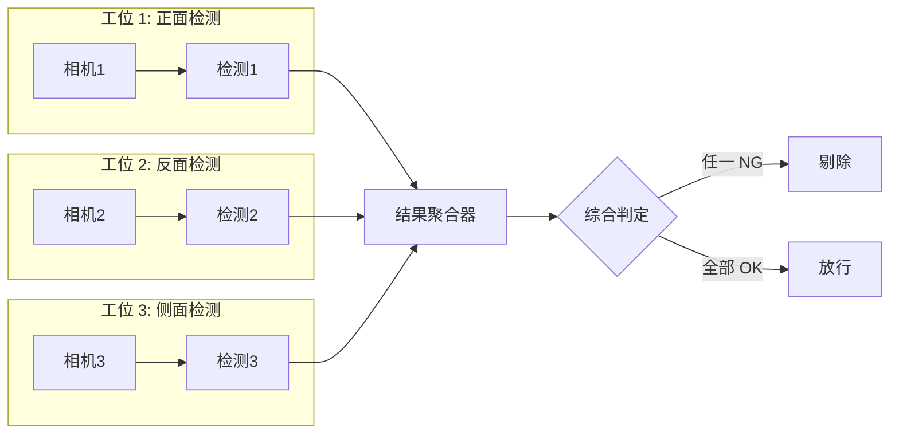

### 11.4 生产节拍匹配

| 节拍要求 | 单工位方案 | 多工位方案 |
| --- | --- | --- |
| **> 500ms** | 单相机全检 | 不需要 |
| **200~500ms** | 单相机 + GPU 加速 | 2 工位并行 |
| **100~200ms** | 高速相机 + 算法优化 | 3~4 工位并行 |
| **< 100ms** | 多相机同步采集 | 流水线分布式检测 |

---

## 12. 质量管理体系

### 12.1 SPC 统计过程控制

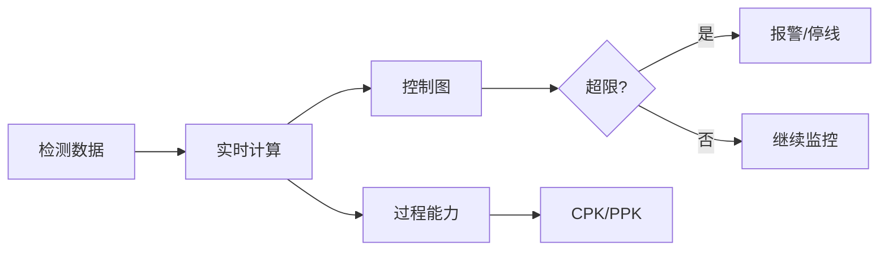

**控制图实现**：

```cpp
class SPCController {
public:
    struct ControlLimits {
        double UCL;  // 上控制限
        double CL;   // 中心线
        double LCL;  // 下控制限
    };
    
    void addSample(double value) {
        m_samples.push_back(value);
        if (m_samples.size() > m_windowSize) {
            m_samples.pop_front();
        }
        
        updateStatistics();
        checkRules();
    }
    
    ControlLimits calcXBarLimits() {
        double xBar = mean(m_subgroupMeans);
        double rBar = mean(m_subgroupRanges);
        double A2 = getA2Factor(m_subgroupSize);
        
        return {
            xBar + A2 * rBar,  // UCL
            xBar,               // CL
            xBar - A2 * rBar   // LCL
        };
    }
    
    double calcCpk() {
        double xBar = mean(m_samples);
        double sigma = stddev(m_samples);
        double Cpu = (m_USL - xBar) / (3 * sigma);
        double Cpl = (xBar - m_LSL) / (3 * sigma);
        return std::min(Cpu, Cpl);
    }
    
private:
    void checkRules() {
        // 规则 1: 单点超出控制限
        if (m_samples.back() > m_limits.UCL || m_samples.back() < m_limits.LCL) {
            emit alarm("Rule1", "单点超出控制限");
        }
        
        // 规则 2: 连续 7 点在中心线同侧
        if (checkConsecutiveSameSide(7)) {
            emit alarm("Rule2", "连续7点在中心线同侧");
        }
        
        // 规则 3: 连续 7 点递增或递减
        if (checkMonotonicTrend(7)) {
            emit alarm("Rule3", "连续7点单调趋势");
        }
    }
};
```

### 12.2 质量指标看板

```
┌─────────────────────────────────────────────────────────────────┐
│                      质量监控看板                                │
├─────────────────────────────────────────────────────────────────┤
│  【今日统计】                                                    │
│  总检测数: 12,456    OK: 12,234 (98.2%)    NG: 222 (1.8%)       │
│                                                                 │
│  【缺陷分布】                    【严重度分布】                   │
│  划痕: ████████ 45%             轻微: ████████████ 68%          │
│  裂纹: ████ 22%                 中等: █████ 25%                 │
│  异物: ███ 18%                  严重: ██ 7%                     │
│  尺寸: ███ 15%                                                  │
│                                                                 │
│  【过程能力】                    【控制图状态】                   │
│  CPK: 1.45 ✅                   X-Bar: 正常 🟢                  │
│  PPK: 1.38 ✅                   R 图: 正常 🟢                   │
│  良率目标: 98.0%                 趋势: 稳定 →                    │
│  当前良率: 98.2% ✅                                              │
│                                                                 │
│  【近期趋势】                                                    │
│  良率 ─────────────────────────────────────────                 │
│  99% │    ╭─╮                                                   │
│  98% │╭──╯  ╰──╮  ╭──────                                      │
│  97% │         ╰──╯                                             │
│      └─────────────────────────────────────────                 │
│        1/10  1/11  1/12  1/13  1/14  1/15                       │
└─────────────────────────────────────────────────────────────────┘
```

### 12.3 追溯与报表

```sql
-- 缺陷追溯查询
SELECT 
    p.product_id,
    p.batch_no,
    p.inspect_time,
    d.defect_type,
    d.severity_score,
    d.severity_level,
    p.image_path
FROM inspections p
JOIN defects d ON [p.id](http://p.id) = d.inspection_id
WHERE p.batch_no = 'BATCH-20250115-A'
  AND d.severity_level IN ('moderate', 'severe')
ORDER BY p.inspect_time DESC;
```

**日报/周报自动生成**：

| 报表类型 | 生成时间 | 包含内容 | 发送对象 |
| --- | --- | --- | --- |
| **班次报表** | 每班次结束 | 良率、缺陷分布、异常事件 | 班组长 |
| **日报** | 每日 00:00 | 汇总统计、趋势分析、TOP 缺陷 | 质量主管 |
| **周报** | 每周一 08:00 | CPK 趋势、改进建议、对比分析 | 生产经理 |
| **月报** | 每月 1 日 | 综合分析、成本核算、改进计划 | 厂长/质量总监 |

---

## 13. 运维与维护体系

### 13.1 远程诊断

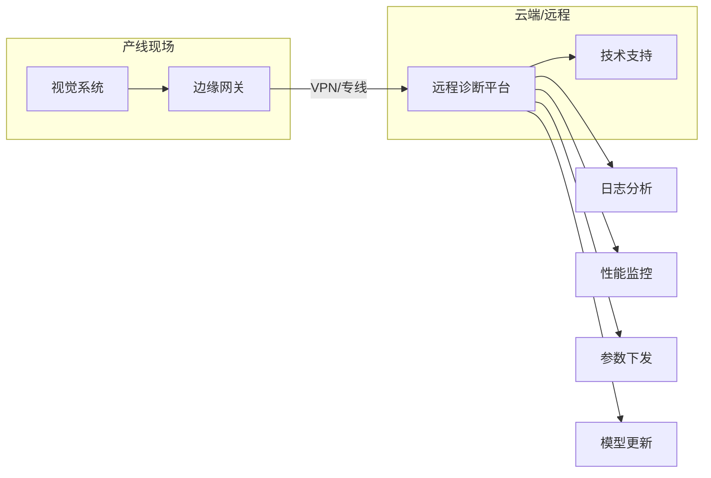

**远程运维功能**：

| 功能 | 描述 | 实现方式 |
| --- | --- | --- |
| **实时监控** | 查看系统状态、检测结果 | WebSocket 推送 |
| **日志查询** | 远程查看/下载日志 | REST API + 日志服务器 |
| **参数调整** | 在线修改检测参数 | 配置热加载 |
| **模型热更新** | 不停机更新检测模型 | 双缓冲切换 |
| **远程截图** | 获取当前检测画面 | 按需采集 |

### 13.2 参数在线调优

```cpp
class HotConfigReloader : public QObject {
    Q_OBJECT
public:
    void watchConfig(const QString& path) {
        m_watcher.addPath(path);
        connect(&m_watcher, &QFileSystemWatcher::fileChanged,
                this, &HotConfigReloader::onConfigChanged);
    }
    
private slots:
    void onConfigChanged(const QString& path) {
        QFile file(path);
        if ((QIODevice::ReadOnly)) return;
        
        QJsonDocument doc = QJsonDocument::fromJson(file.readAll());
        if (doc.isNull()) {
            emit reloadFailed("JSON 解析失败");
            return;
        }
        
        // 参数校验
        if (!validateConfig(doc.object())) {
            emit reloadFailed("参数校验失败");
            return;
        }
        
        // 热加载
        emit configReloaded(doc.object());
    }
    
private:
    QFileSystemWatcher m_watcher;
};
```

### 13.3 模型热更新

```cpp
class ModelManager {
public:
    void loadModel(const QString& path) {
        // 后台加载新模型
        auto newNet = cv::dnn::readNetFromONNX(path.toStdString());
        
        // 验证模型
        if (!validateModel(newNet)) {
            emit loadFailed("模型验证失败");
            return;
        }
        
        // 原子切换
        {
            QWriteLocker lock(&m_lock);
            m_net = std::move(newNet);
            m_modelVersion = extractVersion(path);
        }
        
        emit modelUpdated(m_modelVersion);
    }
    
    cv::dnn::Net getModel() {
        QReadLocker lock(&m_lock);
        return m_net;
    }
    
private:
    cv::dnn::Net m_net;
    QString m_modelVersion;
    QReadWriteLock m_lock;
};

#### 增补：模型校验器与期望参数示例

```

```cpp
// ModelValidationReport.h

#pragma once

#include <QString>

#include <QStringList>

#include <opencv2/core.hpp>

namespace Validator {

struct ModelValidationReport {

bool ok = false;

QStringList errors;

QStringList warnings;

double warmupMs = 0.0;

double singleRunMs = 0.0;

QString backend;

QString target;

int opset = -1;

cv::Size inputSize{640, 640};

int inputChannels = 3;

int numClasses = -1;

};

} // namespace Validator
```

```cpp
// ModelValidator.h

#pragma once

#include <QString>

#include "ModelValidationReport.h"

namespace Validator {

class ModelValidator {

public:

struct Expectation {

cv::Size inputSize = {640, 640};

int inputChannels = 3;          // BGR

int minOutputDims = 3;          // e.g. [N, dets, 5+C]

int expectedClasses = -1;       // 不校验则置 -1

double maxWarmupMs = 200.0;     // 基于设备标定

double maxSingleRunMs = 50.0;   // 基于设备标定

bool requireNCHW = true;

};

// 基于 ONNX 文件路径的完整校验

ModelValidationReport validateONNX(const QString& onnxPath,

const Expectation& exp,

bool tryCUDA = false);

};

} // namespace Validator
```

```cpp
// ModelValidator.cpp
#include "ModelValidator.h"
#include &lt;QFileInfo&gt;
#include &lt;opencv2/dnn.hpp&gt;
#include &lt;opencv2/imgproc.hpp&gt;
#include &lt;chrono&gt;
#include &lt;algorithm&gt;

namespace Validator {

ModelValidationReport ModelValidator::validateONNX(const QString& onnxPath,
                                                    const Expectation& exp,
                                                    bool tryCUDA) {
    ModelValidationReport rep;
    
    // 0) 文件检查
    QFileInfo fi(onnxPath);
    if (!fi.exists() || !fi.isFile()) {
        rep.errors &lt;&lt; QString("模型文件不存在：%1").arg(onnxPath);
        return rep;
    }
    
    if (fi.size() &lt; 10 * 1024) {
        rep.errors &lt;&lt; "模型文件过小，疑似损坏";
        return rep;
    }
    
    // 1) 读取模型
    cv::dnn::Net net;
    try {
        net = cv::dnn::readNetFromONNX(onnxPath.toStdString());
    } catch (const cv::Exception& e) {
        rep.errors &lt;&lt; QString("ONNX 解析失败：%1").arg(e.what());
        return rep;
    }
    
    // 2) Backend/Target
    if (tryCUDA) {
        net.setPreferableBackend(cv::dnn::DNN_BACKEND_CUDA);
        net.setPreferableTarget(cv::dnn::DNN_TARGET_CUDA);
        rep.backend = "CUDA";
        rep.target = "CUDA";
    } else {
        net.setPreferableBackend(cv::dnn::DNN_BACKEND_OPENCV);
        net.setPreferableTarget(cv::dnn::DNN_TARGET_CPU);
        rep.backend = "OPENCV";
        rep.target = "CPU";
    }
    
    // 3) 输出层检查
    std::vector&lt;cv::String&gt; outNames = net.getUnconnectedOutLayersNames();
    if (outNames.empty()) {
        rep.errors &lt;&lt; "未检测到输出层（UnconnectedOutLayersNames 为空）";
        return rep;
    }
    
    // 4) 构造虚拟输入并前向
    const int W = exp.inputSize.width;
    const int H = exp.inputSize.height;
    if (W &lt;= 0 || H &lt;= 0) {
        rep.errors &lt;&lt; "期望输入尺寸非法";
        return rep;
    }
    
    cv::Mat dummy(H, W, CV_8UC3, cv::Scalar(127, 127, 127));
    cv::Mat blob;
    try {
        cv::dnn::blobFromImage(dummy, blob, 1.0/255.0, cv::Size(W, H),
                               cv::Scalar(), true /*swapRB*/, false /*crop*/);
    } catch (const cv::Exception& e) {
        rep.errors &lt;&lt; QString("构造 blob 失败：%1").arg(e.what());
        return rep;
    }
    
    if (exp.requireNCHW) {
        if (blob.dims != 4 || blob.size[1] != exp.inputChannels) {
            rep.errors &lt;&lt; QString("输入张量不匹配，需 NCHW 且 C=%1，实际 C=%2")
                             .arg(exp.inputChannels)
                             .arg(blob.dims &gt;= 2 ? blob.size[1] : -1);
            return rep;
        }
    }
    
    try {
        net.setInput(blob);
        
        // warmup
        {
            auto t0 = std::chrono::steady_clock::now();
            net.forward(outNames.front());
            auto t1 = std::chrono::steady_clock::now();
            rep.warmupMs = std::chrono::duration&lt;double, std::milli&gt;(t1 - t0).count();
        }
        
        // 单次推理
        cv::Mat out;
        {
            auto t0 = std::chrono::steady_clock::now();
            out = net.forward(outNames.front());
            auto t1 = std::chrono::steady_clock::now();
            rep.singleRunMs = std::chrono::duration&lt;double, std::milli&gt;(t1 - t0).count();
        }
        
        // 输出维度检查
        if (out.dims &lt; 2) {
            rep.errors &lt;&lt; QString("输出张量维度过低：%1").arg(out.dims);
            return rep;
        }
        
        if (out.dims &lt; exp.minOutputDims) {
            rep.warnings &lt;&lt; QString("输出维度为 %1，低于期望下限 %2")
                                .arg(out.dims).arg(exp.minOutputDims);
        }
        
        // 解析潜在类别数（YOLO 典型：最后维 = 5+C）
        int attrs = out.size[out.dims - 1];
        if (exp.expectedClasses &gt; 0) {
            int maybeC = attrs - 5;
            if (maybeC &lt;= 0) {
                rep.errors &lt;&lt; "无法从输出推断类别数（attrs-5 &lt;= 0）";
                return rep;
            }
            
            rep.numClasses = maybeC;
            if (rep.numClasses != exp.expectedClasses) {
                rep.errors &lt;&lt; QString("类别数不匹配：期望 %1，实际 %2")
                                 .arg(exp.expectedClasses).arg(rep.numClasses);
                return rep;
            }
        }
        
    } catch (const cv::Exception& e) {
        rep.errors &lt;&lt; QString("前向推理失败：%1").arg(e.what());
        return rep;
    }
    
    // 5) 性能阈值
    if (rep.warmupMs &gt; exp.maxWarmupMs) {
        rep.warnings &lt;&lt; QString("warmup 耗时偏高：%1 ms &gt; %2 ms")
                            .arg(rep.warmupMs, 0, 'f', 2).arg(exp.maxWarmupMs, 0, 'f', 2);
    }
    
    if (rep.singleRunMs &gt; exp.maxSingleRunMs) {
        rep.warnings &lt;&lt; QString("单次推理耗时偏高：%1 ms &gt; %2 ms")
                            .arg(rep.singleRunMs, 0, 'f', 2).arg(exp.maxSingleRunMs, 0, 'f', 2);
    }
    
    rep.ok = rep.errors.isEmpty();
    return rep;
}

} // namespace Validator
```

```cpp
// 与 ModelManager 集成示例（片段）

// ModelManager.cpp 需要：#include "ModelValidator.h"

#include <QStringList>

using namespace Validator;

static bool validateModelFile(const QString& onnx, QString *err, QStringList* warns) {

ModelValidator v;

ModelValidator::Expectation exp;

exp.inputSize = {640, 640};

exp.inputChannels = 3;

exp.expectedClasses = 4;   // 与业务类别对齐：{"scratch","crack","foreign","dimension"}

// 依据平台标定：以下数值以 i5 CPU 为例

exp.maxWarmupMs = 300.0;

exp.maxSingleRunMs = 60.0;

exp.minOutputDims = 3;

exp.requireNCHW = true;

auto rep = v.validateONNX(onnx, exp, /*tryCUDA=*/false);

if (!rep.ok && err) *err = rep.errors.join("; ");

if (warns) *warns = rep.warnings;

return rep.ok;

}
```

```

**期望参数示例与说明**：
- 输入与布局
  - inputSize: 640x640
  - inputChannels: 3
  - requireNCHW: true
- 任务相关
  - expectedClasses: 4，对应 {"scratch","crack","foreign","dimension"}
  - minOutputDims: 3，常见为 [N, dets, 5+C] 或 [dets, 5+C]
- 性能阈值（请按目标设备重标定）
  - maxWarmupMs: 300 ms（CPU 首次 forward）
  - maxSingleRunMs: 60 ms（CPU 单次 forward）
- 部署切换策略（建议）
  - 上线前计算模型 SHA‑256 并校验
  - 旁挂 model.json 记录 opset、类别、输入、训练版本与 Git commit
  - 上线后设观察窗口，若连续超时或误检激增则自动回滚

### 13.4 维护周期规划
```

| 维护项目 | 周期 | 执行内容 | 负责人 |
| --- | --- | --- | --- |
| **日常点检** | 每班 | 镜头清洁、光源亮度、系统状态 | 操作员 |
| **周维护** | 每周 | 参数校验、日志清理、备份检查 | 设备员 |
| **月维护** | 每月 | 相机标定、光源更换评估、性能测试 | 工程师 |
| **季度维护** | 每季 | 硬件检测、系统升级、模型评估 | 供应商 |
| **年度维护** | 每年 | 全面检修、备件更换、系统优化 | 供应商 |

---

## 14. 安全与权限管理

### 14.1 用户角色权限

| 角色 | 查看数据 | 调整参数 | 系统设置 | 用户管理 |
| --- | --- | --- | --- | --- |
| **操作员** | ✅ | ❌ | ❌ | ❌ |
| **工程师** | ✅ | ✅ | ❌ | ❌ |
| **管理员** | ✅ | ✅ | ✅ | ✅ |
| **审计员** | ✅ (只读) | ❌ | ❌ | ❌ |

### 14.2 审计日志

```cpp
struct AuditLog {
    QString timestamp;
    QString userId;
    QString action;      // "LOGIN" | "PARAM_CHANGE" | "MODEL_UPDATE" | ...
    QString target;      // 操作对象
    QString oldValue;    // 修改前值
    QString newValue;    // 修改后值
    QString ipAddress;
    QString result;      // "SUCCESS" | "FAILED"
};

class AuditLogger {
public:
    void log(const AuditLog& entry) {
        // 写入数据库（不可修改）
        m_db.exec(QString(
            "INSERT INTO audit_logs VALUES ('%1', '%2', '%3', '%4', '%5', '%6', '%7', '%8')"
        ).arg(entry.timestamp, entry.userId, entry.action, [entry.target](http://entry.target),
              entry.oldValue, entry.newValue, entry.ipAddress, entry.result));
        
        // 关键操作同步到远程审计服务器
        if (isCriticalAction(entry.action)) {
            m_remoteLogger->send(entry);
        }
    }
};
```

### 14.3 数据安全

| 安全措施 | 实现方式 | 保护对象 |
| --- | --- | --- |
| **传输加密** | TLS 1.3 | 网络通信 |
| **存储加密** | AES-256 | 敏感配置、模型文件 |
| **访问控制** | RBAC + Token | API 接口 |
| **防篡改** | 哈希校验 | 配置文件、模型文件 |
| **备份加密** | GPG | 备份数据 |

---

## 15. 部署与交付

### 15.1 部署检查清单

- [ ]  **硬件安装**
    - [ ]  相机固定、镜头调焦
    - [ ]  光源安装、角度调整
    - [ ]  工控机固定、散热检查
    - [ ]  线缆布局、接地检查
- [ ]  **软件部署**
    - [ ]  操作系统安装与配置
    - [ ]  依赖库安装
    - [ ]  应用程序部署
    - [ ]  开机自启动配置
- [ ]  **参数调试**
    - [ ]  相机曝光/增益调整
    - [ ]  ROI 区域设定
    - [ ]  检测参数调优
    - [ ]  阈值标定
- [ ]  **联调测试**
    - [ ]  PLC 通信测试
    - [ ]  IO 信号测试
    - [ ]  节拍测试
    - [ ]  长时间稳定性测试
- [ ]  **验收确认**
    - [ ]  漏检率测试（Golden Sample）
    - [ ]  误检率测试
    - [ ]  文档交付
    - [ ]  培训完成

### 15.2 Golden Sample 管理

| 样本类型 | 数量建议 | 用途 | 保存要求 |
| --- | --- | --- | --- |
| **OK 样本** | 10~20 片 | 验证无误检 | 密封保存、避光 |
| **划痕样本** | 轻/中/重各 3 片 | 验证检出能力 | 标注位置、编号 |
| **裂纹样本** | 轻/中/重各 3 片 | 验证检出能力 | 定期更换 |
| **异物样本** | 不同大小 5 片 | 验证检出能力 | 防止脱落 |
| **尺寸样本** | 边界值 ±5 片 | 验证测量精度 | 定期计量 |

### 15.3 培训内容

| 培训对象 | 培训内容 | 时长 |
| --- | --- | --- |
| **操作员** | 日常操作、点检维护、异常处理 | 4 小时 |
| **设备员** | 参数调整、故障排查、备件更换 | 8 小时 |
| **工程师** | 系统原理、高级调试、二次开发 | 16 小时 |

---

## 附录 C. 常见问题与排查

| 问题现象 | 可能原因 | 排查方法 | 解决方案 |
| --- | --- | --- | --- |
| **图像模糊** | 镜头失焦、振动 | 查看 Laplacian 方差 | 重新对焦、加固支架 |
| **检测超时** | CPU 负载高、算法复杂 | 查看 CPU 占用率 | 降低分辨率、优化算法 |
| **漏检** | 阈值过高、光源不足 | 对比 Golden Sample | 降低阈值、调整光源 |
| **误检** | 阈值过低、背景干扰 | 查看误检图像 | 提高阈值、优化 ROI |
| **通信断开** | 网线松动、IP 冲突 | ping 测试 | 检查线缆、固定 IP |
| **系统卡死** | 内存泄漏、死锁 | 查看内存占用 | 重启、分析 dump |

## 附录 D. 版本历史

| 版本 | 日期 | 修改内容 | 作者 |
| --- | --- | --- | --- |
| v1.0 | 2025-01-15 | 初始版本 | - |
| v1.1 | - | 增加深度学习模块 | - |
| v1.2 | - | 增加严重度评分系统 | - |
| v1.3 | - | 增加工程可靠性、产线集成、质量管理、运维体系 | - |

[架构设计](%E5%9F%BA%E4%BA%8EQT6+OpenCV4%206%E5%AE%9E%E7%8E%B0%E4%BA%A7%E5%93%81%E7%BC%BA%E9%99%B7%E5%80%BC%E6%A3%80%E6%B5%8B/%E6%9E%B6%E6%9E%84%E8%AE%BE%E8%AE%A1%200ab28d9624d343e2920a89db0a1b5ed7.md)

[功能时序](%E5%9F%BA%E4%BA%8EQT6+OpenCV4%206%E5%AE%9E%E7%8E%B0%E4%BA%A7%E5%93%81%E7%BC%BA%E9%99%B7%E5%80%BC%E6%A3%80%E6%B5%8B/%E5%8A%9F%E8%83%BD%E6%97%B6%E5%BA%8F%200ddabfbff5b0445895be0e7d35acb1a7.md)

[项目说明](%E5%9F%BA%E4%BA%8EQT6+OpenCV4%206%E5%AE%9E%E7%8E%B0%E4%BA%A7%E5%93%81%E7%BC%BA%E9%99%B7%E5%80%BC%E6%A3%80%E6%B5%8B/%E9%A1%B9%E7%9B%AE%E8%AF%B4%E6%98%8E%204ac529c9fda0410c8a1c60eb2883a899.md)

[构建指南](%E5%9F%BA%E4%BA%8EQT6+OpenCV4%206%E5%AE%9E%E7%8E%B0%E4%BA%A7%E5%93%81%E7%BC%BA%E9%99%B7%E5%80%BC%E6%A3%80%E6%B5%8B/%E6%9E%84%E5%BB%BA%E6%8C%87%E5%8D%97%20b67b1b16b4f44fdf966a4dc96106124a.md)

[部署指南](%E5%9F%BA%E4%BA%8EQT6+OpenCV4%206%E5%AE%9E%E7%8E%B0%E4%BA%A7%E5%93%81%E7%BC%BA%E9%99%B7%E5%80%BC%E6%A3%80%E6%B5%8B/%E9%83%A8%E7%BD%B2%E6%8C%87%E5%8D%97%20ca77ff3a8b5e40f38490bb557713a900.md)

[API 文档](%E5%9F%BA%E4%BA%8EQT6+OpenCV4%206%E5%AE%9E%E7%8E%B0%E4%BA%A7%E5%93%81%E7%BC%BA%E9%99%B7%E5%80%BC%E6%A3%80%E6%B5%8B/API%20%E6%96%87%E6%A1%A3%20ff758916a1a84e52ba7182356e83ac2b.md)

[UI 界面设计](%E5%9F%BA%E4%BA%8EQT6+OpenCV4%206%E5%AE%9E%E7%8E%B0%E4%BA%A7%E5%93%81%E7%BC%BA%E9%99%B7%E5%80%BC%E6%A3%80%E6%B5%8B/UI%20%E7%95%8C%E9%9D%A2%E8%AE%BE%E8%AE%A1%20975e1a7a64c543379c74d563cc5d5822.md)

[数据库表结构设计](%E5%9F%BA%E4%BA%8EQT6+OpenCV4%206%E5%AE%9E%E7%8E%B0%E4%BA%A7%E5%93%81%E7%BC%BA%E9%99%B7%E5%80%BC%E6%A3%80%E6%B5%8B/%E6%95%B0%E6%8D%AE%E5%BA%93%E8%A1%A8%E7%BB%93%E6%9E%84%E8%AE%BE%E8%AE%A1%20c129cfb2e16341ee83b7365bf4354d02.md)

[项目目录结构模板](%E5%9F%BA%E4%BA%8EQT6+OpenCV4%206%E5%AE%9E%E7%8E%B0%E4%BA%A7%E5%93%81%E7%BC%BA%E9%99%B7%E5%80%BC%E6%A3%80%E6%B5%8B/%E9%A1%B9%E7%9B%AE%E7%9B%AE%E5%BD%95%E7%BB%93%E6%9E%84%E6%A8%A1%E6%9D%BF%20b8828a3ba1d44e3baa128bd57b4c36a6.md)

[qmake 工程配置文件](%E5%9F%BA%E4%BA%8EQT6+OpenCV4%206%E5%AE%9E%E7%8E%B0%E4%BA%A7%E5%93%81%E7%BC%BA%E9%99%B7%E5%80%BC%E6%A3%80%E6%B5%8B/qmake%20%E5%B7%A5%E7%A8%8B%E9%85%8D%E7%BD%AE%E6%96%87%E4%BB%B6%20043f9ffb4a334f0ea947408ab376aa8f.md)