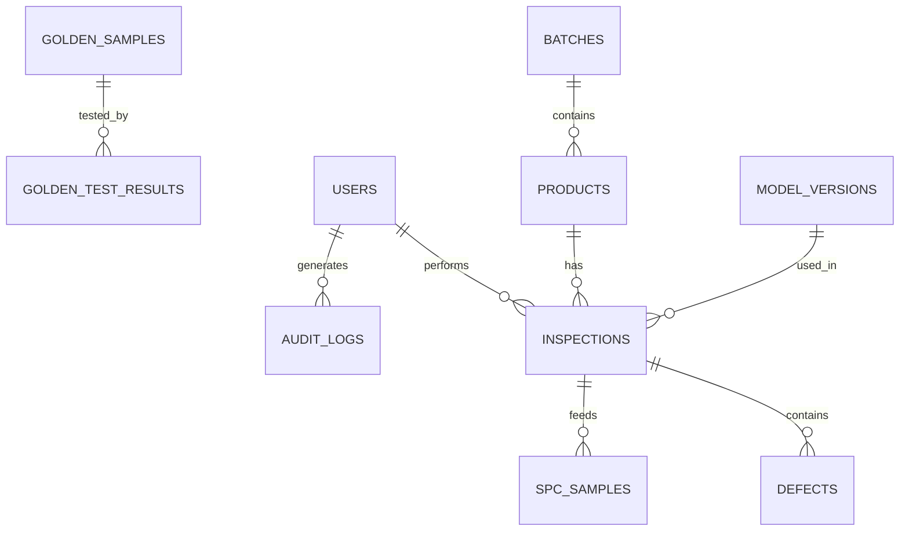
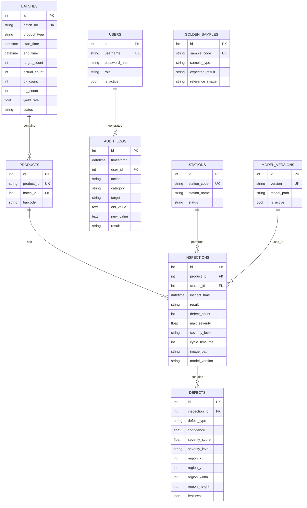

# 数据库表结构设计

> **存储方案**：本地使用 **SQLite**（单机部署），支持扩展至 **MySQL/PostgreSQL**（多工位/MES 对接场景）。
> 

---

## 1. 数据库架构总览



### 1.1 表清单

| 序号 | 表名 | 用途 | 数据量估算 |
| --- | --- | --- | --- |
| 1 | `batches` | 生产批次 | ~100/月 |
| 2 | `products` | 产品信息 | ~10万/月 |
| 3 | `inspections` | 检测记录 | ~10万/月 |
| 4 | `defects` | 缺陷详情 | ~1万/月 |
| 5 | `users` | 用户账户 | ~50 |
| 6 | `audit_logs` | 审计日志 | ~1万/月 |
| 7 | `spc_samples` | SPC 采样 | ~10万/月 |
| 8 | `alarms` | 报警记录 | ~100/月 |
| 9 | `golden_samples` | 标准样本 | ~50 |
| 10 | `golden_test_results` | 标样测试 | ~500/月 |
| 11 | `model_versions` | 模型版本 | ~10 |
| 12 | `config_history` | 配置历史 | ~100/月 |
| 13 | `stations` | 工位信息 | ~10 |

---

## 2. 核心业务表

### 2.1 批次表 (batches)

```sql
CREATE TABLE batches (
    id              INTEGER PRIMARY KEY AUTOINCREMENT,
    batch_no        VARCHAR(50) NOT NULL UNIQUE,  -- 批次号 BATCH-20250115-A
    product_type    VARCHAR(50) NOT NULL,          -- 产品型号
    start_time      DATETIME NOT NULL,             -- 开始时间
    end_time        DATETIME,                      -- 结束时间
    target_count    INTEGER DEFAULT 0,             -- 计划数量
    actual_count    INTEGER DEFAULT 0,             -- 实际数量
    ok_count        INTEGER DEFAULT 0,             -- 合格数量
    ng_count        INTEGER DEFAULT 0,             -- 不合格数量
    yield_rate      REAL,                          -- 良率 (计算字段)
    status          VARCHAR(20) DEFAULT 'running', -- running/completed/paused
    operator_id     INTEGER,                       -- 操作员 ID
    shift           VARCHAR(10),                   -- 班次 A/B/C
    remark          TEXT,
    created_at      DATETIME DEFAULT CURRENT_TIMESTAMP,
    updated_at      DATETIME DEFAULT CURRENT_TIMESTAMP,
    
    FOREIGN KEY (operator_id) REFERENCES users(id)
);

-- 索引
CREATE INDEX idx_batches_batch_no ON batches(batch_no);
CREATE INDEX idx_batches_start_time ON batches(start_time);
CREATE INDEX idx_batches_status ON batches(status);
```

### 2.2 产品表 (products)

```sql
CREATE TABLE products (
    id              INTEGER PRIMARY KEY AUTOINCREMENT,
    product_id      VARCHAR(50) NOT NULL UNIQUE,   -- 产品序列号 PROD-2025-001234
    batch_id        INTEGER NOT NULL,              -- 所属批次
    barcode         VARCHAR(100),                  -- 条码/二维码
    created_at      DATETIME DEFAULT CURRENT_TIMESTAMP,
    
    FOREIGN KEY (batch_id) REFERENCES batches(id)
);

CREATE INDEX idx_products_product_id ON products(product_id);
CREATE INDEX idx_products_batch_id ON products(batch_id);
CREATE INDEX idx_products_barcode ON products(barcode);
```

### 2.3 检测记录表 (inspections)

```sql
CREATE TABLE inspections (
    id              INTEGER PRIMARY KEY AUTOINCREMENT,
    product_id      INTEGER NOT NULL,              -- 产品 ID
    station_id      INTEGER,                       -- 工位 ID
    inspect_time    DATETIME NOT NULL,             -- 检测时间
    
    -- 综合判定结果
    result          VARCHAR(10) NOT NULL,          -- OK/NG/ERROR
    defect_count    INTEGER DEFAULT 0,             -- 缺陷数量
    max_severity    REAL DEFAULT 0,                -- 最高严重度分数
    severity_level  VARCHAR(20),                   -- None/Minor/Moderate/Severe
    
    -- 性能指标
    cycle_time_ms   INTEGER,                       -- 检测耗时 (ms)
    acquire_time_ms INTEGER,                       -- 采集耗时 (ms)
    process_time_ms INTEGER,                       -- 处理耗时 (ms)
    
    -- 图像存储
    image_path      VARCHAR(500),                  -- 原图路径
    annotated_path  VARCHAR(500),                  -- 标注图路径
    thumbnail_path  VARCHAR(500),                  -- 缩略图路径
    
    -- 环境信息
    exposure_us     INTEGER,                       -- 曝光时间
    gain_db         REAL,                          -- 增益
    brightness_avg  REAL,                          -- 平均亮度
    sharpness       REAL,                          -- 清晰度 (Laplacian)
    
    -- 模型信息
    model_version   VARCHAR(50),                   -- 使用的模型版本
    config_version  VARCHAR(50),                   -- 配置版本
    
    -- 操作信息
    operator_id     INTEGER,                       -- 操作员
    reviewed        BOOLEAN DEFAULT FALSE,         -- 是否已复检
    reviewer_id     INTEGER,                       -- 复检人
    review_result   VARCHAR(10),                   -- 复检结果
    review_time     DATETIME,                      -- 复检时间
    
    created_at      DATETIME DEFAULT CURRENT_TIMESTAMP,
    
    FOREIGN KEY (product_id) REFERENCES products(id),
    FOREIGN KEY (station_id) REFERENCES stations(id),
    FOREIGN KEY (operator_id) REFERENCES users(id),
    FOREIGN KEY (reviewer_id) REFERENCES users(id)
);

-- 索引（针对高频查询优化）
CREATE INDEX idx_inspections_product ON inspections(product_id);
CREATE INDEX idx_inspections_time ON inspections(inspect_time);
CREATE INDEX idx_inspections_result ON inspections(result);
CREATE INDEX idx_inspections_severity ON inspections(severity_level);
CREATE INDEX idx_inspections_station ON inspections(station_id);
-- 复合索引：按时间+结果查询
CREATE INDEX idx_inspections_time_result ON inspections(inspect_time, result);
```

### 2.4 缺陷详情表 (defects)

```sql
CREATE TABLE defects (
    id              INTEGER PRIMARY KEY AUTOINCREMENT,
    inspection_id   INTEGER NOT NULL,              -- 检测记录 ID
    
    -- 缺陷基本信息
    defect_type     VARCHAR(20) NOT NULL,          -- scratch/crack/foreign/dimension
    defect_code     VARCHAR(20),                   -- 自定义缺陷编码
    confidence      REAL,                          -- 置信度 0.0~1.0
    
    -- 严重度评分
    severity_score  REAL NOT NULL,                 -- 严重度分数 0~100
    severity_level  VARCHAR(20) NOT NULL,          -- Minor/Moderate/Severe
    action          VARCHAR(20),                   -- pass/review/reject
    
    -- 位置信息 (像素坐标)
    region_x        INTEGER,                       -- 缺陷区域 X
    region_y        INTEGER,                       -- 缺陷区域 Y
    region_width    INTEGER,                       -- 缺陷区域宽度
    region_height   INTEGER,                       -- 缺陷区域高度
    
    -- 缺陷特征（JSON 存储各类型特有属性）
    features        TEXT,                          -- JSON 格式
    /*
    划痕: {"length": 45.2, "width": 2.1, "angle": 15.3}
    裂纹: {"length": 28.5, "branch_count": 2, "depth": 3.2}
    异物: {"area": 156.8, "contrast": 85.2, "circularity": 0.78}
    尺寸: {"width_mm": 50.2, "height_mm": 29.8, "delta_w": 0.2, "delta_h": -0.2}
    */
    
    -- 检测方法
    detector        VARCHAR(50),                   -- 检测器名称
    is_dnn          BOOLEAN DEFAULT FALSE,         -- 是否 DNN 检出
    
    created_at      DATETIME DEFAULT CURRENT_TIMESTAMP,
    
    FOREIGN KEY (inspection_id) REFERENCES inspections(id) ON DELETE CASCADE
);

CREATE INDEX idx_defects_inspection ON defects(inspection_id);
CREATE INDEX idx_defects_type ON defects(defect_type);
CREATE INDEX idx_defects_severity ON defects(severity_level);
CREATE INDEX idx_defects_type_severity ON defects(defect_type, severity_level);
```

---

## 3. 用户与权限表

### 3.1 用户表 (users)

```sql
CREATE TABLE users (
    id              INTEGER PRIMARY KEY AUTOINCREMENT,
    username        VARCHAR(50) NOT NULL UNIQUE,   -- 用户名
    password_hash   VARCHAR(256) NOT NULL,         -- 密码哈希 (bcrypt)
    salt            VARCHAR(64),                   -- 盐值
    
    -- 基本信息
    display_name    VARCHAR(100),                  -- 显示名称
    employee_id     VARCHAR(50),                   -- 工号
    email           VARCHAR(100),
    phone           VARCHAR(20),
    department      VARCHAR(100),                  -- 部门
    
    -- 角色权限
    role            VARCHAR(20) NOT NULL,          -- operator/engineer/admin/auditor
    permissions     TEXT,                          -- JSON 格式的细粒度权限
    
    -- 状态
    is_active       BOOLEAN DEFAULT TRUE,
    last_login      DATETIME,
    login_count     INTEGER DEFAULT 0,
    failed_attempts INTEGER DEFAULT 0,             -- 连续失败次数
    locked_until    DATETIME,                      -- 锁定截止时间
    
    created_at      DATETIME DEFAULT CURRENT_TIMESTAMP,
    updated_at      DATETIME DEFAULT CURRENT_TIMESTAMP,
    created_by      INTEGER,
    
    FOREIGN KEY (created_by) REFERENCES users(id)
);

CREATE UNIQUE INDEX idx_users_username ON users(username);
CREATE INDEX idx_users_role ON users(role);
CREATE INDEX idx_users_employee_id ON users(employee_id);
```

### 3.2 审计日志表 (audit_logs)

```sql
CREATE TABLE audit_logs (
    id              INTEGER PRIMARY KEY AUTOINCREMENT,
    timestamp       DATETIME NOT NULL DEFAULT CURRENT_TIMESTAMP,
    user_id         INTEGER,                       -- 操作用户
    username        VARCHAR(50),                   -- 冗余用户名（防止删除后丢失）
    
    -- 操作信息
    action          VARCHAR(50) NOT NULL,          -- 操作类型
    /*
    操作类型枚举:
    - AUTH: LOGIN, LOGOUT, LOGIN_FAILED, PASSWORD_CHANGE
    - CONFIG: PARAM_CHANGE, CONFIG_IMPORT, CONFIG_EXPORT
    - MODEL: MODEL_UPLOAD, MODEL_SWITCH, MODEL_DELETE
    - SYSTEM: START, STOP, RESTART, EMERGENCY_STOP
    - DATA: DATA_EXPORT, DATA_DELETE, BACKUP_CREATE
    - USER: USER_CREATE, USER_UPDATE, USER_DELETE, ROLE_CHANGE
    */
    category        VARCHAR(20),                   -- AUTH/CONFIG/MODEL/SYSTEM/DATA/USER
    target          VARCHAR(200),                  -- 操作对象
    
    -- 变更详情
    old_value       TEXT,                          -- 修改前值 (JSON)
    new_value       TEXT,                          -- 修改后值 (JSON)
    
    -- 请求信息
    ip_address      VARCHAR(45),                   -- IPv4/IPv6
    user_agent      VARCHAR(500),                  -- 客户端信息
    request_id      VARCHAR(36),                   -- 请求追踪 ID
    
    -- 结果
    result          VARCHAR(20) NOT NULL,          -- SUCCESS/FAILED/DENIED
    error_message   TEXT,                          -- 错误信息
    
    -- 不可修改
    checksum        VARCHAR(64)                    -- SHA-256 完整性校验
);

-- 审计日志不允许删除，只允许插入
-- 生产环境应配置数据库触发器防止 UPDATE/DELETE

CREATE INDEX idx_audit_timestamp ON audit_logs(timestamp);
CREATE INDEX idx_audit_user ON audit_logs(user_id);
CREATE INDEX idx_audit_action ON audit_logs(action);
CREATE INDEX idx_audit_category ON audit_logs(category);
CREATE INDEX idx_audit_result ON audit_logs(result);
```

---

## 4. SPC 质量控制表

### 4.1 SPC 采样表 (spc_samples)

```sql
CREATE TABLE spc_samples (
    id              INTEGER PRIMARY KEY AUTOINCREMENT,
    sample_time     DATETIME NOT NULL,
    station_id      INTEGER,
    
    -- 采样数据
    metric_name     VARCHAR(50) NOT NULL,          -- 指标名称
    /*
    指标类型:
    - yield_rate: 良率
    - cycle_time: 节拍
    - defect_rate_scratch: 划痕缺陷率
    - defect_rate_crack: 裂纹缺陷率
    - severity_avg: 平均严重度
    - dimension_width: 宽度测量值
    - dimension_height: 高度测量值
    */
    
    -- 采样值
    value           REAL NOT NULL,                 -- 测量值
    subgroup_id     INTEGER,                       -- 子组 ID（用于 X-Bar R 图）
    subgroup_size   INTEGER DEFAULT 1,             -- 子组大小
    
    -- 控制限（采样时刻的控制限）
    ucl             REAL,                          -- 上控制限
    cl              REAL,                          -- 中心线
    lcl             REAL,                          -- 下控制限
    
    -- 状态
    in_control      BOOLEAN,                       -- 是否受控
    rule_violated   VARCHAR(50),                   -- 违反的规则 (Rule1/Rule2/...)
    
    created_at      DATETIME DEFAULT CURRENT_TIMESTAMP,
    
    FOREIGN KEY (station_id) REFERENCES stations(id)
);

CREATE INDEX idx_spc_time ON spc_samples(sample_time);
CREATE INDEX idx_spc_metric ON spc_samples(metric_name);
CREATE INDEX idx_spc_station ON spc_samples(station_id);
CREATE INDEX idx_spc_control ON spc_samples(in_control);
```

### 4.2 SPC 控制限配置表 (spc_limits)

```sql
CREATE TABLE spc_limits (
    id              INTEGER PRIMARY KEY AUTOINCREMENT,
    metric_name     VARCHAR(50) NOT NULL,
    station_id      INTEGER,                       -- NULL 表示全局
    
    -- 规格限 (Specification Limits)
    usl             REAL,                          -- 上规格限
    target          REAL,                          -- 目标值
    lsl             REAL,                          -- 下规格限
    
    -- 控制限 (Control Limits) - 可自动计算
    ucl             REAL,
    cl              REAL,
    lcl             REAL,
    
    -- 计算参数
    calc_method     VARCHAR(20) DEFAULT 'auto',    -- auto/manual
    sample_count    INTEGER DEFAULT 100,           -- 计算样本数
    sigma_factor    REAL DEFAULT 3.0,              -- σ 倍数
    
    -- 报警配置
    enable_alarm    BOOLEAN DEFAULT TRUE,
    alarm_rules     TEXT,                          -- JSON: 启用的规则
    
    is_active       BOOLEAN DEFAULT TRUE,
    updated_at      DATETIME DEFAULT CURRENT_TIMESTAMP,
    updated_by      INTEGER,
    
    FOREIGN KEY (station_id) REFERENCES stations(id),
    FOREIGN KEY (updated_by) REFERENCES users(id)
);

CREATE UNIQUE INDEX idx_spc_limits_metric_station ON spc_limits(metric_name, station_id);
```

---

## 5. 报警与事件表

### 5.1 报警记录表 (alarms)

```sql
CREATE TABLE alarms (
    id              INTEGER PRIMARY KEY AUTOINCREMENT,
    alarm_time      DATETIME NOT NULL,
    station_id      INTEGER,
    
    -- 报警信息
    alarm_code      VARCHAR(20) NOT NULL,          -- 报警代码
    alarm_level     VARCHAR(20) NOT NULL,          -- INFO/WARNING/ERROR/CRITICAL
    alarm_type      VARCHAR(50) NOT NULL,          -- 报警类型
    /*
    报警类型:
    - CAMERA_DISCONNECT: 相机断开
    - CAMERA_TIMEOUT: 相机超时
    - DETECT_TIMEOUT: 检测超时
    - PLC_DISCONNECT: PLC 断开
    - IMAGE_ABNORMAL: 图像异常
    - SPC_OUT_OF_CONTROL: SPC 失控
    - YIELD_LOW: 良率过低
    - MEMORY_HIGH: 内存占用高
    - DISK_FULL: 磁盘空间不足
    - MODEL_LOAD_FAILED: 模型加载失败
    */
    
    message         TEXT NOT NULL,                 -- 报警消息
    details         TEXT,                          -- JSON 详细信息
    
    -- 关联信息
    inspection_id   INTEGER,                       -- 关联的检测记录
    
    -- 处理状态
    status          VARCHAR(20) DEFAULT 'active',  -- active/acknowledged/resolved
    acknowledged_by INTEGER,                       -- 确认人
    acknowledged_at DATETIME,                      -- 确认时间
    resolved_by     INTEGER,                       -- 解决人
    resolved_at     DATETIME,                      -- 解决时间
    resolution      TEXT,                          -- 解决方案
    
    -- 自动恢复
    auto_recovered  BOOLEAN DEFAULT FALSE,
    recover_time    DATETIME,
    
    created_at      DATETIME DEFAULT CURRENT_TIMESTAMP,
    
    FOREIGN KEY (station_id) REFERENCES stations(id),
    FOREIGN KEY (inspection_id) REFERENCES inspections(id),
    FOREIGN KEY (acknowledged_by) REFERENCES users(id),
    FOREIGN KEY (resolved_by) REFERENCES users(id)
);

CREATE INDEX idx_alarms_time ON alarms(alarm_time);
CREATE INDEX idx_alarms_level ON alarms(alarm_level);
CREATE INDEX idx_alarms_type ON alarms(alarm_type);
CREATE INDEX idx_alarms_status ON alarms(status);
CREATE INDEX idx_alarms_station ON alarms(station_id);
```

---

## 6. 标准样本管理表

### 6.1 Golden Sample 表 (golden_samples)

```sql
CREATE TABLE golden_samples (
    id              INTEGER PRIMARY KEY AUTOINCREMENT,
    sample_code     VARCHAR(50) NOT NULL UNIQUE,   -- 样本编号 GS-001
    
    -- 样本信息
    sample_type     VARCHAR(20) NOT NULL,          -- ok/scratch/crack/foreign/dimension
    severity_level  VARCHAR(20),                   -- 缺陷样本的严重度
    description     TEXT,                          -- 描述
    
    -- 标定信息
    expected_result VARCHAR(10) NOT NULL,          -- 期望结果 OK/NG
    expected_defects TEXT,                         -- JSON: 期望检出的缺陷
    /*
    {
      "defects": [
        {"type": "scratch", "region": {"x": 100, "y": 150, "w": 50, "h": 10}},
        {"type": "crack", "region": {"x": 300, "y": 200, "w": 30, "h": 40}}
      ]
    }
    */
    
    -- 参考图像
    reference_image VARCHAR(500),                  -- 参考图像路径
    annotated_image VARCHAR(500),                  -- 标注图像路径
    
    -- 管理信息
    storage_location VARCHAR(100),                 -- 存放位置
    calibration_date DATE,                         -- 上次标定日期
    next_calibration DATE,                         -- 下次标定日期
    calibration_cycle_days INTEGER DEFAULT 90,     -- 标定周期（天）
    
    is_active       BOOLEAN DEFAULT TRUE,
    created_at      DATETIME DEFAULT CURRENT_TIMESTAMP,
    created_by      INTEGER,
    
    FOREIGN KEY (created_by) REFERENCES users(id)
);

CREATE INDEX idx_golden_samples_type ON golden_samples(sample_type);
CREATE INDEX idx_golden_samples_active ON golden_samples(is_active);
```

### 6.2 Golden Sample 测试结果表 (golden_test_results)

```sql
CREATE TABLE golden_test_results (
    id              INTEGER PRIMARY KEY AUTOINCREMENT,
    sample_id       INTEGER NOT NULL,
    test_time       DATETIME NOT NULL,
    station_id      INTEGER,
    
    -- 测试结果
    actual_result   VARCHAR(10) NOT NULL,          -- OK/NG/ERROR
    is_correct      BOOLEAN NOT NULL,              -- 是否与期望一致
    
    -- 详细结果
    detected_defects TEXT,                         -- JSON: 实际检出的缺陷
    
    -- 性能指标
    cycle_time_ms   INTEGER,
    
    -- 图像
    test_image_path VARCHAR(500),
    
    -- 测试环境
    model_version   VARCHAR(50),
    config_version  VARCHAR(50),
    operator_id     INTEGER,
    
    created_at      DATETIME DEFAULT CURRENT_TIMESTAMP,
    
    FOREIGN KEY (sample_id) REFERENCES golden_samples(id),
    FOREIGN KEY (station_id) REFERENCES stations(id),
    FOREIGN KEY (operator_id) REFERENCES users(id)
);

CREATE INDEX idx_golden_test_sample ON golden_test_results(sample_id);
CREATE INDEX idx_golden_test_time ON golden_test_results(test_time);
CREATE INDEX idx_golden_test_correct ON golden_test_results(is_correct);
```

---

## 7. 系统配置表

### 7.1 模型版本表 (model_versions)

```sql
CREATE TABLE model_versions (
    id              INTEGER PRIMARY KEY AUTOINCREMENT,
    version         VARCHAR(50) NOT NULL UNIQUE,   -- v1.0.0
    model_name      VARCHAR(100) NOT NULL,         -- YOLOv5n-defect
    
    -- 模型文件
    model_path      VARCHAR(500) NOT NULL,         -- 模型文件路径
    model_hash      VARCHAR(64) NOT NULL,          -- SHA-256 校验
    model_size_mb   REAL,                          -- 文件大小
    
    -- 模型信息
    framework       VARCHAR(50),                   -- ONNX/TensorRT/OpenVINO
    input_size      VARCHAR(20),                   -- 640x640
    classes         TEXT,                          -- JSON: 类别列表
    
    -- 性能指标
    inference_time_ms REAL,                        -- 推理耗时
    accuracy        REAL,                          -- 准确率
    precision_val   REAL,                          -- 精确率
    recall          REAL,                          -- 召回率
    f1_score        REAL,                          -- F1 分数
    
    -- 训练信息
    train_dataset   VARCHAR(200),                  -- 训练数据集
    train_date      DATE,                          -- 训练日期
    epochs          INTEGER,                       -- 训练轮数
    
    -- 状态
    is_active       BOOLEAN DEFAULT FALSE,         -- 是否当前使用
    is_verified     BOOLEAN DEFAULT FALSE,         -- 是否已验证
    verified_by     INTEGER,
    verified_at     DATETIME,
    
    -- 管理
    description     TEXT,
    changelog       TEXT,                          -- 变更日志
    created_at      DATETIME DEFAULT CURRENT_TIMESTAMP,
    created_by      INTEGER,
    
    FOREIGN KEY (created_by) REFERENCES users(id),
    FOREIGN KEY (verified_by) REFERENCES users(id)
);

CREATE INDEX idx_model_versions_active ON model_versions(is_active);
CREATE INDEX idx_model_versions_version ON model_versions(version);
```

### 7.2 配置历史表 (config_history)

```sql
CREATE TABLE config_history (
    id              INTEGER PRIMARY KEY AUTOINCREMENT,
    config_type     VARCHAR(50) NOT NULL,          -- camera/detector/roi/output/plc
    version         INTEGER NOT NULL,              -- 版本号 (自增)
    
    -- 配置内容
    config_json     TEXT NOT NULL,                 -- JSON 格式的配置
    config_hash     VARCHAR(64) NOT NULL,          -- SHA-256
    
    -- 变更信息
    change_reason   TEXT,                          -- 变更原因
    
    -- 状态
    is_active       BOOLEAN DEFAULT FALSE,         -- 是否当前使用
    
    -- 管理
    created_at      DATETIME DEFAULT CURRENT_TIMESTAMP,
    created_by      INTEGER,
    activated_at    DATETIME,
    activated_by    INTEGER,
    
    FOREIGN KEY (created_by) REFERENCES users(id),
    FOREIGN KEY (activated_by) REFERENCES users(id)
);

CREATE INDEX idx_config_history_type ON config_history(config_type);
CREATE INDEX idx_config_history_active ON config_history(is_active);
CREATE UNIQUE INDEX idx_config_history_type_version ON config_history(config_type, version);
```

### 7.3 工位表 (stations)

```sql
CREATE TABLE stations (
    id              INTEGER PRIMARY KEY AUTOINCREMENT,
    station_code    VARCHAR(20) NOT NULL UNIQUE,   -- ST-01
    station_name    VARCHAR(100),                  -- 正面检测工位
    
    -- 工位配置
    camera_type     VARCHAR(50),                   -- 相机类型
    camera_ip       VARCHAR(45),                   -- 相机 IP
    detection_types TEXT,                          -- JSON: 检测类型列表
    
    -- 状态
    is_active       BOOLEAN DEFAULT TRUE,
    status          VARCHAR(20) DEFAULT 'idle',    -- idle/running/error/maintenance
    last_heartbeat  DATETIME,
    
    -- 统计
    total_count     INTEGER DEFAULT 0,
    ok_count        INTEGER DEFAULT 0,
    ng_count        INTEGER DEFAULT 0,
    
    created_at      DATETIME DEFAULT CURRENT_TIMESTAMP,
    updated_at      DATETIME DEFAULT CURRENT_TIMESTAMP
);

CREATE INDEX idx_stations_code ON stations(station_code);
CREATE INDEX idx_stations_status ON stations(status);
```

---

## 8. 常用查询示例

### 8.1 检测结果统计

```sql
-- 今日检测统计
SELECT 
    COUNT(*) as total,
    SUM(CASE WHEN result = 'OK' THEN 1 ELSE 0 END) as ok_count,
    SUM(CASE WHEN result = 'NG' THEN 1 ELSE 0 END) as ng_count,
    ROUND(SUM(CASE WHEN result = 'OK' THEN 1.0 ELSE 0 END) / COUNT(*) * 100, 2) as yield_rate,
    ROUND(AVG(cycle_time_ms), 1) as avg_cycle_time
FROM inspections
WHERE DATE(inspect_time) = DATE('now');
```

### 8.2 缺陷分布统计

```sql
-- 按缺陷类型统计
SELECT 
    defect_type,
    COUNT(*) as count,
    ROUND(COUNT(*) * 100.0 / SUM(COUNT(*)) OVER(), 2) as percentage,
    ROUND(AVG(severity_score), 1) as avg_severity
FROM defects d
JOIN inspections i ON d.inspection_id = i.id
WHERE DATE(i.inspect_time) = DATE('now')
GROUP BY defect_type
ORDER BY count DESC;
```

### 8.3 产品追溯

```sql
-- 根据产品 ID 追溯完整检测历史
SELECT 
    p.product_id,
    b.batch_no,
    i.inspect_time,
    i.result,
    i.severity_level,
    i.cycle_time_ms,
    i.image_path,
    GROUP_CONCAT(d.defect_type || '(' || d.severity_level || ')') as defects
FROM products p
JOIN batches b ON p.batch_id = b.id
JOIN inspections i ON i.product_id = p.id
LEFT JOIN defects d ON d.inspection_id = i.id
WHERE p.product_id = 'PROD-2025-001234'
GROUP BY i.id
ORDER BY i.inspect_time;
```

### 8.4 CPK 计算

```sql
-- 计算尺寸 CPK（宽度）
WITH stats AS (
    SELECT 
        AVG(CAST(json_extract(features, '$.width_mm') AS REAL)) as mean,
        (
            SELECT value FROM (
                SELECT CAST(json_extract(features, '$.width_mm') AS REAL) as value
                FROM defects
                WHERE defect_type = 'dimension'
                ORDER BY value
                LIMIT 2 - (SELECT COUNT(*) FROM defects WHERE defect_type = 'dimension') % 2
                OFFSET (SELECT (COUNT(*) - 1) / 2 FROM defects WHERE defect_type = 'dimension')
            )
            LIMIT 1
        ) as median,
        -- 使用样本标准差
        SQRT(SUM((CAST(json_extract(features, '$.width_mm') AS REAL) - sub.avg_val) * 
                 (CAST(json_extract(features, '$.width_mm') AS REAL) - sub.avg_val)) / 
             (COUNT(*) - 1)) as stddev
    FROM defects, (
        SELECT AVG(CAST(json_extract(features, '$.width_mm') AS REAL)) as avg_val
        FROM defects WHERE defect_type = 'dimension'
    ) sub
    WHERE defect_type = 'dimension'
),
limits AS (
    SELECT 50.5 as USL, 49.5 as LSL  -- 从配置读取
)
SELECT 
    ROUND(mean, 4) as mean,
    ROUND(stddev, 4) as sigma,
    ROUND((USL - mean) / (3 * stddev), 3) as Cpu,
    ROUND((mean - LSL) / (3 * stddev), 3) as Cpl,
    ROUND(MIN((USL - mean) / (3 * stddev), (mean - LSL) / (3 * stddev)), 3) as Cpk
FROM stats, limits;
```

---

## 9. 数据维护策略

### 9.1 数据保留策略

| 数据类型 | 保留周期 | 归档方式 | 清理策略 |
| --- | --- | --- | --- |
| **检测记录** | 在线 90 天 | 按月归档至 CSV/Parquet | 超期数据压缩备份后删除 |
| **缺陷详情** | 在线 90 天 | 随检测记录归档 | 同上 |
| **NG 图像** | 在线 30 天 | 压缩后转移至 NAS | 超期删除本地 |
| **审计日志** | 永久在线 | 按年归档 | 不删除 |
| **SPC 数据** | 在线 180 天 | 按月归档聚合数据 | 保留日均值 |

### 9.2 数据归档脚本

```sql
-- 归档 90 天前的检测数据
INSERT INTO inspections_archive 
SELECT * FROM inspections 
WHERE inspect_time < DATE('now', '-90 days');

DELETE FROM defects 
WHERE inspection_id IN (
    SELECT id FROM inspections 
    WHERE inspect_time < DATE('now', '-90 days')
);

DELETE FROM inspections 
WHERE inspect_time < DATE('now', '-90 days');

-- 重建索引
REINDEX inspections;
REINDEX defects;
VACUUM;
```

### 9.3 数据库优化

```sql
-- 分析表统计信息
ANALYZE inspections;
ANALYZE defects;

-- 检查索引使用情况
EXPLAIN QUERY PLAN
SELECT * FROM inspections 
WHERE inspect_time > DATE('now', '-1 day') AND result = 'NG';

-- 定期 VACUUM（碎片整理）
VACUUM;

-- 检查数据库完整性
PRAGMA integrity_check;
```

---

## 10. C++ ORM 封装示例

```cpp
// 检测结果数据模型
struct InspectionRecord {
    int64_t id = 0;
    int64_t productId = 0;
    QDateTime inspectTime;
    QString result;           // "OK" / "NG" / "ERROR"
    int defectCount = 0;
    double maxSeverity = 0;
    QString severityLevel;
    int cycleTimeMs = 0;
    QString imagePath;
    QString annotatedPath;
    
    // 缺陷列表（一对多）
    std::vector<DefectRecord> defects;
};

struct DefectRecord {
    int64_t id = 0;
    int64_t inspectionId = 0;
    QString defectType;
    double confidence = 0;
    double severityScore = 0;
    QString severityLevel;
    QRect region;
    QJsonObject features;
};

// 数据访问层
class InspectionDAO {
public:
    explicit InspectionDAO(QSqlDatabase& db) : m_db(db) {}
    
    // 插入检测记录（含缺陷）
    bool insert(InspectionRecord& record) {
        QSqlQuery query(m_db);
        m_db.transaction();
        
        try {
            // 插入主记录
            query.prepare(R"(
                INSERT INTO inspections (
                    product_id, inspect_time, result, defect_count,
                    max_severity, severity_level, cycle_time_ms,
                    image_path, annotated_path
                ) VALUES (?, ?, ?, ?, ?, ?, ?, ?, ?)
            )");
            
            query.addBindValue(record.productId);
            query.addBindValue(record.inspectTime);
            query.addBindValue(record.result);
            query.addBindValue(record.defectCount);
            query.addBindValue(record.maxSeverity);
            query.addBindValue(record.severityLevel);
            query.addBindValue(record.cycleTimeMs);
            query.addBindValue(record.imagePath);
            query.addBindValue(record.annotatedPath);
            
            if (!query.exec()) {
                throw std::runtime_error(query.lastError().text().toStdString());
            }
            
            record.id = query.lastInsertId().toLongLong();
            
            // 插入缺陷记录
            if (!record.defects.empty()) {
                query.prepare(R"(
                    INSERT INTO defects (
                        inspection_id, defect_type, confidence,
                        severity_score, severity_level,
                        region_x, region_y, region_width, region_height,
                        features
                    ) VALUES (?, ?, ?, ?, ?, ?, ?, ?, ?, ?)
                )");
                
                for (auto& defect : record.defects) {
                    defect.inspectionId = record.id;
                    query.addBindValue(defect.inspectionId);
                    query.addBindValue(defect.defectType);
                    query.addBindValue(defect.confidence);
                    query.addBindValue(defect.severityScore);
                    query.addBindValue(defect.severityLevel);
                    query.addBindValue(defect.region.x());
                    query.addBindValue(defect.region.y());
                    query.addBindValue(defect.region.width());
                    query.addBindValue(defect.region.height());
                    query.addBindValue(QJsonDocument(defect.features).toJson());
                    
                    if (!query.exec()) {
                        throw std::runtime_error(query.lastError().text().toStdString());
                    }
                    defect.id = query.lastInsertId().toLongLong();
                }
            }
            
            m_db.commit();
            return true;
            
        } catch (const std::exception& e) {
            m_db.rollback();
            LOG_ERROR("InspectionDAO::insert failed: {}", e.what());
            return false;
        }
    }
    
    // 查询今日统计
    struct DailyStats {
        int total = 0;
        int okCount = 0;
        int ngCount = 0;
        double yieldRate = 0;
        double avgCycleTime = 0;
    };
    
    DailyStats getTodayStats() {
        DailyStats stats;
        QSqlQuery query(m_db);
        
        query.exec(R"(
            SELECT 
                COUNT(*) as total,
                SUM(CASE WHEN result = 'OK' THEN 1 ELSE 0 END) as ok_count,
                SUM(CASE WHEN result = 'NG' THEN 1 ELSE 0 END) as ng_count,
                AVG(cycle_time_ms) as avg_cycle
            FROM inspections
            WHERE DATE(inspect_time) = DATE('now', 'localtime')
        )");
        
        if (query.next()) {
            stats.total = query.value("total").toInt();
            stats.okCount = query.value("ok_count").toInt();
            stats.ngCount = query.value("ng_count").toInt();
            stats.avgCycleTime = query.value("avg_cycle").toDouble();
            stats.yieldRate = stats.total > 0 
                ? (double)stats.okCount / stats.total * 100 : 0;
        }
        
        return stats;
    }
    
private:
    QSqlDatabase& m_db;
};
```

---

## 11. ER 图（完整）


