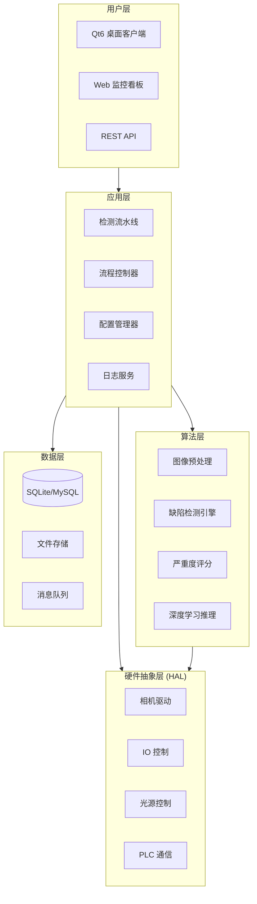
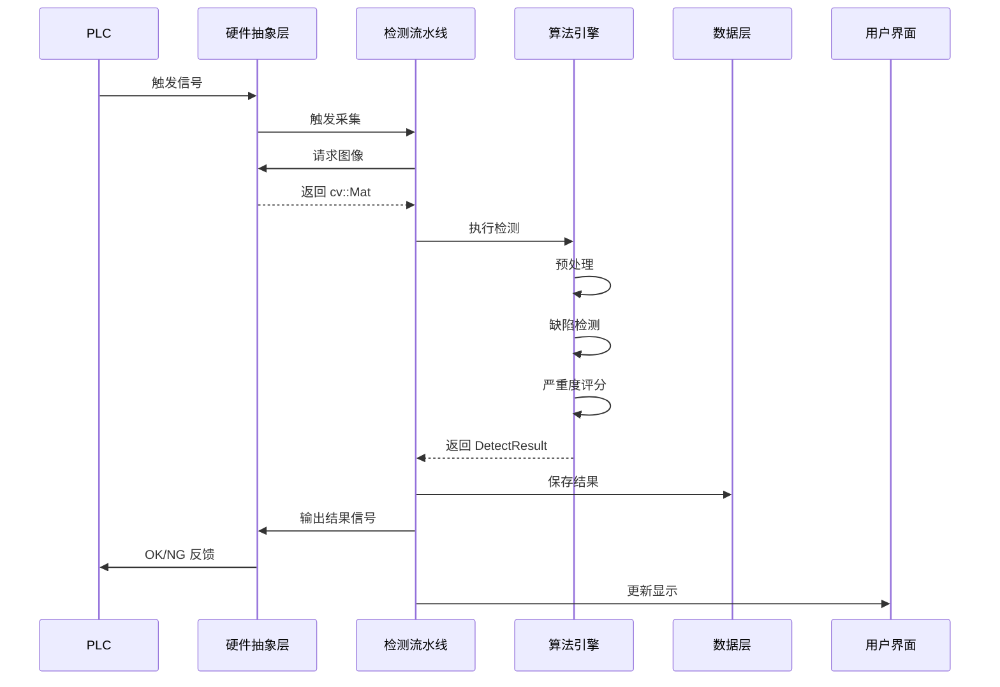
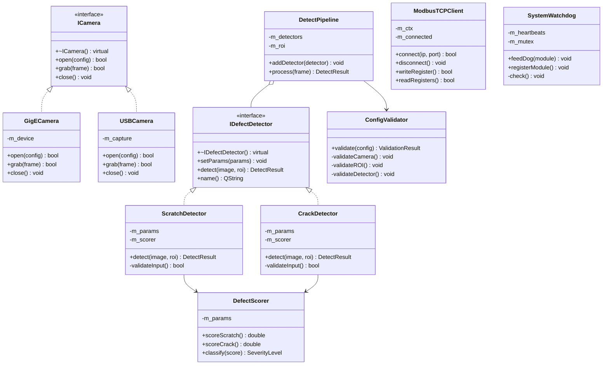
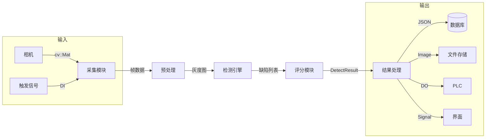
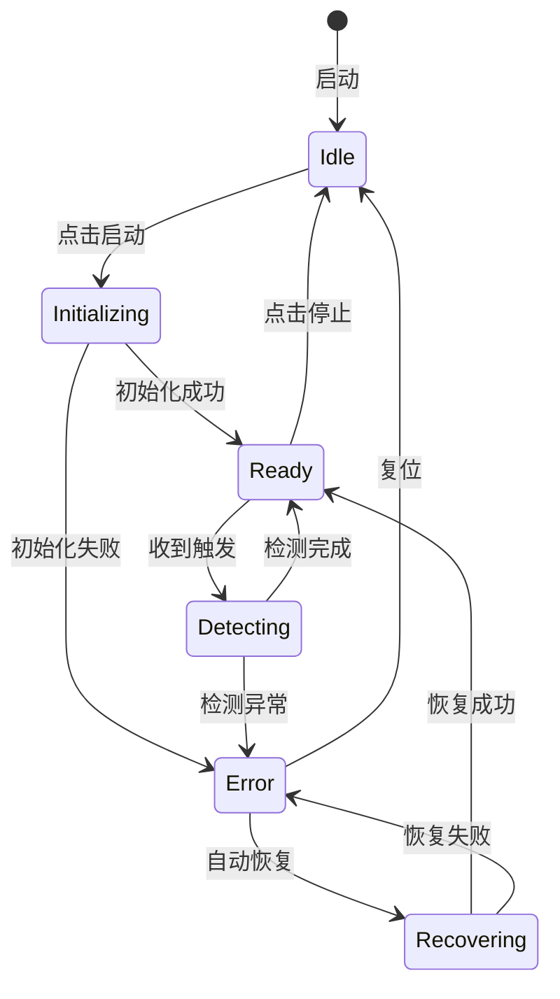
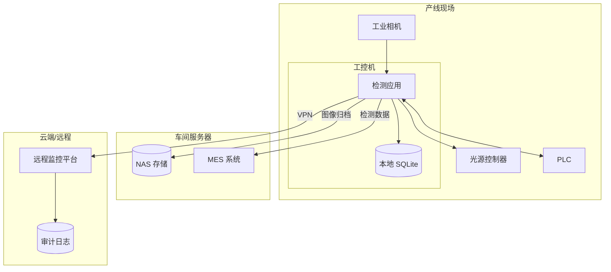

# 架构设计

## 1. 系统总体架构



---

## 2. 分层架构说明

| 层级 | 职责 | 关键组件 |
| --- | --- | --- |
| **用户层** | 人机交互、数据可视化 | Qt6 GUI、Web 看板、REST API |
| **应用层** | 业务流程编排、系统协调 | 检测流水线、流程控制、配置管理 |
| **算法层** | 图像处理、缺陷识别 | 预处理、检测器、评分器、DNN |
| **HAL 层** | 硬件设备抽象封装 | 相机、IO、光源、PLC 驱动 |
| **数据层** | 数据持久化、消息传递 | SQLite、文件系统、消息队列 |

---

## 3. 核心模块交互



---

## 4. 目录结构

```jsx
defect-detection/
├── CMakeLists.txt                      # 顶层 CMake 配置
├── cmake/                              # CMake 模块
│   ├── FindHIKCamera.cmake             # 海康相机 SDK 查找脚本
│   ├── FindDaheng.cmake                # 大恒相机 SDK 查找脚本
│   ├── CompilerOptions.cmake           # 编译器选项配置
│   └── Version.cmake                   # 版本号管理
│
├── src/                                # 源代码目录
│   ├── main.cpp                        # 程序入口
│   │
│   ├── app/                            # 【应用层】业务流程编排
│   │   ├── CMakeLists.txt
│   │   ├── DetectPipeline.h            # 检测流水线
│   │   ├── DetectPipeline.cpp
│   │   ├── FlowController.h            # 流程状态机控制
│   │   ├── FlowController.cpp
│   │   ├── ConfigManager.h             # 配置热加载管理
│   │   ├── ConfigManager.cpp
│   │   ├── SystemWatchdog.h            # 看门狗监控
│   │   ├── SystemWatchdog.cpp
│   │   ├── ResultAggregator.h          # 多工位结果聚合
│   │   └── ResultAggregator.cpp
│   │
│   ├── algorithm/                      # 【算法层】图像处理与缺陷识别
│   │   ├── CMakeLists.txt
│   │   ├── IDefectDetector.h           # 检测器接口（纯虚类）
│   │   ├── DetectorFactory.h           # 检测器工厂
│   │   ├── DetectorFactory.cpp
│   │   ├── detectors/                  # 各类缺陷检测器
│   │   │   ├── ScratchDetector.h       # 划痕检测
│   │   │   ├── ScratchDetector.cpp
│   │   │   ├── CrackDetector.h         # 裂纹检测
│   │   │   ├── CrackDetector.cpp
│   │   │   ├── ForeignDetector.h       # 异物检测
│   │   │   ├── ForeignDetector.cpp
│   │   │   ├── DimensionDetector.h     # 尺寸测量
│   │   │   └── DimensionDetector.cpp
│   │   ├── dnn/                        # 深度学习推理
│   │   │   ├── DnnDetector.h           # DNN 检测器基类
│   │   │   ├── DnnDetector.cpp
│   │   │   ├── YoloDetector.h          # YOLO 系列封装
│   │   │   ├── YoloDetector.cpp
│   │   │   └── ModelManager.h          # 模型热更新管理
│   │   ├── scoring/                    # 严重度评分
│   │   │   ├── DefectScorer.h
│   │   │   ├── DefectScorer.cpp
│   │   │   └── SeverityConfig.h        # 评分阈值配置
│   │   ├── preprocess/                 # 图像预处理
│   │   │   ├── ImagePreprocessor.h
│   │   │   ├── ImagePreprocessor.cpp
│   │   │   ├── ROIManager.h            # ROI 区域管理
│   │   │   └── Calibration.h           # 标定与畸变校正
│   │   └── postprocess/                # 后处理
│   │       ├── NMSFilter.h             # 非极大值抑制
│   │       └── DefectMerger.h          # 缺陷区域合并
│   │
│   ├── hal/                            # 【硬件抽象层】设备驱动封装
│   │   ├── CMakeLists.txt
│   │   ├── camera/                     # 相机驱动
│   │   │   ├── ICamera.h               # 相机接口
│   │   │   ├── CameraFactory.h         # 相机工厂
│   │   │   ├── CameraFactory.cpp
│   │   │   ├── GigECamera.h            # GigE Vision 相机
│   │   │   ├── GigECamera.cpp
│   │   │   ├── USBCamera.h             # USB 相机（OpenCV）
│   │   │   ├── USBCamera.cpp
│   │   │   ├── HikCamera.h             # 海康相机 SDK 封装
│   │   │   ├── HikCamera.cpp
│   │   │   ├── DahengCamera.h          # 大恒相机 SDK 封装
│   │   │   ├── DahengCamera.cpp
│   │   │   └── FileCamera.h            # 文件/图片输入（调试用）
│   │   ├── io/                         # IO 控制
│   │   │   ├── IIOController.h
│   │   │   ├── GPIOController.h        # Linux GPIO
│   │   │   ├── GPIOController.cpp
│   │   │   ├── SerialIO.h              # 串口 IO
│   │   │   └── SerialIO.cpp
│   │   ├── light/                      # 光源控制
│   │   │   ├── ILightController.h
│   │   │   ├── SerialLightController.h # 串口光源控制器
│   │   │   └── ModbusLightController.h # Modbus 光源控制器
│   │   └── plc/                        # PLC 通信
│   │       ├── IPLCClient.h
│   │       ├── ModbusTCPClient.h       # Modbus TCP 客户端
│   │       ├── ModbusTCPClient.cpp
│   │       ├── ModbusRTUClient.h       # Modbus RTU 客户端
│   │       ├── SiemensS7Client.h       # 西门子 S7 协议
│   │       └── MitsubishiMCClient.h    # 三菱 MC 协议
│   │
│   ├── ui/                             # 【用户界面层】Qt6 GUI
│   │   ├── CMakeLists.txt
│   │   ├── MainWindow.h
│   │   ├── MainWindow.cpp
│   │   ├── MainWindow.ui               # Qt Designer 文件
│   │   ├── widgets/                    # 自定义控件
│   │   │   ├── ImageView.h             # 图像显示（支持缩放/标注）
│   │   │   ├── ImageView.cpp
│   │   │   ├── ROIEditor.h             # ROI 可视化编辑
│   │   │   ├── ROIEditor.cpp
│   │   │   ├── SeverityBar.h           # 严重度进度条
│   │   │   ├── ParamPanel.h            # 参数配置面板
│   │   │   ├── ParamPanel.cpp
│   │   │   └── ResultCard.h            # 检测结果卡片
│   │   ├── dialogs/                    # 对话框
│   │   │   ├── SettingsDialog.h        # 系统设置
│   │   │   ├── CalibrationDialog.h     # 标定向导
│   │   │   ├── LoginDialog.h           # 登录/权限
│   │   │   └── AboutDialog.h           # 关于
│   │   ├── views/                      # 视图页面
│   │   │   ├── DetectView.h            # 检测主视图
│   │   │   ├── StatisticsView.h        # 统计报表视图
│   │   │   ├── HistoryView.h           # 历史记录视图
│   │   │   └── SPCView.h               # SPC 控制图视图
│   │   └── models/                     # Qt Model/View 模型
│   │       ├── DefectTableModel.h      # 缺陷列表模型
│   │       └── HistoryTableModel.h     # 历史记录模型
│   │
│   ├── data/                           # 【数据层】持久化与存储
│   │   ├── CMakeLists.txt
│   │   ├── DatabaseManager.h           # 数据库连接管理
│   │   ├── DatabaseManager.cpp
│   │   ├── repositories/               # 数据仓库（DAO 模式）
│   │   │   ├── IRepository.h
│   │   │   ├── InspectionRepository.h  # 检测记录仓库
│   │   │   ├── InspectionRepository.cpp
│   │   │   ├── DefectRepository.h      # 缺陷记录仓库
│   │   │   └── ConfigRepository.h      # 配置存储
│   │   ├── storage/                    # 文件存储
│   │   │   ├── ImageStorage.h          # 图像存储（本地/NAS）
│   │   │   ├── ImageStorage.cpp
│   │   │   └── BackupManager.h         # 备份管理
│   │   └── export/                     # 数据导出
│   │       ├── CSVExporter.h           # CSV 导出
│   │       ├── ExcelExporter.h         # Excel 导出
│   │       └── ReportGenerator.h       # PDF 报表生成
│   │
│   ├── network/                        # 【网络层】对外通信
│   │   ├── CMakeLists.txt
│   │   ├── http/                       # HTTP 服务
│   │   │   ├── HttpServer.h            # REST API 服务
│   │   │   ├── HttpServer.cpp
│   │   │   └── ApiRoutes.h             # 路由定义
│   │   ├── websocket/                  # WebSocket 推送
│   │   │   ├── WSServer.h
│   │   │   └── WSServer.cpp
│   │   └── mes/                        # MES 对接
│   │       ├── MESClient.h             # MES 客户端
│   │       └── MESProtocol.h           # 数据格式定义
│   │
│   └── common/                         # 【公共模块】
│       ├── CMakeLists.txt
│       ├── Types.h                     # 类型定义（DetectResult 等）
│       ├── Constants.h                 # 常量定义
│       ├── Logger.h                    # 日志封装（spdlog）
│       ├── Logger.cpp
│       ├── Utils.h                     # 工具函数
│       ├── Utils.cpp
│       ├── ThreadPool.h                # 线程池
│       ├── SPSCQueue.h                 # 无锁队列
│       ├── CircularBuffer.h            # 环形缓冲区
│       ├── Singleton.h                 # 单例模板
│       ├── Timer.h                     # 高精度计时器
│       └── ErrorCode.h                 # 错误码定义
│
├── include/                            # 公共头文件（供外部使用）
│   └── defect_detection/
│       ├── API.h                       # 导出接口
│       └── Types.h
│
├── config/                             # 配置文件
│   ├── default.json                    # 默认配置
│   ├── camera/                         # 相机配置
│   │   ├── hik_config.json
│   │   └── daheng_config.json
│   ├── detector/                       # 检测器配置
│   │   ├── scratch.json
│   │   ├── crack.json
│   │   ├── foreign.json
│   │   └── dimension.json
│   ├── severity.json                   # 严重度评分配置
│   ├── plc_registers.json              # PLC 寄存器映射
│   └── ui_layout.json                  # 界面布局配置
│
├── models/                             # 深度学习模型
│   ├── yolov5n_defect.onnx             # YOLOv5n 缺陷检测
│   ├── yolov8n_defect.onnx             # YOLOv8n 缺陷检测
│   ├── mobilenet_classifier.onnx       # OK/NG 分类器
│   └── model_info.json                 # 模型元信息
│
├── third_party/                        # 【第三方库】源码或子模块
│   ├── CMakeLists.txt                  # 第三方库统一构建
│   ├── opencv/                         # OpenCV 4.6+ (git submodule 或源码)
│   │   ├── CMakeLists.txt
│   │   ├── modules/
│   │   │   ├── core/                   # 核心模块
│   │   │   ├── imgproc/                # 图像处理
│   │   │   ├── imgcodecs/              # 图像编解码
│   │   │   ├── highgui/                # GUI (可选)
│   │   │   ├── dnn/                    # 深度学习推理
│   │   │   └── ximgproc/               # 扩展模块 (骨架化等)
│   │   └── build/                      # 编译输出 (gitignore)
│   ├── spdlog/                         # 日志库 (git submodule)
│   ├── json/                           # nlohmann/json (git submodule)
│   ├── googletest/                     # 单元测试框架 (git submodule)
│   └── libmodbus/                      # Modbus 通信库
│
├── external/                           # 【预编译SDK/闭源库】
│   ├── opencv_prebuilt/                # OpenCV 预编译版本 (可选)
│   │   ├── linux-x64/
│   │   │   ├── include/
│   │   │   │   └── opencv4/
│   │   │   │       └── opencv2/
│   │   │   │           ├── core.hpp
│   │   │   │           ├── imgproc.hpp
│   │   │   │           ├── dnn.hpp
│   │   │   │           └── ...
│   │   │   └── lib/
│   │   │       ├── libopencv_[core.so](http://core.so)
│   │   │       ├── libopencv_[imgproc.so](http://imgproc.so)
│   │   │       ├── libopencv_[dnn.so](http://dnn.so)
│   │   │       └── ...
│   │   ├── linux-aarch64/              # ARM64 交叉编译版本
│   │   │   ├── include/
│   │   │   └── lib/
│   │   └── windows-x64/
│   │       ├── include/
│   │       ├── lib/
│   │       └── bin/                    # DLL 文件
│   │           ├── opencv_core460.dll
│   │           ├── opencv_imgproc460.dll
│   │           └── ...
│   ├── qt6/                            # Qt6 SDK 路径 (环境变量指定)
│   │   └── [README.md](http://README.md)                   # 安装说明
│   ├── hik_sdk/                        # 海康相机 SDK
│   │   ├── include/
│   │   │   └── MvCameraControl.h
│   │   ├── lib/
│   │   │   ├── linux64/
│   │   │   └── win64/
│   │   └── doc/
│   ├── daheng_sdk/                     # 大恒相机 SDK
│   │   ├── include/
│   │   └── lib/
│   └── basler_sdk/                     # Basler Pylon SDK
│       ├── include/
│       └── lib/
│
├── cmake/                              # CMake 模块 (更新)
│   ├── FindOpenCV.cmake                # OpenCV 查找脚本
│   ├── FindQt6.cmake                   # Qt6 查找脚本
│   ├── FindHIKCamera.cmake             # 海康相机 SDK 查找脚本
│   ├── FindDaheng.cmake                # 大恒相机 SDK 查找脚本
│   ├── FindBasler.cmake                # Basler SDK 查找脚本
│   ├── FindModbus.cmake                # libmodbus 查找脚本
│   ├── toolchain-aarch64.cmake         # ARM64 交叉编译工具链
│   ├── CompilerOptions.cmake           # 编译器选项配置
│   └── Version.cmake                   # 版本号管理
│
├── resources/                          # Qt 资源文件
│   ├── resources.qrc
│   ├── icons/
│   ├── images/
│   ├── qss/                            # 样式表
│   └── translations/                   # 多语言
│
├── scripts/                            # 构建/部署脚本
│   ├── build/
│   │   ├── build_[opencv.sh](http://opencv.sh)             # OpenCV 编译脚本
│   │   ├── build_opencv_[arm.sh](http://arm.sh)         # ARM 交叉编译 OpenCV
│   │   ├── build_[linux.sh](http://linux.sh)
│   │   ├── build_windows.bat
│   │   └── build_[arm.sh](http://arm.sh)
│   ├── deploy/
│   └── tools/
│
├── tests/                              # 测试代码
│   ├── unit/
│   ├── integration/
│   ├── performance/
│   └── fixtures/
│
├── docs/                               # 文档
│
├── platform/                           # 平台特定配置
│   ├── linux/
│   └── windows/
│
├── data/                               # 运行时数据 (gitignore)
│   ├── db/
│   ├── logs/
│   ├── images/
│   └── backup/
│
├── .gitmodules                         # Git 子模块配置
├── .gitignore
├── CMakeLists.txt                      # 顶层 CMake
├── [README.md](http://README.md)
└── LICENSE 
```

### 4.1 目录规范说明

| 目录 | 用途 | 命名规范 |
| --- | --- | --- |
| `src/` | 源代码，按分层架构组织 | 小写 + 下划线 |
| `include/` | 公共头文件，供外部库使用 | 与 src 对应 |
| `config/` | 运行时配置文件 | JSON 格式，按模块分目录 |
| `models/` | DNN 模型文件 | `{模型名}_{用途}.onnx` |
| `resources/` | Qt 资源（图标/样式/翻译） | 按类型分目录 |
| `scripts/` | 构建/部署/工具脚本 | Shell/Python |
| `tests/` | 测试代码 | `test_*.cpp` / `bench_*.cpp` |
| `docs/` | 项目文档 | Markdown 格式 |
| `third_party/` | 第三方源码依赖 | 保持原始目录名 |
| `platform/` | 平台特定配置 | 按平台分目录 |

### 4.2 头文件包含规范

```cpp
// 包含顺序（按优先级）
#include "MyClass.h"              // 1. 对应的头文件

#include <QObject>                // 2. Qt 头文件
#include <QString>

#include <opencv2/core.hpp>       // 3. 第三方库头文件
#include <spdlog/spdlog.h>

#include "common/Types.h"         // 4. 项目内部头文件
#include "algorithm/IDetector.h"

#include <vector>                 // 5. C++ 标准库
#include <memory>
```

---

## 5. 类图



---

## 5.1 关键代码规范（12 项工程修正）

<aside>
⚠️

**以下 12 项修正为强制性规范，所有代码必须遵循**

</aside>

### 修正 1：接口类虚析构函数

```cpp
// ✅ 所有接口类必须声明虚析构函数
class ICamera {
public:
    virtual ~ICamera() = default;  // ⚠️ 必须添加
    virtual bool open(const CameraConfig& cfg) = 0;
    virtual bool grab(cv::Mat& frame) = 0;
    virtual void close() = 0;
};

class IDefectDetector {
public:
    virtual ~IDefectDetector() = default;  // ⚠️ 必须添加
    virtual void setParams(const QVariantMap& params) = 0;
    virtual DetectResult detect(const cv::Mat& image, const cv::Rect& roi) = 0;
    virtual QString name() const = 0;
};
```

### 修正 2：cv::Mat 跨线程深拷贝

```cpp
// ❌ 错误：浅拷贝，多线程访问同一块内存
void AcquisitionThread::onFrameGrabbed(const cv::Mat& frame) {
    m_queue.push(frame);  // 危险！
}

// ✅ 正确：深拷贝，每个线程独立内存
void AcquisitionThread::onFrameGrabbed(const cv::Mat& frame) {
    m_queue.push(frame.clone());  // 安全
}
```

### 修正 3：输入校验（空图像）

```cpp
DetectResult ScratchDetector::detect(const cv::Mat& image, const cv::Rect& roi) {
    DetectResult result;
    result.defectType = "scratch";
    
    // ✅ 输入校验：防止空图像导致崩溃
    if (image.empty()) {
        LOG_WARN("ScratchDetector: 输入图像为空");
        return result;
    }
    // ... 后续处理
}
```

### 修正 4：ROI 边界检查

```cpp
// ✅ ROI 边界检查，防止越界访问
cv::Rect safeRoi = roi & cv::Rect(0, 0, image.cols, image.rows);
if (safeRoi.empty()) {
    LOG_WARN("ScratchDetector: ROI 无效或超出图像边界");
    return result;
}
cv::Mat cropped = image(safeRoi);
```

### 修正 5：ROI 坐标转换

```cpp
// ✅ 检测结果坐标需转换回原图坐标系
for (const auto& line : lines) {
    cv::Rect lineRect = lineToRect(line);
    // 转换回原图坐标
    lineRect.x += safeRoi.x;
    lineRect.y += safeRoi.y;
    result.regions.push_back(lineRect);
}
```

### 修正 6：异常捕获

```cpp
try {
    cv::Canny(cropped, edges, m_cannyLow, m_cannyHigh);
    // ... OpenCV 操作
} catch (const cv::Exception& e) {
    LOG_ERROR("ScratchDetector: OpenCV 异常 - {}", e.what());
}
```

### 修正 7：SystemWatchdog 线程安全（副本迭代）

```cpp
void SystemWatchdog::check() {
    qint64 now = QDateTime::currentMSecsSinceEpoch();
    
    // ✅ 使用副本迭代，避免持锁时 emit 导致死锁
    QMap<QString, qint64> heartbeatsCopy;
    QMap<QString, qint64> timeoutsCopy;
    {
        QMutexLocker lock(&m_mutex);
        heartbeatsCopy = m_heartbeats;
        timeoutsCopy = m_timeouts;
    }  // 释放锁
    
    // 在锁外检查并发送信号
    for (auto it = heartbeatsCopy.constBegin(); it != heartbeatsCopy.constEnd(); ++it) {
        qint64 timeout = timeoutsCopy.value(it.key(), 5000);
        qint64 elapsed = now - it.value();
        if (elapsed > timeout) {
            emit moduleTimeout(it.key(), elapsed);  // ✅ 安全：锁已释放
        }
    }
}
```

### 修正 8：ModbusTCPClient RAII 封装

```cpp
class ModbusTCPClient {
public:
    ModbusTCPClient() : m_ctx(nullptr), m_connected(false) {}
    
    ~ModbusTCPClient() {
        disconnect();  // ✅ 析构时自动释放资源
    }
    
    // 禁止拷贝，允许移动
    ModbusTCPClient(const ModbusTCPClient&) = delete;
    ModbusTCPClient& operator=(const ModbusTCPClient&) = delete;
    ModbusTCPClient(ModbusTCPClient&& other) noexcept;
    
    bool connect(const QString& ip, int port = 502);
    void disconnect();
    
private:
    modbus_t* m_ctx;
    bool m_connected;
};
```

### 修正 9：Modbus 连接超时设置

```cpp
bool ModbusTCPClient::connect(const QString& ip, int port) {
    disconnect();  // 先断开已有连接
    
    m_ctx = modbus_new_tcp(ip.toStdString().c_str(), port);
    if (!m_ctx) return false;
    
    // ✅ 设置超时
    modbus_set_response_timeout(m_ctx, 1, 0);  // 1秒超时
    
    if (modbus_connect(m_ctx) == -1) {
        modbus_free(m_ctx);
        m_ctx = nullptr;
        return false;
    }
    m_connected = true;
    return true;
}
```

### 修正 10：ConfigValidator 启动校验

```cpp
class ConfigValidator {
public:
    struct ValidationResult {
        bool valid = true;
        QStringList errors;
        QStringList warnings;
        
        void addError(const QString& msg) { valid = false; errors << msg; }
        void addWarning(const QString& msg) { warnings << msg; }
    };
    
    ValidationResult validate(const QJsonObject& config);
    
private:
    void validateCamera(const QJsonObject& cam, ValidationResult& result);
    void validateROI(const QJsonObject& roi, ValidationResult& result);
    void validateDetector(const QJsonObject& det, const QString& name, ValidationResult& result);
};
```

### 修正 11：DNN 后处理完整实现

```cpp
DetectResult DnnDefectDetector::postProcess(const std::vector<cv::Mat>& outputs, 
                                             cv::Size imgSize, const cv::Rect& roi) {
    DetectResult result;
    std::vector<cv::Rect> boxes;
    std::vector<float> confidences;
    std::vector<int> classIds;
    
    const float confThreshold = 0.5f;
    const float nmsThreshold = 0.4f;
    const float scaleX = static_cast<float>(imgSize.width) / 640.0f;
    const float scaleY = static_cast<float>(imgSize.height) / 640.0f;
    
    // ✅ 解析 YOLO 输出 + NMS + 坐标缩放 + ROI 坐标转换
    // ... 完整实现见主文档
}
```

### 修正 12：Canny 阈值校验

```cpp
void ConfigValidator::validateDetector(const QJsonObject& det, const QString& name, 
                                        ValidationResult& result) {
    if (name == "scratch") {
        int cannyLow = det["canny_low"].toInt(50);
        int cannyHigh = det["canny_high"].toInt(150);
        // ✅ 阈值合理性校验
        if (cannyLow >= cannyHigh) {
            result.addError(QString("scratch.canny_low (%1) 必须小于 canny_high (%2)")
                .arg(cannyLow).arg(cannyHigh));
        }
    }
    if (name == "dimension") {
        double pixelRatio = det["pixel_ratio"].toDouble(0);
        if (pixelRatio <= 0) {
            result.addError("dimension.pixel_ratio 必须 > 0");
        }
    }
}
```

### 修正清单总览

| 序号 | 修正项 | 类别 | 影响范围 |
| --- | --- | --- | --- |
| 1 | 接口类虚析构函数 | 内存安全 | ICamera, IDefectDetector 等 |
| 2 | cv::Mat 深拷贝 | 线程安全 | 采集线程 → 检测线程 |
| 3 | 空图像校验 | 输入校验 | 所有检测器 |
| 4 | ROI 边界检查 | 输入校验 | 所有检测器 |
| 5 | ROI 坐标转换 | 逻辑正确性 | 检测结果输出 |
| 6 | OpenCV 异常捕获 | 异常处理 | 所有 OpenCV 调用 |
| 7 | Watchdog 副本迭代 | 线程安全 | SystemWatchdog |
| 8 | Modbus RAII 封装 | 资源管理 | ModbusTCPClient |
| 9 | Modbus 连接超时 | 健壮性 | ModbusTCPClient |
| 10 | 启动配置校验 | 健壮性 | ConfigValidator |
| 11 | DNN 后处理完整 | 功能完整 | DnnDefectDetector |
| 12 | Canny 阈值校验 | 参数校验 | ScratchDetector 配置 |

---

## 6. 数据流图



---

## 7. 状态机



---

## 8. 部署架构



---

## 9. 技术选型总结

| 领域 | 技术选型 | 说明 |
| --- | --- | --- |
| **GUI 框架** | Qt 6.5+ | 跨平台、高性能、成熟生态 |
| **图像处理** | OpenCV 4.6+ | 工业视觉标准库 |
| **深度学习** | OpenCV DNN / NCNN | 轻量推理、无额外依赖 |
| **通信协议** | Modbus TCP | PLC 通信标准 |
| **数据库** | SQLite / MySQL | 本地/网络灵活切换 |
| **日志** | spdlog | 高性能 C++ 日志库 |
| **配置** | nlohmann/json | 现代 C++ JSON 库 |
| **构建** | CMake | 跨平台构建系统 |

---

## 10. 扩展性设计

### 10.1 检测器插件化

```cpp
// 检测器工厂
class DetectorFactory {
public:
    using Creator = std::function<std::unique_ptr<IDefectDetector>()>;
    
    static void registerDetector(const QString& name, Creator creator) {
        creators()[name] = creator;
    }
    
    static std::unique_ptr<IDefectDetector> create(const QString& name) {
        auto it = creators().find(name);
        if (it != creators().end()) {
            return it->second();
        }
        return nullptr;
    }
    
private:
    static QMap<QString, Creator>& creators() {
        static QMap<QString, Creator> instance;
        return instance;
    }
};

// 注册宏
#define REGISTER_DETECTOR(name, cls) \
    static bool _reg_##cls = []{ \
        DetectorFactory::registerDetector(name, []{ return std::make_unique<cls>(); }); \
        return true; \
    }();

// 使用
REGISTER_DETECTOR("scratch", ScratchDetector)
REGISTER_DETECTOR("crack", CrackDetector)
```

### 10.2 相机驱动插件化

```cpp
// 相机工厂
class CameraFactory {
public:
    static std::unique_ptr<ICamera> create(const QString& type) {
        if (type == "gige") return std::make_unique<GigECamera>();
        if (type == "usb") return std::make_unique<USBCamera>();
        if (type == "file") return std::make_unique<FileCamera>();  // 调试用
        return nullptr;
    }
};
```