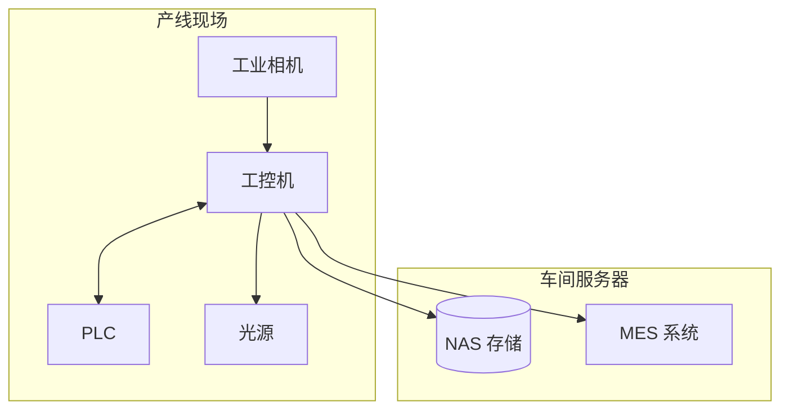

# 部署指南

> 仓库当前没有打包/安装脚本，也没有 dist 产物。已有的可执行是调试版：`build/Desktop_Qt_6_8_1_MinGW_64_bit-Debug/src/app/DefectDetection.exe`，发布请按下述步骤自行构建 Release 并打包。

---

## 1. 部署架构



---

## 2. Windows 部署（手工打包）

1) **构建 Release**（qmake / Qt Creator），产物位于 `build/<Kit>/src/app/DefectDetection.exe`。

2) **收集依赖**
```powershell
cd build\Desktop_Qt_6_8_1_MinGW_64_bit-Release
windeployqt .\src\app\DefectDetection.exe
```
如需 OpenCV/相机 SDK DLL，手工复制到 `src/app/` 同级目录。

3) **整理发布目录**
```
dist/defect-detection-1.0.0-win64/
├─ bin/DefectDetection.exe 及 Qt/OpenCV/SDK DLL
├─ config/   # 配置文件（可从仓库 config/ 拷贝）
├─ logs/
├─ data/
└─ docs/     # 可选，放使用说明
```

4) **封装**
```powershell
7z a dist/defect-detection-1.0.0-win64.zip dist/defect-detection-1.0.0-win64
```

5) **开机自启（可选）**
- 启动文件夹快捷方式，或注册 Windows 服务：
```powershell
sc create DefectDetection binPath= "C:\\Program Files\\DefectDetection\\bin\\DefectDetection.exe --service"
sc config DefectDetection start= auto
sc start DefectDetection
```

---

## 3. Linux 部署（需自行编译）

1) 按《构建指南》使用 qmake 在 Linux 上编译 Release，得到可执行 `build/.../src/app/DefectDetection`。

2) 手工整理目录：
```bash
mkdir -p dist/defect-detection-1.0.0-linux-x64/{bin,config,logs,data}
cp build/<Kit>/src/app/DefectDetection dist/defect-detection-1.0.0-linux-x64/bin/
cp -r config dist/defect-detection-1.0.0-linux-x64/config
# 拷贝 Qt/OpenCV/SDK so 到 bin/ 或 LD_LIBRARY_PATH 可见路径
```

3) 打包：
```bash
tar -czf dist/defect-detection-1.0.0-linux-x64.tar.gz -C dist defect-detection-1.0.0-linux-x64
```

4) （可选）systemd 服务示例：
```
[Unit]
Description=Defect Detection Service
After=network.target

[Service]
Type=simple
User=detect
WorkingDirectory=/opt/defect-detection
ExecStart=/opt/defect-detection/bin/DefectDetection --headless
Restart=always
RestartSec=5

[Install]
WantedBy=multi-user.target
```

5) （可选）udev 相机规则示例：
```
SUBSYSTEM=="usb", ATTR{idVendor}=="2bdf", MODE="0666"   # 海康
SUBSYSTEM=="usb", ATTR{idVendor}=="1ab2", MODE="0666"   # 大恒
```

---

## 4. 配置文件示例

```json
// config/default.json
{
  "camera": {"type": "gige", "ip": "192.168.1.100", "exposure_us": 5000, "gain_db": 0},
  "plc": {"protocol": "modbus_tcp", "ip": "192.168.1.200", "port": 502},
  "database": {"type": "sqlite", "path": "./data/inspection.db"},
  "log": {"level": "info", "path": "./logs/"}
}
```

```json
// config/detector/scratch.json
{
  "enabled": true,
  "canny_low": 50,
  "canny_high": 150,
  "min_length": 20,
  "max_gap": 10
}
```

---

## 5. 部署检查清单
- [ ] Qt/OpenCV/相机 SDK 依赖齐全，可执行可启动。
- [ ] 相机连接成功，能抓图；PLC 通信正常。
- [ ] 数据库文件可读写；日志目录有写权限。
- [ ] Golden Sample 检测通过；节拍、漏检、误检指标达标。

---

## 6. 升级/回滚建议
- 升级前备份现有安装目录与配置。
- 升级：停止服务 → 覆盖 bin/ 与依赖 → 保留 config/ → 启动服务。
- 回滚：停止服务 → 恢复备份 → 启动服务。
