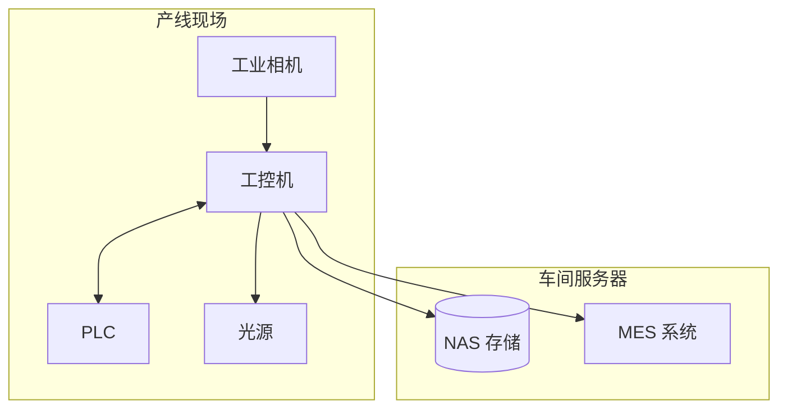

# 部署指南

## 1. 部署架构



---

## 2. Linux 部署

### 2.1 打包

```bash
# 运行打包脚本
cd scripts
./[package.sh](http://package.sh)

# 生成产物
# dist/defect-detection-1.0.0-linux-x64.tar.gz
```

### 2.2 安装

```bash
# 解压
tar -xzf defect-detection-1.0.0-linux-x64.tar.gz
cd defect-detection

# 安装依赖
sudo ./install_[deps.sh](http://deps.sh)

# 安装程序
sudo ./[install.sh](http://install.sh)
```

### 2.3 配置 systemd 服务

```
# /etc/systemd/system/defect-detection.service
[Unit]
Description=Defect Detection Service
After=[network.target](http://network.target)

[Service]
Type=simple
User=detect
WorkingDirectory=/opt/defect-detection
ExecStart=/opt/defect-detection/bin/defect-detection --headless
Restart=always
RestartSec=5

[Install]
WantedBy=[multi-user.target](http://multi-user.target)
```

```bash
# 启用服务
sudo systemctl daemon-reload
sudo systemctl enable defect-detection
sudo systemctl start defect-detection
```

### 2.4 相机 udev 规则

```bash
# /etc/udev/rules.d/99-camera.rules

# 海康相机
SUBSYSTEM=="usb", ATTR{idVendor}=="2bdf", MODE="0666"

# 大恒相机
SUBSYSTEM=="usb", ATTR{idVendor}=="1ab2", MODE="0666"

# 重新加载规则
sudo udevadm control --reload-rules
sudo udevadm trigger
```

---

## 3. Windows 部署

### 3.1 打包

```powershell
# 运行打包脚本
cd scripts
.\package.bat

# 生成产物
# dist/defect-detection-1.0.0-win64-setup.exe
```

### 3.2 安装

1. 运行安装程序 `defect-detection-1.0.0-win64-setup.exe`
2. 选择安装路径（默认 `C:\Program Files\DefectDetection`）
3. 选择是否创建桌面快捷方式
4. 完成安装

### 3.3 开机自启动

```powershell
# 方法1：添加到启动文件夹
$WshShell = New-Object -comObject [WScript.Shell](http://WScript.Shell)
$Shortcut = $WshShell.CreateShortcut("$env:APPDATA\Microsoft\Windows\Start Menu\Programs\Startup\DefectDetection.lnk")
$Shortcut.TargetPath = "C:\Program Files\DefectDetection\bin\defect-detection.exe"
$[Shortcut.Save](http://Shortcut.Save)()

# 方法2：注册 Windows 服务
sc create DefectDetection binPath= "C:\Program Files\DefectDetection\bin\defect-detection.exe --service"
sc config DefectDetection start= auto
sc start DefectDetection
```

---

## 4. 嵌入式部署 (RK3399)

### 4.1 系统镜像准备

```bash
# 烧录 Ubuntu 20.04 镜像
sudo dd if=ubuntu-20.04-rk3399.img of=/dev/sdX bs=4M status=progress
```

### 4.2 部署应用

```bash
# 传输文件
scp -r defect-detection root@192.168.1.100:/opt/

# SSH 登录配置
ssh root@192.168.1.100
cd /opt/defect-detection
./[install.sh](http://install.sh)
```

### 4.3 性能优化

```bash
# 设置 CPU 性能模式
echo performance | sudo tee /sys/devices/system/cpu/cpu*/cpufreq/scaling_governor

# 禁用不必要的服务
sudo systemctl disable bluetooth
sudo systemctl disable cups
```

---

## 5. 配置文件

### 5.1 主配置文件

```json
// config/default.json
{
  "camera": {
    "type": "gige",
    "ip": "192.168.1.100",
    "exposure_us": 5000,
    "gain_db": 0
  },
  "plc": {
    "protocol": "modbus_tcp",
    "ip": "192.168.1.200",
    "port": 502
  },
  "database": {
    "type": "sqlite",
    "path": "./data/inspection.db"
  },
  "log": {
    "level": "info",
    "path": "./logs/"
  }
}
```

### 5.2 检测器配置

```json
// config/detector/scratch.json
{
  "enabled": true,
  "canny_low": 50,
  "canny_high": 150,
  "min_length": 20,
  "max_gap": 10
}
```

---

## 6. 部署检查清单

### 6.1 硬件检查

- [ ]  相机固定、镜头调焦
- [ ]  光源安装、角度调整
- [ ]  工控机散热、接地
- [ ]  网线/USB 线缆连接

### 6.2 软件检查

- [ ]  程序正常启动
- [ ]  相机连接成功
- [ ]  PLC 通信正常
- [ ]  数据库读写正常

### 6.3 功能验收

- [ ]  Golden Sample 检测通过
- [ ]  漏检率 < 0.1%
- [ ]  误检率 < 1%
- [ ]  节拍 ≤ 100ms

---

## 7. 升级与回滚

### 7.1 升级流程

```bash
# 1. 备份当前版本
cp -r /opt/defect-detection /opt/defect-detection.bak

# 2. 停止服务
sudo systemctl stop defect-detection

# 3. 解压新版本
tar -xzf defect-detection-1.1.0-linux-x64.tar.gz -C /opt/

# 4. 保留配置文件
cp /opt/defect-detection.bak/config/*.json /opt/defect-detection/config/

# 5. 启动服务
sudo systemctl start defect-detection
```

### 7.2 回滚流程

```bash
# 1. 停止服务
sudo systemctl stop defect-detection

# 2. 恢复备份
rm -rf /opt/defect-detection
mv /opt/defect-detection.bak /opt/defect-detection

# 3. 启动服务
sudo systemctl start defect-detection
```