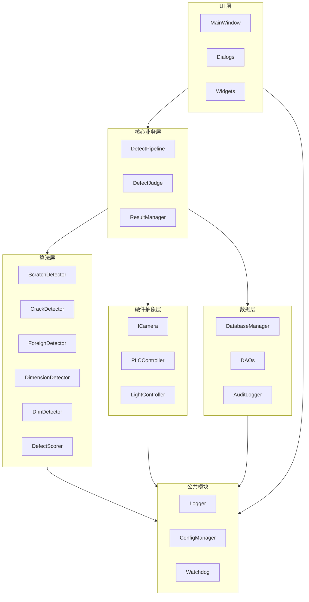

# 项目目录结构模板

> **一键生成**：可直接复制下方 Shell 脚本创建完整目录结构。
> 

---

## 1. 目录结构总览

```
defect-inspector/
├── 📁 cmake/                      # CMake 模块与工具链
│   ├── FindOpenCV.cmake
│   ├── FindQt6.cmake
│   ├── toolchain-aarch64.cmake    # ARM 交叉编译工具链
│   └── version.cmake              # 版本号管理
│
├── 📁 src/                         # 源代码
│   ├── 📁 app/                     # 应用程序入口
│   │   ├── main.cpp
│   │   ├── Application.h/cpp      # 应用程序类
│   │   └── [version.h.in](http://version.h.in)           # 版本信息模板
│   │
│   ├── 📁 core/                    # 核心业务逻辑
│   │   ├── DetectPipeline.h/cpp   # 检测流水线
│   │   ├── DefectJudge.h/cpp      # 缺陷判定器
│   │   ├── ResultManager.h/cpp    # 结果管理器
│   │   ├── BatchManager.h/cpp     # 批次管理
│   │   └── WorkflowController.h/cpp
│   │
│   ├── 📁 algorithm/               # 算法引擎层
│   │   ├── IDefectDetector.h      # 检测器接口
│   │   ├── ScratchDetector.h/cpp  # 划痕检测
│   │   ├── CrackDetector.h/cpp    # 裂纹检测
│   │   ├── ForeignDetector.h/cpp  # 异物检测
│   │   ├── DimensionDetector.h/cpp # 尺寸测量
│   │   ├── DnnDetector.h/cpp      # DNN 检测器
│   │   ├── DefectScorer.h/cpp     # 严重度评分
│   │   ├── ImagePreprocessor.h/cpp # 图像预处理
│   │   └── ROIManager.h/cpp       # ROI 管理
│   │
│   ├── 📁 hal/                     # 硬件抽象层
│   │   ├── ICamera.h              # 相机接口
│   │   ├── HikCamera.h/cpp        # 海康相机实现
│   │   ├── BaslerCamera.h/cpp     # Basler 相机实现
│   │   ├── MockCamera.h/cpp       # 模拟相机（测试用）
│   │   ├── ILightController.h     # 光源接口
│   │   ├── SerialLight.h/cpp      # 串口光源控制
│   │   ├── IIOController.h        # IO 接口
│   │   ├── ModbusTCPClient.h/cpp  # Modbus TCP
│   │   └── PLCController.h/cpp    # PLC 控制器
│   │
│   ├── 📁 ui/                      # Qt6 界面层
│   │   ├── MainWindow.h/cpp       # 主窗口
│   │   ├── MainWindow.ui
│   │   ├── 📁 widgets/             # 自定义控件
│   │   │   ├── ImageView.h/cpp    # 图像显示控件
│   │   │   ├── ROIEditor.h/cpp    # ROI 编辑器
│   │   │   ├── ResultCard.h/cpp   # 结果卡片
│   │   │   ├── ParamPanel.h/cpp   # 参数面板
│   │   │   ├── SeverityBar.h/cpp  # 严重度进度条
│   │   │   └── StatisticsChart.h/cpp # 统计图表
│   │   ├── 📁 dialogs/             # 对话框
│   │   │   ├── SettingsDialog.h/cpp
│   │   │   ├── CalibrationDialog.h/cpp
│   │   │   ├── LoginDialog.h/cpp
│   │   │   ├── UserManageDialog.h/cpp
│   │   │   ├── HistoryDialog.h/cpp
│   │   │   ├── AlarmDialog.h/cpp
│   │   │   ├── ModelManageDialog.h/cpp
│   │   │   └── AboutDialog.h/cpp
│   │   └── 📁 views/               # 功能视图
│   │       ├── StatisticsView.h/cpp
│   │       ├── HistoryView.h/cpp
│   │       └── SPCView.h/cpp
│   │
│   ├── 📁 data/                    # 数据访问层
│   │   ├── DatabaseManager.h/cpp  # 数据库管理
│   │   ├── InspectionDAO.h/cpp    # 检测记录 DAO
│   │   ├── DefectDAO.h/cpp        # 缺陷 DAO
│   │   ├── UserDAO.h/cpp          # 用户 DAO
│   │   ├── ConfigDAO.h/cpp        # 配置 DAO
│   │   ├── AuditLogger.h/cpp      # 审计日志
│   │   └── DataExporter.h/cpp     # 数据导出
│   │
│   ├── 📁 network/                 # 网络通信
│   │   ├── MESClient.h/cpp        # MES 对接
│   │   ├── WebSocketServer.h/cpp  # WebSocket 服务
│   │   ├── RESTServer.h/cpp       # REST API
│   │   └── RemoteDiagnostic.h/cpp # 远程诊断
│   │
│   └── 📁 common/                  # 公共模块
│       ├── Logger.h/cpp           # 日志封装 (spdlog)
│       ├── ConfigManager.h/cpp    # 配置管理
│       ├── ConfigValidator.h/cpp  # 配置校验
│       ├── SPSCQueue.h            # 无锁队列
│       ├── ThreadPool.h           # 线程池
│       ├── SystemWatchdog.h/cpp   # 看门狗
│       ├── PerformanceProfiler.h/cpp # 性能统计
│       ├── ImageUtils.h/cpp       # 图像工具
│       ├── FileUtils.h/cpp        # 文件工具
│       ├── CryptoUtils.h/cpp      # 加密工具
│       └── Types.h                # 公共类型定义
│
├── 📁 include/                     # 公共头文件（对外接口）
│   └── defect_inspector/
│       ├── export.h               # 导出宏
│       ├── types.h                # 公共类型
│       └── api.h                  # C API（可选）
│
├── 📁 config/                      # 配置文件
│   ├── default.json               # 默认配置
│   ├── camera_hik.json            # 海康相机配置
│   ├── camera_basler.json         # Basler 相机配置
│   ├── detectors.json             # 检测器参数
│   ├── severity.json              # 严重度阈值
│   ├── plc_registers.json         # PLC 寄存器映射
│   └── 📁 templates/               # 配置模板
│       ├── product_A.json
│       └── product_B.json
│
├── 📁 models/                      # AI 模型
│   ├── yolov5n_defect_v1.0.onnx
│   ├── yolov5n_defect_v1.1.onnx
│   └── model_info.json            # 模型元信息
│
├── 📁 resources/                   # 资源文件
│   ├── 📁 icons/                   # 图标
│   │   ├── app.ico
│   │   ├── ok.svg
│   │   ├── ng.svg
│   │   └── ...
│   ├── 📁 images/                  # 图片
│   │   ├── splash.png
│   │   └── logo.png
│   ├── 📁 qss/                     # Qt 样式表
│   │   ├── light.qss
│   │   └── dark.qss
│   ├── 📁 translations/            # 多语言
│   │   ├── app_zh_CN.ts
│   │   ├── app_en_US.ts
│   │   └── app_zh_CN.qm
│   └── resources.qrc              # Qt 资源文件
│
├── 📁 scripts/                     # 脚本工具
│   ├── 📁 build/                   # 构建脚本
│   │   ├── build_[linux.sh](http://linux.sh)
│   │   ├── build_windows.bat
│   │   ├── build_[arm.sh](http://arm.sh)
│   │   └── [package.sh](http://package.sh)             # 打包脚本
│   ├── 📁 deploy/                  # 部署脚本
│   │   ├── [install.sh](http://install.sh)
│   │   ├── [uninstall.sh](http://uninstall.sh)
│   │   ├── [backup.sh](http://backup.sh)
│   │   └── [restore.sh](http://restore.sh)
│   ├── 📁 tools/                   # 工具脚本
│   │   ├── db_[migrate.py](http://migrate.py)          # 数据库迁移
│   │   ├── config_[convert.py](http://convert.py)      # 配置转换
│   │   ├── log_[analyzer.py](http://analyzer.py)        # 日志分析
│   │   └── golden_sample_[test.py](http://test.py)  # Golden Sample 测试
│   └── 📁 ci/                      # CI/CD 脚本
│       ├── [lint.sh](http://lint.sh)
│       ├── [test.sh](http://test.sh)
│       └── [coverage.sh](http://coverage.sh)
│
├── 📁 tests/                       # 测试代码
│   ├── 📁 unit/                    # 单元测试
│   │   ├── test_scratch_detector.cpp
│   │   ├── test_crack_detector.cpp
│   │   ├── test_defect_scorer.cpp
│   │   ├── test_config_validator.cpp
│   │   └── test_spsc_queue.cpp
│   ├── 📁 integration/             # 集成测试
│   │   ├── test_detect_pipeline.cpp
│   │   ├── test_database.cpp
│   │   └── test_camera_mock.cpp
│   ├── 📁 performance/             # 性能测试
│   │   ├── bench_detectors.cpp
│   │   └── bench_dnn.cpp
│   ├── 📁 fixtures/                # 测试数据
│   │   ├── 📁 images/
│   │   │   ├── ok_sample_001.png
│   │   │   ├── scratch_mild_001.png
│   │   │   ├── crack_severe_001.png
│   │   │   └── ...
│   │   └── 📁 configs/
│   │       └── test_config.json
│   └── CMakeLists.txt
│
├── 📁 docs/                        # 文档
│   ├── [README.md](http://README.md)                  # 项目说明
│   ├── [BUILD.md](http://BUILD.md)                   # 构建指南
│   ├── [DEPLOY.md](http://DEPLOY.md)                  # 部署指南
│   ├── [API.md](http://API.md)                     # API 文档
│   ├── [ARCHITECTURE.md](http://ARCHITECTURE.md)            # 架构设计
│   ├── [CHANGELOG.md](http://CHANGELOG.md)               # 变更日志
│   ├── [CONTRIBUTING.md](http://CONTRIBUTING.md)            # 贡献指南
│   └── 📁 images/                  # 文档图片
│       └── architecture.png
│
├── 📁 third_party/                 # 第三方依赖
│   ├── 📁 spdlog/                  # 日志库 (submodule)
│   ├── 📁 json/                    # nlohmann/json (submodule)
│   ├── 📁 googletest/              # Google Test (submodule)
│   └── CMakeLists.txt
│
├── 📁 platform/                    # 平台特定代码
│   ├── 📁 linux/
│   │   ├── systemd/
│   │   │   └── defect-inspector.service
│   │   └── udev/
│   │       └── 99-camera.rules
│   └── 📁 windows/
│       ├── installer.nsi          # NSIS 安装脚本
│       └── defect-inspector.rc    # 资源文件
│
├── 📁 data/                        # 运行时数据（gitignore）
│   ├── 📁 db/                      # 数据库文件
│   │   └── inspection.db
│   ├── 📁 logs/                    # 日志文件
│   ├── 📁 images/                  # 检测图像
│   │   ├── 📁 ng/                  # NG 图像
│   │   └── 📁 archive/             # 归档图像
│   ├── 📁 backup/                  # 备份文件
│   └── 📁 export/                  # 导出数据
│
├── 📁 .github/                     # GitHub 配置
│   ├── 📁 workflows/
│   │   ├── build.yml              # CI 构建
│   │   ├── test.yml               # CI 测试
│   │   └── release.yml            # 发布流程
│   ├── ISSUE_[TEMPLATE.md](http://TEMPLATE.md)
│   └── PULL_REQUEST_[TEMPLATE.md](http://TEMPLATE.md)
│
├── CMakeLists.txt                 # 主 CMake 配置
├── .gitignore
├── .gitmodules                    # Git 子模块
├── .clang-format                  # 代码格式化配置
├── .clang-tidy                    # 静态分析配置
├── LICENSE
└── [README.md](http://README.md)
```

---

## 2. 目录创建脚本

### 2.1 Linux/macOS

```bash
#!/bin/bash
# create_[project.sh](http://project.sh) - 创建项目目录结构

PROJECT_NAME="defect-inspector"

echo "Creating project: $PROJECT_NAME"
mkdir -p $PROJECT_NAME && cd $PROJECT_NAME

# CMake 模块
mkdir -p cmake
touch cmake/{FindOpenCV.cmake,FindQt6.cmake,toolchain-aarch64.cmake,version.cmake}

# 源代码目录
mkdir -p src/{app,core,algorithm,hal,ui/{widgets,dialogs,views},data,network,common}
mkdir -p include/defect_inspector

# 源文件占位
touch src/app/{main.cpp,Application.h,Application.cpp,[version.h.in](http://version.h.in)}
touch src/core/{DetectPipeline,DefectJudge,ResultManager,BatchManager,WorkflowController}.{h,cpp}
touch src/algorithm/{IDefectDetector.h,ScratchDetector,CrackDetector,ForeignDetector,DimensionDetector,DnnDetector,DefectScorer,ImagePreprocessor,ROIManager}.{h,cpp} 2>/dev/null || true
touch src/algorithm/IDefectDetector.h
for f in ScratchDetector CrackDetector ForeignDetector DimensionDetector DnnDetector DefectScorer ImagePreprocessor ROIManager; do
    touch src/algorithm/${f}.h src/algorithm/${f}.cpp
done

touch src/hal/{ICamera.h,HikCamera,BaslerCamera,MockCamera,ILightController.h,SerialLight,IIOController.h,ModbusTCPClient,PLCController}.{h,cpp} 2>/dev/null || true
touch src/hal/ICamera.h src/hal/ILightController.h src/hal/IIOController.h
for f in HikCamera BaslerCamera MockCamera SerialLight ModbusTCPClient PLCController; do
    touch src/hal/${f}.h src/hal/${f}.cpp
done

touch src/ui/{MainWindow.h,MainWindow.cpp,MainWindow.ui}
for f in ImageView ROIEditor ResultCard ParamPanel SeverityBar StatisticsChart; do
    touch src/ui/widgets/${f}.h src/ui/widgets/${f}.cpp
done
for f in SettingsDialog CalibrationDialog LoginDialog UserManageDialog HistoryDialog AlarmDialog ModelManageDialog AboutDialog; do
    touch src/ui/dialogs/${f}.h src/ui/dialogs/${f}.cpp
done
for f in StatisticsView HistoryView SPCView; do
    touch src/ui/views/${f}.h src/ui/views/${f}.cpp
done

touch src/data/{DatabaseManager,InspectionDAO,DefectDAO,UserDAO,ConfigDAO,AuditLogger,DataExporter}.{h,cpp}
touch src/network/{MESClient,WebSocketServer,RESTServer,RemoteDiagnostic}.{h,cpp}
touch src/common/{Logger,ConfigManager,ConfigValidator,SystemWatchdog,PerformanceProfiler,ImageUtils,FileUtils,CryptoUtils}.{h,cpp}
touch src/common/{SPSCQueue.h,ThreadPool.h,Types.h}

touch include/defect_inspector/{export.h,types.h,api.h}

# 配置文件
mkdir -p config/templates
touch config/{default.json,camera_hik.json,camera_basler.json,detectors.json,severity.json,plc_registers.json}
touch config/templates/{product_A.json,product_B.json}

# AI 模型
mkdir -p models
touch models/model_info.json

# 资源文件
mkdir -p resources/{icons,images,qss,translations}
touch resources/{resources.qrc}
touch resources/qss/{light.qss,dark.qss}
touch resources/translations/{app_zh_CN.ts,app_en_US.ts}

# 脚本
mkdir -p scripts/{build,deploy,tools,ci}
touch scripts/build/{build_[linux.sh](http://linux.sh),build_windows.bat,build_[arm.sh](http://arm.sh),[package.sh](http://package.sh)}
touch scripts/deploy/{[install.sh](http://install.sh),[uninstall.sh](http://uninstall.sh),[backup.sh](http://backup.sh),[restore.sh](http://restore.sh)}
touch scripts/tools/{db_[migrate.py](http://migrate.py),config_[convert.py](http://convert.py),log_[analyzer.py](http://analyzer.py),golden_sample_[test.py](http://test.py)}
touch scripts/ci/{[lint.sh](http://lint.sh),[test.sh](http://test.sh),[coverage.sh](http://coverage.sh)}
chmod +x scripts/**/*.sh 2>/dev/null || true

# 测试
mkdir -p tests/{unit,integration,performance,fixtures/{images,configs}}
touch tests/unit/{test_scratch_detector,test_crack_detector,test_defect_scorer,test_config_validator,test_spsc_queue}.cpp
touch tests/integration/{test_detect_pipeline,test_database,test_camera_mock}.cpp
touch tests/performance/{bench_detectors,bench_dnn}.cpp
touch tests/CMakeLists.txt
touch tests/fixtures/configs/test_config.json

# 文档
mkdir -p docs/images
touch docs/{[README.md](http://README.md),[BUILD.md](http://BUILD.md),[DEPLOY.md](http://DEPLOY.md),[API.md](http://API.md),[ARCHITECTURE.md](http://ARCHITECTURE.md),[CHANGELOG.md](http://CHANGELOG.md),[CONTRIBUTING.md](http://CONTRIBUTING.md)}

# 第三方依赖
mkdir -p third_party/{spdlog,json,googletest}
touch third_party/CMakeLists.txt

# 平台特定
mkdir -p platform/linux/{systemd,udev}
mkdir -p platform/windows
touch platform/linux/systemd/defect-inspector.service
touch platform/linux/udev/99-camera.rules
touch platform/windows/{installer.nsi,defect-inspector.rc}

# 运行时数据目录
mkdir -p data/{db,logs,images/{ng,archive},backup,export}

# GitHub
mkdir -p .github/workflows
touch .github/workflows/{build.yml,test.yml,release.yml}
touch .github/{ISSUE_[TEMPLATE.md](http://TEMPLATE.md),PULL_REQUEST_[TEMPLATE.md](http://TEMPLATE.md)}

# 根目录文件
touch CMakeLists.txt .gitignore .gitmodules .clang-format .clang-tidy LICENSE [README.md](http://README.md)

echo "✅ Project structure created successfully!"
echo "📁 Total directories: $(find . -type d | wc -l)"
echo "📄 Total files: $(find . -type f | wc -l)"
```

### 2.2 Windows (PowerShell)

```powershell
# create_[project.ps](http://project.ps)1 - 创建项目目录结构

$PROJECT_NAME = "defect-inspector"

Write-Host "Creating project: $PROJECT_NAME" -ForegroundColor Green
New-Item -ItemType Directory -Force -Path $PROJECT_NAME | Out-Null
Set-Location $PROJECT_NAME

# 目录列表
$directories = @(
    "cmake",
    "src/app", "src/core", "src/algorithm", "src/hal",
    "src/ui/widgets", "src/ui/dialogs", "src/ui/views",
    "src/data", "src/network", "src/common",
    "include/defect_inspector",
    "config/templates",
    "models",
    "resources/icons", "resources/images", "resources/qss", "resources/translations",
    "scripts/build", "scripts/deploy", "scripts/tools", "scripts/ci",
    "tests/unit", "tests/integration", "tests/performance",
    "tests/fixtures/images", "tests/fixtures/configs",
    "docs/images",
    "third_party/spdlog", "third_party/json", "third_party/googletest",
    "platform/linux/systemd", "platform/linux/udev", "platform/windows",
    "data/db", "data/logs", "data/images/ng", "data/images/archive",
    "data/backup", "data/export",
    ".github/workflows"
)

foreach ($dir in $directories) {
    New-Item -ItemType Directory -Force -Path $dir | Out-Null
}

# 创建占位文件
$files = @(
    "CMakeLists.txt", ".gitignore", ".gitmodules", ".clang-format", ".clang-tidy",
    "LICENSE", "[README.md](http://README.md)",
    "cmake/FindOpenCV.cmake", "cmake/FindQt6.cmake", "cmake/toolchain-aarch64.cmake",
    "src/app/main.cpp", "src/app/Application.h", "src/app/Application.cpp",
    "config/default.json", "config/detectors.json", "config/severity.json",
    "resources/resources.qrc", "resources/qss/light.qss", "resources/qss/dark.qss",
    "docs/[README.md](http://README.md)", "docs/[BUILD.md](http://BUILD.md)", "docs/[DEPLOY.md](http://DEPLOY.md)", "docs/[API.md](http://API.md)",
    "tests/CMakeLists.txt", "third_party/CMakeLists.txt"
)

foreach ($file in $files) {
    New-Item -ItemType File -Force -Path $file | Out-Null
}

Write-Host "✅ Project structure created successfully!" -ForegroundColor Green
$dirCount = (Get-ChildItem -Recurse -Directory | Measure-Object).Count
$fileCount = (Get-ChildItem -Recurse -File | Measure-Object).Count
Write-Host "📁 Total directories: $dirCount"
Write-Host "📄 Total files: $fileCount"
```

---

## 3. 核心配置文件模板

### 3.1 CMakeLists.txt (根目录)

```
cmake_minimum_required(VERSION 3.20)

# 版本信息
set(PROJECT_VERSION_MAJOR 1)
set(PROJECT_VERSION_MINOR 0)
set(PROJECT_VERSION_PATCH 0)

project(defect-inspector
    VERSION ${PROJECT_VERSION_MAJOR}.${PROJECT_VERSION_MINOR}.${PROJECT_VERSION_PATCH}
    LANGUAGES CXX
)

# C++ 标准
set(CMAKE_CXX_STANDARD 17)
set(CMAKE_CXX_STANDARD_REQUIRED ON)
set(CMAKE_CXX_EXTENSIONS OFF)

# 编译选项
option(BUILD_TESTS "Build unit tests" ON)
option(BUILD_DOCS "Build documentation" OFF)
option(ENABLE_DNN "Enable DNN detector" ON)
option(USE_CUDA "Use CUDA for DNN" OFF)

# 输出目录
set(CMAKE_RUNTIME_OUTPUT_DIRECTORY ${CMAKE_BINARY_DIR}/bin)
set(CMAKE_LIBRARY_OUTPUT_DIRECTORY ${CMAKE_BINARY_DIR}/lib)
set(CMAKE_ARCHIVE_OUTPUT_DIRECTORY ${CMAKE_BINARY_DIR}/lib)

# CMake 模块路径
list(APPEND CMAKE_MODULE_PATH ${CMAKE_SOURCE_DIR}/cmake)

# 查找依赖
find_package(Qt6 REQUIRED COMPONENTS
    Core Gui Widgets Network Sql Charts Concurrent
)
find_package(OpenCV 4.6 REQUIRED COMPONENTS
    core imgproc imgcodecs highgui dnn
)
find_package(spdlog REQUIRED)
find_package(nlohmann_json REQUIRED)

# Qt 自动化
set(CMAKE_AUTOMOC ON)
set(CMAKE_AUTORCC ON)
set(CMAKE_AUTOUIC ON)

# 子目录
add_subdirectory(third_party)
add_subdirectory(src)

if(BUILD_TESTS)
    enable_testing()
    add_subdirectory(tests)
endif()

# 安装规则
install(TARGETS defect-inspector
    RUNTIME DESTINATION bin
    LIBRARY DESTINATION lib
    ARCHIVE DESTINATION lib
)

install(DIRECTORY config/ DESTINATION etc/defect-inspector)
install(DIRECTORY resources/ DESTINATION share/defect-inspector)

# CPack 打包
set(CPACK_PACKAGE_NAME "defect-inspector")
set(CPACK_PACKAGE_VERSION ${PROJECT_VERSION})
set(CPACK_PACKAGE_VENDOR "Your Company")
include(CPack)
```

### 3.2 src/CMakeLists.txt

```
# 源文件收集
file(GLOB_RECURSE SOURCES
    "app/*.cpp"
    "core/*.cpp"
    "algorithm/*.cpp"
    "hal/*.cpp"
    "ui/*.cpp"
    "data/*.cpp"
    "network/*.cpp"
    "common/*.cpp"
)

file(GLOB_RECURSE HEADERS
    "app/*.h"
    "core/*.h"
    "algorithm/*.h"
    "hal/*.h"
    "ui/*.h"
    "data/*.h"
    "network/*.h"
    "common/*.h"
)

file(GLOB_RECURSE UI_FILES "ui/*.ui")
file(GLOB_RECURSE QRC_FILES "../resources/*.qrc")

# 版本头文件
configure_file(
    ${CMAKE_CURRENT_SOURCE_DIR}/app/[version.h.in](http://version.h.in)
    ${CMAKE_CURRENT_BINARY_DIR}/version.h
)

# 可执行文件
add_executable(defect-inspector
    ${SOURCES}
    ${HEADERS}
    ${UI_FILES}
    ${QRC_FILES}
)

target_include_directories(defect-inspector PRIVATE
    ${CMAKE_CURRENT_SOURCE_DIR}
    ${CMAKE_CURRENT_BINARY_DIR}
    ${CMAKE_SOURCE_DIR}/include
)

target_link_libraries(defect-inspector PRIVATE
    Qt6::Core
    Qt6::Gui
    Qt6::Widgets
    Qt6::Network
    Qt6::Sql
    Qt6::Charts
    Qt6::Concurrent
    ${OpenCV_LIBS}
    spdlog::spdlog
    nlohmann_json::nlohmann_json
)

# 预编译头
target_precompile_headers(defect-inspector PRIVATE
    <QObject>
    <QString>
    <QVector>
    <opencv2/core.hpp>
    <memory>
    <vector>
    <string>
)

# Windows 特定
if(WIN32)
    set_target_properties(defect-inspector PROPERTIES
        WIN32_EXECUTABLE TRUE
    )
endif()
```

### 3.3 .gitignore

```
# Build
build/
cmake-build-*/
*.o
*.obj
*.exe
*.dll
*.so
*.dylib
*.a
*.lib

# IDE
.idea/
.vscode/
*.user
*.pro.user*
.qmake.stash

# Runtime data
data/db/
data/logs/
data/images/
data/backup/
data/export/

# OS
.DS_Store
Thumbs.db

# Dependencies (if not using submodules)
third_party/*/
!third_party/CMakeLists.txt

# Temporary
*.tmp
*.temp
*.swp
*~

# Models (large files)
models/*.onnx
models/*.engine
models/*.bin
!models/model_info.json

# Generated
moc_*
ui_*
qrc_*
```

### 3.4 .clang-format

```yaml
---
Language: Cpp
BasedOnStyle: Google
IndentWidth: 4
TabWidth: 4
UseTab: Never
ColumnLimit: 100

# 命名空间不缩进
NamespaceIndentation: None

# 大括号
BreakBeforeBraces: Attach
AllowShortFunctionsOnASingleLine: Inline
AllowShortIfStatementsOnASingleLine: Never
AllowShortLoopsOnASingleLine: false

# 指针对齐
PointerAlignment: Left
ReferenceAlignment: Left

# include 排序
SortIncludes: CaseInsensitive
IncludeBlocks: Regroup
IncludeCategories:
  - Regex: '^<Q'
    Priority: 2
  - Regex: '^<opencv2/'
    Priority: 3
  - Regex: '^<'
    Priority: 4
  - Regex: '"'
    Priority: 1

# 其他
AlignConsecutiveAssignments: false
AlignConsecutiveDeclarations: false
AlignTrailingComments: true
SpaceAfterCStyleCast: false
SpaceBeforeParens: ControlStatements
...
```

---

## 4. 模块依赖关系



---

## 5. 快速开始

### 5.1 克隆并初始化

```bash
# 克隆项目
git clone [https://github.com/yourcompany/defect-inspector.git](https://github.com/yourcompany/defect-inspector.git)
cd defect-inspector

# 初始化子模块
git submodule update --init --recursive

# 创建运行时目录
mkdir -p data/{db,logs,images/{ng,archive},backup,export}
```

### 5.2 构建 (Linux)

```bash
# 创建构建目录
mkdir build && cd build

# 配置
cmake .. -DCMAKE_BUILD_TYPE=Release

# 编译
cmake --build . -j$(nproc)

# 运行
./bin/defect-inspector
```

### 5.3 构建 (Windows)

```powershell
# 创建构建目录
mkdir build; cd build

# 配置 (VS 2022)
cmake .. -G "Visual Studio 17 2022" -A x64

# 编译
cmake --build . --config Release

# 运行
.\bin\Release\defect-inspector.exe
```